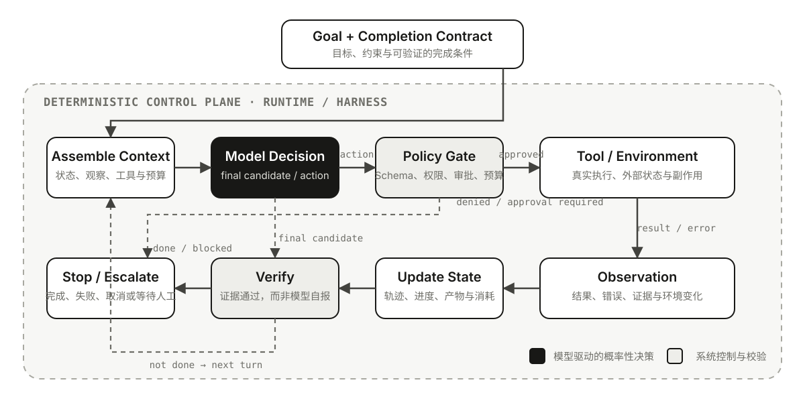

# 01｜从模型调用到 Agent：定义、闭环与边界

Agent 在不同框架和产品里指向的抽象并不完全相同：有时是一个配置了工具的模型对象，有时是一段动态执行循环，有时又泛指包含权限、Sandbox、Memory 和界面的完整产品。与其先争论一个包罗万象的定义，不如从控制权怎样变化开始。

设想一个任务：**修复仓库里失败的测试，并证明修改有效。**

- 把错误日志发给模型，它可以解释原因并给出建议，但看不到真实代码，也不能验证判断。
- 给模型一个读取文件的工具，它可以补充信息；如果读取哪个文件仍由程序预先写死，这只是工具增强的固定流程。
- 让模型根据当前证据选择搜索、读取、编辑或运行测试，并把每次结果送回下一轮，它才开始形成 Agent 式闭环。
- 再加入权限、隔离、取消、预算、状态恢复、Trace 和评测，才接近一个可以托付真实任务的 Agent 系统。

这里有两个容易被混在一起的问题：

1. **最小判定**：一个系统在什么条件下可以称为 Agent？
2. **工程成熟度**：这个 Agent 是否可靠到可以进入生产？

前者讨论动态决策闭环，后者讨论怎样约束这个闭环。会调用工具的 Demo 可能已经具有 Agent 特征，但离可生产 Agent 仍有很长距离。

## 一个工程上的最小判定

本文采用的判断是：

> **Agent 是一个围绕目标运行的系统：模型动态决定至少一部分下一步行动，行动会影响或查询环境，环境结果又成为后续决策的观察，系统持续更新状态，直到完成、停止或把控制权交还给人。**

这个定义包含七个要素：

1. **Goal**：存在需要持续追踪的目标，而不只是生成一次响应。
2. **Decision**：模型对下一步做什么拥有有限决策权。
3. **Action Space**：系统提供工具、API、代码执行、UI 操作或其他环境行动。
4. **Observation**：行动结果会返回闭环，而不是执行后即丢弃。
5. **State**：目标、历史行动、观察与当前进度能跨步骤延续。
6. **Loop**：系统可以根据新状态再次决策。
7. **Termination**：存在完成、失败、取消、预算耗尽或请求人工介入等出口。

这里的 **State 不等于必须安装一个 Memory 组件**。把当前轨迹继续放进模型输入，也是一种最小状态传递。Long-term Memory、RAG、MCP、Skills、Reflection、显式 Planner 和 Multi-Agent 都可能增强系统，但不是最小 Agent 的必要条件。

同样，Agent 也不是严格的二值标签。模型只负责一个分类节点，Agentic 程度很低；模型可以在受限工具集里动态规划几十步，Agentic 程度更高。真正值得追问的不是“它到底算不算 Agent”，而是：

- 模型获得了哪部分控制权？
- 控制权被什么确定性规则约束？
- 行动怎样被环境证据校正？

这里的**控制权不等于授权**。模型可以决定“下一步建议运行测试”，但是否允许执行、能访问哪个仓库、是否需要审批，仍由 Principal、Policy、Capability 与 Credential 共同决定；完整模型见 [07｜Agent 的授权边界](07-agent-authorization-semantics.md)。同样，工具返回内容只是一次带来源和时间的 **Observation**，模型据此形成的是可验证、可撤回的 **Claim**，而不是自动获得一条永久事实；它们的状态语义在 [03｜Agent 的状态边界](03-agent-state-semantics.md)中展开。

## 从模型调用到生产 Agent

下表把几个经常混用的概念放在同一条能力阶梯上：

| 形态 | 谁控制下一步 | 外部行动与反馈 | 跨步状态 | 动态循环 | 主要缺口 |
| --- | --- | --- | --- | --- | --- |
| 单次模型调用 | 调用方 | 无 | 无 | 无 | 不能观察或改变环境 |
| Structured Output / 单次 RAG | 调用方 | 通常只有一次检索或数据注入 | 可选 | 无 | 控制路径仍由代码决定 |
| 单次 Tool Calling | 通常由模型选择工具，也可被程序强制 | 有一次或少量回传 | 可选 | 不一定 | 有 Agentic 能力，但未必形成持续闭环 |
| 固定 Workflow | 预定义代码路径 | 有 | 有 | 由代码控制 | 灵活性受已知路径限制 |
| Agent Loop | 模型动态选择行动或结束 | 持续反馈 | 有 | 有 | 仍可能失控、误判完成或累积错误 |
| 生产 Agent | 模型决策与系统控制协同 | 可执行、可验证、可审计 | 可持久与恢复 | 受约束 | 需要持续评测和运营治理 |

这条阶梯最重要的分界不是“调用了几次模型”，而是**谁在运行时决定下一步**。一个程序可以连续调用十次模型，却始终沿着固定 DAG 执行；它仍然更接近 Workflow。一次模型调用也可能选择不同工具，但如果程序不允许根据结果继续调整，它只是暴露了一小部分 Agentic 能力。

## Tool Calling 不等于工具执行

Tool Calling 经常被描述成“模型调用了函数”，但从系统责任看，这句话省略了最关键的部分。更准确的过程是：

1. 应用把工具名称、描述和参数 Schema 提供给模型。
2. 模型生成一个 **调用候选**：工具名与参数。
3. Runtime 解析并校验候选，执行权限、预算和审批策略。
4. 工具或外部环境真正执行，产生结果、错误或副作用。
5. Runtime 把结果包装成 Observation，再交给模型决定下一步。

因此可以把责任分成三段：

| 责任段 | 负责什么 | 典型失败 |
| --- | --- | --- |
| 模型提议 | 选择工具、生成参数、判断何时需要外部信息 | 选错工具、遗漏参数、虚构工具 |
| Runtime 治理 | Schema 校验、权限、审批、调度、超时、并发与结果封装 | 未拦截越权、错误重试、丢失取消信号 |
| 环境执行 | 读取或改变真实状态，返回可观察结果 | 服务故障、部分成功、重复副作用、脏数据 |

模型输出 Tool Call 并不意味着副作用已经发生。真正执行删除文件、发送邮件或写数据库的是应用侧代码。也正因为如此，不能把参数校验、鉴权或幂等性“提示给模型以后就算完成”：模型可以协助决策，却不能替代这些确定性控制。

读取类工具失败后重试通常影响有限，支付、发信、部署等写操作却可能重复产生副作用。生产 Runtime 至少需要区分：

- 可安全重试的瞬时失败；
- 需要幂等键或执行记录才能重试的操作；
- 结果未知、必须先查询外部状态的部分成功；
- 权限拒绝和策略拒绝，它们不应被当成普通错误反复尝试。

几个相邻概念也应放回正确位置：

- **Function Calling / Tool Calling** 解决模型怎样表达行动意图。
- **MCP** 解决宿主怎样发现并连接标准化的工具与数据能力。
- **RAG** 解决怎样检索外部知识并放入当前上下文。
- **Skill** 解决完成某类任务时怎样复用说明、经验与流程。

它们可以组合进 Agent，但任何一项都不单独决定系统是否形成动态闭环。

## 最小执行闭环

一个可解释的 Agent Loop 不只是 `Reason → Act`。它还要把概率性的模型决策嵌入确定性的控制面：



图中黑色节点是模型驱动的概率性决策；其余节点属于 Runtime 或 Harness 的确定性控制。移动端可打开 [SVG 原图](../assets/images/agent-loop.svg) 查看节点细节。这里有一个贯穿后续内容的核心判断：

> **Agent 的能力来自模型能够动态选择行动；Agent 的工程可信度来自模型不能绕过控制面直接把候选行动变成现实副作用。**

一个框架无关的最小实现大致如下：

```python
def run_agent(goal, tools, policy, completion, limits):
    state = {
        "goal": goal,
        "trajectory": [],
        "artifacts": [],
        "usage": {"steps": 0, "cost": 0},
    }

    while limits.allow(state["usage"]):
        model_input = assemble_context(state, tools)
        candidate = model_decide(model_input)

        if candidate.kind == "final":
            verdict = completion.verify(candidate.output, state)
            if verdict.passed:
                return Completed(candidate.output, verdict.evidence)

            state["trajectory"].append(
                Observation("completion_rejected", verdict.reason)
            )
            continue

        call = validate_schema(candidate.tool_call, tools)
        decision = policy.authorize(call, state)

        if decision.needs_approval:
            return Paused(state, pending=call)
        if decision.denied:
            state["trajectory"].append(
                Observation("policy_denied", decision.reason)
            )
            continue

        observation = execute_with_timeout_and_idempotency(call)
        state["trajectory"].append((call, observation))
        state["usage"] = update_usage(state["usage"], observation)

    return Stopped(state, reason="budget_exhausted")
```

这段代码刻意把 `candidate` 和最终结果分开。模型说“测试已经通过”只是 **Final Candidate**；只有真实测试结果、数据库状态、生成的 Artifact 或人工验收满足 **Completion Contract**，任务才算完成。

Completion Contract 可以包含：

- 结构条件：输出是否满足 Schema，必要字段是否齐全；
- 环境条件：测试是否通过，目标记录是否存在，文件是否真的生成；
- 质量条件：结果是否满足可执行的 Rubric 或领域规则；
- 安全条件：是否经过必要审批，是否越过权限与数据边界；
- 资源条件：是否仍在时间、步数和成本预算内。

对无法完全自动判断的创意或开放任务，Contract 也不必假装绝对客观；它可以明确把最终判断交给人。重要的是让“不知道是否完成”成为一种可表达状态，而不是让模型用自信措辞掩盖证据缺口。

Completion Contract 也不能脱离任务版本单独存在：Goal、Constraint 或 Scope 一旦改变，旧证据未必仍能证明新要求。Intent 怎样形成可执行 Task、Plan 与 Contract 怎样分别变更，以及 Outcome 如何绑定证据，详见 [04｜Agent 的任务边界](04-agent-task-semantics.md)。

## 常见范式只是闭环的不同组织方式

不同范式主要改变 Planning、Action 和 Verification 怎样进入同一个闭环；它们不是互斥定义，也不是成熟度排名。

| 范式 | 主要组织方式 | 更适合什么 | 工程提醒 |
| --- | --- | --- | --- |
| [ReAct](https://arxiv.org/abs/2210.03629) | 推理、行动与观察交错推进 | 下一步依赖新证据、路径难以预先穷举 | 记录行动、观察和决策摘要即可；可观测轨迹不等于公开 Chain-of-Thought |
| Plan-and-Execute | 先拆解，再逐项执行和重规划 | 需要预算估计、进度展示或并行识别 | Plan 是可证伪假设，不是事实或完成证明 |
| Reflection / Evaluator-Optimizer | 用反馈驱动下一次尝试 | 存在测试、规则或可靠 Judge | 没有外部证据的“再想一次”可能只会强化原错误 |
| [CodeAct](https://arxiv.org/abs/2402.01030) | 用可执行代码组合行动 | 工具组合复杂、预定义接口不够表达 | 表达能力与权限面同时扩大，更依赖 Sandbox 和审计 |

## Workflow 与 Agent：差异在控制权

Anthropic 在 [Building effective agents](https://www.anthropic.com/engineering/building-effective-agents) 中给出了一个实用区分：

- Workflow 通过预定义代码路径编排模型和工具；
- Agent 让模型动态控制自己的过程和工具使用。

这不是非黑即白，而是一条控制权连续谱：

```text
确定性程序
  → 固定 Workflow 中的 LLM 节点
  → 模型动态路由
  → 受约束 Agent Loop
  → 长时间自主 Agent
```

什么时候应该向右移动？当任务包含大量难以穷举的例外、依赖非结构化信息，或下一步必须根据新证据临场决定时，模型的动态决策才可能抵消额外的延迟、成本和不确定性。

反过来，能稳定写成规则的步骤没有必要为了“Agent 化”交给模型。权限检查、金额计算、状态迁移约束、发布门禁和数据完整性都更适合确定性代码。实际系统通常是混合结构：**确定性 Workflow 提供骨架，Agent 节点处理开放决策。**

Multi-Agent 也不自动增加有效自治。把一个任务拆成多个角色，只有在并行探索、上下文隔离、专业能力或独立验证带来可测收益时才值得；否则只是把一次不确定决策变成更多调用、通信损耗与冲突状态。Agent-as-Tool、Handoff、Child Task 与 Team 的控制权和生命周期差异，详见 [05｜Multi-Agent：委派、协作与团队收敛](05-multi-agent-collaboration.md)。

## 模型能力与系统能力

很多 Agent 讨论的问题，实际上属于不同层。把它们都归因于模型，会让架构边界迅速失真。

| 层次 | 核心职责 | 不应混淆的边界 |
| --- | --- | --- |
| Model | 理解输入、生成候选计划、选择工具、形成参数、根据观察调整 | 不直接拥有真实权限、持久化和副作用 |
| Agent Runtime | 驱动循环、执行工具、管理 Run/Session/Event/State、Streaming、取消和错误传播 | 不等于模型，也不等于完整产品 |
| Workflow / Multi-Agent | 显式控制流、路由、并行、Handoff、共享状态与协作 | 多节点或多角色不等于更可靠 |
| [Agent Harness](06-agent-harness-evolution.md) | 上下文装配、Workspace、工具注册、Sandbox、Approval、Artifact、恢复、观测与评测 | Harness 是模型周围的执行与控制环境 |
| 垂直应用 | 领域任务、业务规则、专业工具与用户体验 | 例如 Coding Agent 还需代码库、Shell、测试和 Git 能力 |
| 产品与平台 | 身份、租户、计费、云端执行、团队协作与治理 | 产品能力不能反推底层 Agent 抽象相同 |

Structured Output、多模态输入、模型路由与降级、生成参数和 Prompt Caching，首先属于 **Model Access / Inference** 能力。它们会改变候选输出的格式、延迟、成本和供应商兼容性，却不会自动提供 Run 身份、工具权限、持久状态或完成判定。尤其是 Prompt Caching：它复用的是满足供应商规则的稳定输入前缀，不是缓存模型的判断或任务结果；系统正确性不能依赖“这次应该命中缓存”。完整系统仍要分别处理 Prompt、Context 与 Production Engineering 中的布局、成本、发布和运行约束。

这也解释了为什么框架会出现 `Runner`、`Event` 和 `Session`。以 [tRPC-Agent-Go](https://github.com/trpc-group/trpc-agent-go/tree/fff1eedd0054f8c7149d59f4b35895b48387d243) 为例，Agent 定义行为，Runner 以用户和 Session 驱动运行，调用方消费 Event Stream；取消信号则通过运行上下文传入。类似地，OpenAI Agents SDK 的 Runner 会在模型输出、工具调用与最终结果之间持续循环。

这些对象不是为了“把简单事情复杂化”，而是在回答几个模型本身无法负责的问题：

- 一次 Run 从哪里开始，怎样结束或取消？
- 中间事件怎样被 UI、Trace 和上层服务消费？
- 多轮状态属于当前请求、Session 还是长期 Memory？
- 工具执行失败后，错误如何回到决策闭环？
- 服务重启或等待审批后，任务能否恢复？

更强的模型可能减少部分 Prompt 和固定流程，却不会自动提供权限、幂等、审计、状态一致性或故障恢复。可以把二者理解为：

> **模型是概率性的决策面；Runtime 与 Harness 是确定性的控制面。自治不是移除控制，而是把有限决策权放进受控闭环。**

## 从 Demo 到可生产 Agent

最小循环证明“系统能够自己往下走”，生产工程则要证明“它走错时可被发现、限制和恢复”。可以先用五组问题判断工程缺口：

| 方面 | 必须回答的问题 | 相关内容 |
| --- | --- | --- |
| 可靠性 | 模型错误、工具错误、策略拒绝和系统故障怎样区分？Retry 会不会重复副作用？ | Loop / Tool Engineering |
| 状态与恢复 | Session、Run State、Memory 与 Checkpoint 各保存什么？恢复时怎样校准外部世界？ | [02｜Runtime](02-agent-runtime-semantics.md)、[03｜状态边界](03-agent-state-semantics.md) |
| 安全 | Principal、Capability、Credential、审批、撤销和 Sandbox 在哪里确定性生效？ | [07｜授权边界](07-agent-authorization-semantics.md) / Safety / Harness Engineering |
| 可观测性 | 能否关联模型决策、工具回执、状态变化、成本与停止原因？ | Observability Engineering |
| 评测 | Outcome 是否真实达成，Trajectory 是否合理，Policy、成本和多次 Trial 是否可接受？ | Evaluation Engineering |

[Anthropic 对可信 Agent 的讨论](https://www.anthropic.com/research/trustworthy-agents)强调分层防御；[Agent 评测实践](https://www.anthropic.com/engineering/demystifying-evals-for-ai-agents)则区分 Trajectory 与 Outcome。两者共同指向一个原则：Prompt 可以辅助判断，但最小权限、状态提交、环境证据和验收门禁必须由系统承担。

## 用七个问题识别一个 Agent 系统

面对任何 Agent 框架或产品，可以先问：

1. 目标由谁定义，怎样进入运行状态？
2. 下一步由固定代码决定，还是模型能根据状态动态选择？
3. 模型可以通过哪些行动通道影响环境？
4. 行动结果怎样转换成下一轮可用的 Observation？
5. 哪些状态跨步骤、跨请求或跨会话保存？
6. 系统怎样验证完成，并处理失败、取消、预算和人工介入？
7. 模型、Runtime、Harness 与产品平台分别承担什么责任？

如果这些问题没有答案，“Agent”往往只是一个产品标签。反过来，只要控制权、反馈、状态和终止边界清晰，即使实现没有复杂框架，也已经抓住了 Agent 的工程本质。

Agent 的亮点从来不只是“能自己做更多事”。更重要的是：**系统知道把什么交给模型，把什么留在确定性控制面，并能用环境证据判断任务究竟有没有完成。**

## 参考资料

- [A practical guide to building agents — OpenAI](https://openai.com/business/guides-and-resources/a-practical-guide-to-building-ai-agents/)
- [Building effective agents — Anthropic](https://www.anthropic.com/engineering/building-effective-agents)
- [Function calling — OpenAI API](https://developers.openai.com/api/docs/guides/function-calling)
- [Running agents — OpenAI Agents SDK](https://openai.github.io/openai-agents-python/running_agents/)
- [ReAct: Synergizing Reasoning and Acting in Language Models](https://arxiv.org/abs/2210.03629)
- [Reflexion: Language Agents with Verbal Reinforcement Learning](https://arxiv.org/abs/2303.11366)
- [Executable Code Actions Elicit Better LLM Agents](https://arxiv.org/abs/2402.01030)
- [Trustworthy agents in practice — Anthropic](https://www.anthropic.com/research/trustworthy-agents)
- [Demystifying evals for AI agents — Anthropic](https://www.anthropic.com/engineering/demystifying-evals-for-ai-agents)
- [tRPC-Agent-Go @ fff1eedd](https://github.com/trpc-group/trpc-agent-go/tree/fff1eedd0054f8c7149d59f4b35895b48387d243)
