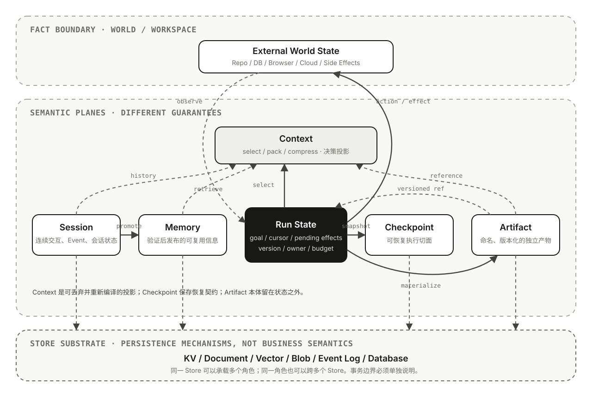

# 03｜Agent 状态的语义地图

> 状态：🟢 第一版

在[从模型调用到 Agent](01-agent-primer.md)中，State 是动态闭环得以延续的必要条件；在[Agent Runtime 的执行语义](02-agent-runtime-semantics.md)中，Run、Attempt、Event、Session 与 Checkpoint 又把“状态”拆成了不同身份和生命周期。真正把 Agent 放进生产以后，问题会继续向外扩张：

- 当前计划存在 Run State，历史消息存在 Session，为什么服务重启后仍不能恢复？
- 工具已经修改代码，Checkpoint 还停在修改之前，应该相信谁？
- UI 已经收到 Final Event，Session 写入却失败，任务算不算完成？
- 两个 Run 同时更新一个 Session，后写入者是否有权覆盖前一个 Run？
- Memory 里记录了“用户允许修改生产配置”，这条信息由谁确认，何时失效？
- Artifact 文件名没有变化，内容已经迭代三版，Checkpoint 引用的究竟是哪一版？

这些并不是多加几个数据库字段就能解决的问题。它们来自一个更根本的误解：把 Context、Run State、Session、Memory、Store、Checkpoint 和 Artifact 当成七种可以随意互换的“存储”。

本文的核心判断是：

> **Agent 状态不是一个对象，而是一组具有不同作用域、所有权、事实性、提交边界和恢复能力的语义角色。生产系统真正要维护的不是“有没有保存数据”，而是这些角色之间的转换是否仍然指向同一个真实世界。**

## 一个“测试已经通过”的事故

继续使用前两篇文章的任务：**修复仓库中失败的测试，并证明修改有效。**

一次看似成功的执行可能发生以下过程：

1. Run `R42` 在 Workspace Commit `C1` 上开始，模型决定修改 `auth.go`；
2. Tool Call 使用 Effect ID `E7` 写入 Patch，测试随后通过；
3. 测试报告被保存为 Artifact `report@v3`；
4. Runtime 生成 Final Candidate，发布“修复完成”的流式事件；
5. Session 写入发生超时，调用方不知道消息和状态是否真正提交；
6. 客户端重试，调度器从旧 Checkpoint `K2` 创建 Attempt `A2`；
7. 另一个 Run 已经把同一 Workspace 更新到 `C2`，Tool Schema 也发布了新版本；
8. `A2` 仍准备重新执行 `E7`。

此时，“任务是否完成”至少包含七个不同问题：

- Workspace 里真实存在什么修改？
- `E7` 是没有执行、执行失败，还是执行成功但回执丢失？
- Run State 是否记录了测试通过及其证据？
- Session 是否保存了面向用户的连续历史？
- Checkpoint 是否足以在新 Attempt 中精确恢复？
- `report@v3` 是否对应当前 Workspace？
- UI 展示的完成状态是否早于必要数据的持久提交？

如果系统只有一个可变的 `state` 字典，这些问题会互相覆盖。更糟的是，最后写入的值看起来往往最完整，却未必最接近事实。

## State 不是 Value，而是一条声明

生产系统不能只保存：

```json
{"tests_passed": true}
```

它至少还要知道这条值描述的是哪个世界：

```text
State Claim
= Value
+ Scope
+ Owner
+ Version
+ Provenance
+ Observed At
```

对于 `tests_passed=true`：

- **Scope**：属于哪个 tenant、user、session、run、attempt、workspace；
- **Owner**：由哪个测试工具或验证节点产生，谁可以覆盖；
- **Version**：对应哪个 Commit、文件摘要、Tool Schema 和测试配置；
- **Provenance**：来自哪条命令、退出码、日志和 Artifact；
- **Observed At**：何时观察到，此后外部状态是否已改变。

这不是要求把每个布尔值包装成复杂对象，而是要求系统知道哪些字段可以简化，哪些声明一旦失去身份和版本就不再可信。

### Agent 最重要的状态往往在 Runtime 外面

Agent 数据库并不拥有整个世界：

- Coding Agent 修改的文件、Git Index、进程和测试环境存在 Workspace；
- 浏览器 Agent 操作的页面状态存在浏览器与远端服务；
- 运维 Agent 创建的资源存在云平台控制面；
- 数据 Agent 依赖的事实存在数据库、对象存储和数据目录。

这些外部系统通常才是 **System of Record**。Run State 保存的是行动意图、观察和进度；Checkpoint 保存的是恢复所需的执行切面；二者都不能仅凭一份旧副本宣布外部世界已经回到某个状态。

因此，恢复不是“反序列化成功以后继续跑”，而是重新验证：

- Workspace 是否仍是预期 Commit；
- 待处理 Effect 是否已经发生；
- Artifact Version 是否还存在；
- 凭据、权限、租约和外部资源版本是否仍有效。

> **Checkpoint 可以恢复 Runtime 的认知，不能自动回滚真实世界。**

## 七个概念分别在保护什么



移动端可打开 [SVG 原图](../assets/images/agent-state-map.svg) 查看箭头和边界。图中最外侧的 World / Workspace 不是第八种 Agent 组件，而是状态声明最终必须校准的事实边界。

| 概念 | 回答的问题 | 典型作用域 | 它是什么 | 它不保证什么 |
| --- | --- | --- | --- | --- |
| Context | 此刻允许消费者看见什么 | Model Turn / Step / Run | 从多种来源编译出的投影 | 不天然持久，也不是事实源 |
| Run State | 当前执行到哪里、还要做什么 | Logical Run / Attempt / Branch | 可变的操作状态 | 不等于对话历史或外部世界 |
| Session | 哪些交互属于同一段连续关系 | User + Conversation | 消息、事件和会话级状态的容器 | 不天然是事务或恢复点 |
| Memory | 哪些信息值得跨任务复用 | User / App / Custom Namespace | 经过选择、验证和索引的信息 | 不等于全量历史或权威知识 |
| Store | 数据怎样被存取 | Backend / Namespace | KV、文档、向量、Blob、Log 等基础设施能力 | 不能决定上层数据语义 |
| Checkpoint | 从哪个已提交切面继续 | Run / Graph / Step | 状态、控制位置与恢复元数据 | 不能证明外部副作用已回滚 |
| Artifact | 哪个独立产物被输入、生成或交付 | Session / User / Run / Task | 命名、版本化、可独立授权的大对象 | 不应承载 Runtime 控制状态 |

这七个概念不是一条从短期到长期的线。它们更像六种语义平面加一个基础设施底座：Context 属于决策投影，Run State 属于执行，Session 属于连续性，Memory 属于复用，Checkpoint 属于恢复，Artifact 属于输入与交付，Store 则在下方提供存取能力。

## Context：一次决策的编译产物

`Context` 是最容易被滥用的词。它至少可能指：

1. 模型真正看到的 Instructions、Messages、Tool Definitions 和检索结果；
2. Runtime 传给工具、Callback 与 Hook 的本地依赖和元数据；
3. 当前环境，例如用户身份、Workspace、请求 Deadline 与权限。

[OpenAI Agents SDK 的 Context 文档](https://openai.github.io/openai-agents-python/context/)明确区分本地 `RunContextWrapper` 与模型可见 Context：前者不会自动发送给模型。这个区别不是某个 SDK 的特殊细节，而是一个普遍边界——**代码可访问不等于模型可见，模型可见也不等于模型可以修改事实源。**

更准确的表达是：

```text
Context Frame
= select(
    instructions,
    session history,
    run state,
    retrieved memory,
    knowledge,
    observations,
    artifact metadata,
    tool definitions,
)
```

`select` 表示选择、排序、压缩、摘要和权限过滤。它必然是有损的：

- 摘要会遗漏细节；
- 检索可能漏召回或召回过期信息；
- Tool Result 可能只返回外部世界的一部分；
- 为节省 Token，历史可能被裁剪；
- 出于最小权限，模型只能看到某些字段。

因此，Context 应满足两个重要不变量：

1. **可重建**：关键事实仍能从更权威的 Session、Run State、Memory、Artifact 或外部系统重新获取；
2. **带来源**：影响高风险决策的信息应保留来源、版本和新鲜度，而不只是变成一段无出处文本。

把 Context 当数据库，会让压缩后的内容逐渐取代原始事实；把全部数据库内容都塞进 Context，则会把权限、噪声和成本问题一起推给模型。Context Engineering 后续要解决“怎样选”，本文只强调：**Context 是视图，不是仓库。**

## Run State：当前执行的操作事实

Run State 服务于一个 Logical Run，典型内容包括：

- 当前目标、约束与 Completion Contract；
- 已完成步骤、当前控制位置与候选计划；
- Tool Call、Observation 与验证结果；
- 待审批动作、待处理 Effect 与结果未知项；
- Token、时间、步骤和成本预算；
- 当前 Agent、Branch、子任务与合并状态；
- Artifact References 与外部版本断言。

它与进程内变量的区别在于语义，而不是介质。一个 Run State 可以只存在内存中，也可以持续持久化；但只要系统承诺 Pause、Resume 或 Worker 故障恢复，就必须说明哪些字段已经提交，哪些仍只是当前 Attempt 的临时变量。

### 同一个 Run 也不能随意共享可变对象

Multi-Agent、并行 Tool 和 Graph 分支会同时产生状态更新。共享一个 Map 并使用互斥锁，只解决内存级数据竞争，不解决业务级冲突：

- 两个分支都读取 `workspace_version=C1`，随后分别生成互不兼容的 Patch；
- 一个分支把任务标为完成，另一个分支刚发现验证失败；
- 子 Agent 使用父 Agent 的键名覆盖了父任务进度；
- Worker `A1` 的租约已经过期，却在新 Worker `A2` 之后提交结果。

系统需要定义：

- 聚合边界：哪些字段必须一起提交；
- 逻辑写入者：谁有权更新某类状态；
- 合并语义：覆盖、追加、Reducer、Compare-and-Swap 或显式冲突；
- Branch / Namespace：父子 Agent 和并行任务怎样隔离；
- Lease / Fencing：旧执行者怎样被阻止继续写入。

锁保护“同时写”，版本保护“基于什么状态写”，Fencing 则保护“现在还有没有资格写”。三者不是同一个问题。

## Session：连续性边界，不是事务边界

Session 通常把同一用户和应用中的多轮交互关联起来，可能包含：

- Message 或 Event History；
- 会话级 State；
- Summary；
- 创建、更新时间和版本；
- 与 User、App、Run 或 Artifact 的引用。

[Google ADK](https://adk.dev/sessions/)将 Session 描述为当前对话线程，其中包含 Event 与 State；[OpenAI Agents SDK](https://openai.github.io/openai-agents-python/sessions/)的 Session 则主要负责跨 `Runner.run` 维护对话历史。相同词名已经对应不同数据模型，更不能把“有 Session 类”推导为“拥有相同恢复保证”。

Session 首先回答：

> **后续交互应该继承哪段连续上下文？**

它不自动回答：

- 当前哪个 Run 还在执行；
- 哪个 Tool Call 已产生副作用；
- 从哪个 Node 或 Step 继续；
- 当前 Workspace 与历史消息是否仍一致；
- 同一 Session 的并发 Run 按什么顺序提交。

[tRPC-Agent-Go 的 Noop Session](https://trpc-group.github.io/trpc-agent-go/session/noop/)仍会在一次 Run 内创建瞬时 Session，同时不会禁用独立配置的 Memory、Artifact 或 Graph Checkpoint 服务。这说明 Session 的语义可以存在于不持久化的实现中，其他状态能力也不应被折叠成 Session 的开关。

### Session 并发最容易制造“合理但错误”的历史

假设用户快速发送两条消息，触发 `R1` 和 `R2`：

1. 两个 Run 都读取 Session Version `S10`；
2. `R2` 先完成，提交 `S11`；
3. `R1` 随后用自己基于 `S10` 的完整副本覆盖 Session；
4. 数据库最后是 `S11` 或 `S12`，但 `R2` 的结果消失。

这不是线程安全问题，而是 **Lost Update**。常见选择包括：

- 同一 Session 单写者或串行 Run；
- Event Append + 单调序号，而不是覆盖完整历史；
- 乐观并发控制，提交时比较 Session Version；
- 允许并发，但为每个 Run 建立 Branch，随后显式合并；
- 把不需要共享的状态留在 Run，而不是写进 Session。

“最后写入获胜”只有在业务明确允许覆盖时才是策略；默认使用它，等于把冲突隐藏成成功。

## Memory：事实发布流程，不是历史备份

Memory 经常被描述为“让 Agent 记住以前的事情”。生产系统更应该把它理解为：

```text
Candidate
→ Validate
→ Publish
→ Retrieve
→ Use
→ Correct / Expire / Delete
```

Session History 中出现过的信息只是 Memory Candidate。它可能是：

- 用户明确表达的稳定偏好；
- 模型基于不完整证据做出的推测；
- 只在某次任务有效的临时约束；
- 已经过期的组织信息；
- 从不可信网页或工具结果中读到的内容。

如果系统把每条历史自动写入长期 Memory，会产生几类风险：

- **错误固化**：模型推测被当成用户事实；
- **时效漂移**：旧权限、职位、项目状态继续影响决策；
- **作用域泄漏**：Session 内秘密被提升到 User 或 App；
- **反馈放大**：模型读取自己过去的错误，再以此生成更确信的错误；
- **删除失效**：原 Session 已删除，抽取出的 Memory 仍然存在。

一条可用于高风险决策的 Memory 至少应有：

- 来源与创建主体；
- User / App / Project 等 Scope；
- 明确事实、推断还是偏好；
- 创建、验证和最后使用时间；
- 置信、版本或关联实体；
- TTL、撤销与删除路径。

Memory 也不等于 Knowledge。Memory 通常来自用户或 Agent 经历，强调个体连续性和复用；Knowledge 更接近可维护、可引用、面向多个任务的外部事实。两者都可能使用向量检索，但共享检索技术不会让它们拥有相同权威性。

> **Memory Write 是一次事实发布，而不是日志追加。**

## Store：基础设施能力不能反推数据语义

Store 可能指 KV Store、Document Store、Vector Store、Blob Store、Event Store，甚至只是一个框架定义的通用持久化接口。它回答：

- 数据按什么 Key 与 Namespace 存取；
- 是否支持查询、事务、版本、TTL 或向量检索；
- 数据保存在内存、数据库还是远端服务；
- 可用性、延迟、容量和一致性如何。

它不回答这份数据应该是 Session、Memory 还是 Checkpoint。

[LangGraph 的 Persistence 文档](https://docs.langchain.com/oss/python/langgraph/persistence)把 Checkpointer 与 Store 明确分开：前者保存 thread 中每个执行步骤的 Graph State Snapshot，后者用于跨 thread 保存和搜索数据。另一方面，某些框架会把 Storage 定义为供 Session 与 Memory 复用的底层客户端。这两种 `Store` 不是同一层抽象。

这带来两个常被忽视的判断：

1. **Persistent 不等于 Long-term**：Session 放入 PostgreSQL 后仍然只是 Session；Memory 使用内存实现时语义上仍是 Memory，只是无法跨进程保留。
2. **同库不等于同事务**：Session、Checkpoint 与 Artifact Metadata 即使都存在一个数据库，也可能位于不同表、分区、服务或提交链，不能假设一起成功。

Store 是实现选择；Scope、Ownership、Retention 和 Recovery Contract 才是语义。

## Checkpoint：可恢复执行的契约

普通 Snapshot 只回答“当时有哪些值”。生产 Checkpoint 还必须回答“下一步从哪里开始，以及此前哪些现实动作不能重复”。

一个框架无关的恢复信封可以写成：

```python
class RecoveryContract:
    checkpoint_id: str
    run_id: str
    attempt_id: str
    state_version: int
    control_cursor: object
    pending_writes: list[object]
    pending_effects: list[object]
    artifact_refs: list[object]
    external_assertions: dict[str, str]
    runtime_fingerprint: dict[str, str]
    parent_checkpoint_id: str | None
```

其中：

- **Control Cursor**：下一个 Node、Step、待审批动作或等待点；
- **Pending Writes**：已计算但尚未纳入稳定状态的更新；
- **Pending Effects**：未执行、已受理、已完成或结果未知的外部动作；
- **External Assertions**：Workspace Commit、数据库版本、Artifact Digest；
- **Runtime Fingerprint**：Agent、Prompt、Tool Schema、Graph 与 State Schema 版本；
- **Parent**：支持 Lineage、Fork、Time Travel 和审计。

[LangGraph](https://docs.langchain.com/oss/python/langgraph/persistence)的 `StateSnapshot` 除了 values，还包含 next、tasks、writes、step 与 parent；其 Pending Writes 机制避免恢复时重跑同一 super-step 中已经成功的节点。[tRPC-Agent-Go Graph](https://trpc-group.github.io/trpc-agent-go/graph/)同样把 per-invocation state、pending writes、checkpoint namespace 与恢复联系起来。这些实现细节共同说明：只有 Value 的 Snapshot 不足以恢复控制流。

### Event Log 不自动等于 Checkpoint

Event Log 可以成为重建状态的来源，但需要满足：

- 事件完整、顺序明确、可去重；
- State Transition 确定且版本兼容；
- 外部副作用有稳定身份与回执；
- 旧代码重放不会产生不同决定；
- 重放与真实执行有清晰隔离。

[Temporal](https://docs.temporal.io/workflow-execution)通过 Event History 重放确定性的 Workflow Code，并让外部交互通过 Activity 发生；Agent Runtime 中的模型输出和外部 Tool 通常不具备天然确定性，因此不能把“保存 Event”直接等同于 Temporal 式 Durable Execution。

### Resume 是五阶段协议

```text
Load
→ Validate
→ Reconcile
→ Acquire Ownership
→ Continue
```

1. **Load**：读取 Checkpoint、State、Pending Effect 与引用；
2. **Validate**：检查 Schema、Tool、Agent、Graph、权限和配置兼容性；
3. **Reconcile**：重新观察 Workspace、Artifact 与外部副作用；
4. **Acquire Ownership**：建立新 Attempt，获取 Lease / Fencing Token；
5. **Continue**：从明确 Cursor 前进，而不是让模型猜测原进度。

任何一步无法证明安全时，正确结果可能是 `Needs Review`、`Stopped` 或创建 New Run，而不是继续自动化。

## Artifact：独立产物不是一个超大的 State 字段

Artifact 是任务输入、中间结果或交付物，例如：

- 用户上传的 PDF、图片或数据集；
- Agent 生成的 Patch、报告、表格或图像；
- 测试日志、构建产物和评测结果；
- Sandbox 导出的文件或归档。

[Google ADK 的 Artifact 文档](https://adk.dev/artifacts/)将 Artifact 定义为按 Session 或 User 作用域管理的命名、版本化二进制数据，并通过独立 Artifact Service 保存；它明确不把 Artifact 本体直接存入 Session State。

一个成熟的 Artifact Reference 通常需要：

```text
artifact_id
+ version / content_hash
+ media_type
+ size
+ producer_run_id
+ source_versions
+ access_scope
+ retention_policy
```

只保存 `report.pdf` 会产生指针漂移：新版本覆盖同名文件以后，旧 Checkpoint 无法证明自己当时使用了什么。只保存对象存储 URL 也不够，因为 URL 可能过期、权限变化或指向可变对象。

State 应保存 Artifact Reference、摘要和血缘，Artifact Service 保存本体。这样可以：

- 让 Context 按需加载，而不是把大文件全部塞进模型；
- 为 Checkpoint 固定输入和输出版本；
- 把 Artifact 作为 Completion Contract 的环境证据；
- 独立执行权限、保留、删除和生命周期策略。

Artifact 不是只能在最后出现。中间分析、计划和测试报告也可以是 Artifact；关键是不要把“可以保存成文件”误解为“已经成为可信交付物”。

## 状态不会在盒子之间搬家，而是在不断变换

七个概念之间常见的是语义变换：

```text
World       --observe----> Run State
Run State   --snapshot---> Checkpoint
Sources     --select-----> Context
Session     --promote----> Memory
Run State   --materialize> Artifact
Artifact    --reference--> Run State / Session / Context
Events      --fold-------> State Projection
```

每种变换都有不同失败模式：

- `observe` 可能读取到过期、局部或结果未知的世界；
- `select` 是有损投影，不能反向覆盖来源；
- `snapshot` 必须绑定控制位置与版本；
- `promote` 需要验证、去敏和 Scope 审查；
- `materialize` 需要原子命名、版本和血缘；
- `reference` 需要防止悬空与版本漂移；
- `fold` 依赖完整、有序、兼容的 Event。

因此，“把 Session 存进 Memory”“把 State 放进 Context”“从 Event 恢复 Checkpoint”都不是复制字段这么简单。真正需要设计的是箭头：谁触发变换、变换损失什么、何时提交、失败后哪一侧仍是事实源。

## Durability Vector：完成不是一个布尔值

前一篇文章区分了 Event 的 Produced、Validated、Committed、Published 与 Consumed。跨状态平面以后，提交关系更复杂：

```python
durability = {
    "world_effect": "committed",
    "run_state": "committed",
    "session": "unknown",
    "checkpoint": "committed",
    "artifact": "committed",
    "memory": "not_required",
    "terminal_event": "published",
}
```

这可以称为一次执行的 **Durability Vector**。它不是必须实现成统一数据结构，而是一种审查方式：不要再用一个 `done=true` 遮蔽多个系统各自的提交状态。

对于修复测试：

- Patch 已写入目标 Workspace；
- 测试基于同一 Workspace Version 通过；
- 测试报告 Artifact 已持久化；
- Run Outcome 与必要引用已提交；

这些可能是 Completion Contract 的必要条件。Memory 发布通常不是；Session 更新失败是否阻止完成，则取决于产品是否承诺连续对话必须与结果原子一致。

> **用户可见完成应该由必要的持久化分量决定，而不是由最先到达的 Final Token 决定。**

### 跨 Store 提交没有魔法事务

Agent 经常同时写文件系统、数据库、对象存储、Event Bus 和第三方 API。它们通常不共享全局事务。

如果业务状态已经写入，而 Terminal Event 发布前进程崩溃，就形成 Dual Write。可行策略不是假装拥有 Exactly-once，而是缩小原子边界：

- 在同一事务中提交状态与 Outbox Record；
- 后台 Relay 以 At-least-once 发布；
- Consumer 使用 Event ID 去重；
- 外部写操作使用 Effect ID / Idempotency Key；
- 无法确定结果时先 Reconcile，再决定是否重试。

[Microsoft 的 Transactional Outbox 说明](https://learn.microsoft.com/en-us/azure/architecture/databases/guide/transactional-out-box-cosmos)展示了将业务状态和待发布事件先写入同一事务，再异步投递的基本做法。Agent Runtime 不必照搬具体数据库实现，但必须正视相同的 Dual Write 问题。

## 七类生产失败：从症状追到不变量

| 失败模式 | 错误假设 | 用户可见后果 | 必须维护的不变量 | 常见控制 |
| --- | --- | --- | --- | --- |
| Session Lost Update | 同一 Session 不会并发执行 | 较晚结束的旧 Run 覆盖新结果 | 每个可变聚合有 Version 与冲突边界 | CAS、单写者、Event Append、Branch |
| 可见完成早于提交 | Final Event 就是完成 | 刷新后结果消失或无法恢复 | 必要 Durability 分量先提交 | Commit Gate、Outbox、明确 Pending |
| 未知 Effect 被重试 | Timeout 等于没执行 | 重复发信、部署、扣费或写文件 | 同一逻辑动作有稳定 Effect ID | Idempotency Key、Receipt、Reconcile |
| Zombie Attempt | 同一 Run 只有一个 Worker | 旧 Worker 覆盖新 Attempt | 只有当前 Owner 可以提交 | Lease、Fencing Token、Attempt Version |
| 旧 Checkpoint 强行恢复 | 代码和 Schema 永远兼容 | 参数错位、跳错节点、重复 Tool | 恢复点绑定 Runtime Fingerprint | 兼容校验、迁移、拒绝 Resume |
| Memory 污染 | 历史里的内容都能复用 | 错误偏好和过期权限持续生效 | Memory 是带来源和失效规则的声明 | Candidate、验证、TTL、撤销 |
| Artifact 漂移 | 文件名唯一代表内容 | 恢复或审计使用错误版本 | Artifact Reference 固定不可歧义版本 | Version、Content Hash、Lineage |

这些控制并不保证“永不失败”。它们的价值是让失败变得可识别：系统知道当前是冲突、未知、过期、不兼容还是缺失，而不是把所有异常重新包装成一段自然语言交给模型猜。

### Idempotency Key 必须表达同一份意图

[AWS 关于幂等 API 的工程说明](https://aws.amazon.com/builders-library/making-retries-safe-with-idempotent-APIs/)强调由调用方提供稳定 Request ID，并校验同一 ID 是否被用于不同参数。仅对参数做 Hash 并不总能表达用户意图：两个参数完全相同的“创建资源”请求，可能真的是想创建两个资源。

对应到 Agent：

- Effect ID 应在 Logical Action 首次形成时产生；
- Retry 和 Resume 必须复用同一 Effect ID；
- 同一 Effect ID 若出现不同参数，应当报冲突而不是覆盖；
- 回执应能回答这份意图创建了哪个外部资源；
- Effect ID 的保留时间应覆盖可能的迟到重试。

Idempotency 不是“Tool 是 PUT 请求”这么简单，而是 Runtime 与外部系统共同维护的意图身份。

## 生命周期与删除也是状态语义

状态设计常从创建和读取开始，却在真正运营以后遇到：

- Session 已删除，抽取出的 Memory 是否仍保留？
- 用户要求删除数据，Checkpoint、Artifact 与 Trace 中的引用怎样处理？
- Artifact 已过期，历史 Run 是否还能解释自己的完成证据？
- Checkpoint 无限增长，哪些可以压缩、归档或删除？
- Idempotency Record 过早清理，迟到请求是否会重复执行？
- User、Project、Tenant 的 Namespace 变化后，旧数据由谁迁移？

创建时没有定义删除、失效和迁移路径，通常意味着系统还没有真正拥有这份状态。

不同角色应拥有不同 Retention：

- Session 可以按对话生命周期清理；
- Memory 可能需要用户级更正与遗忘；
- Checkpoint 取决于 Run 是否仍可能恢复或审计；
- Artifact 取决于交付、合规和存储成本；
- Effect Receipt 至少覆盖 Retry 与迟到请求窗口；
- Context 通常不应被当作新的长期副本永久保存。

级联删除也不能只靠数据库外键。Memory、Artifact 和外部系统可能位于不同 Store，需要显式 Data Lineage、Deletion Event 与可核验的清理结果。

## 不同框架怎样落在这张地图上

下表只做限定映射，不宣称它们提供相同保证：

| 框架 | 相关对象 | 可以确认的语义 | 仍需追问 |
| --- | --- | --- | --- |
| tRPC-Agent-Go | Invocation State、Session、Memory Service、Artifact Service、Graph Checkpoint | Session 与独立服务可分离；Graph 有 per-invocation state、pending writes 与 checkpoint namespace | 各后端原子边界、Effect Receipt、跨服务删除 |
| Google ADK | Session、Event、Session State、Memory Service、Artifact Service | Session/State 聚焦当前交互，Memory 可跨 Session，Artifact 独立版本化 | 并发 Session 更新、恢复与外部世界校验 |
| OpenAI Agents SDK | Run Context、LLM Context、Session、RunState | 本地 Context 与模型 Context 分离；Session 管历史；RunState 可序列化中断执行 | 应用自定义 Context 的持久化、外部 Effect 一致性 |
| LangGraph | Graph State、Thread、Checkpoint、Store | Checkpoint 保存 thread 内步骤状态；Store 可跨 thread；支持 Pending Writes 与 Replay | Node 副作用幂等、Graph/State 版本迁移 |

框架名字只能帮助定位代码，不能替代契约审查。真正的问题始终是：

- Scope ID 是什么；
- 哪一份是事实源；
- 何时提交；
- 并发时谁拥有写权限；
- 崩溃后凭什么安全继续。

## 状态设计的八条不变量

可以把全文压缩成八条产品级约束：

1. **Model Context 必须可以从更权威的来源重新编译。**
2. **每个可变状态聚合必须拥有身份、版本和逻辑写入者。**
3. **Session 连续性不能替代 Run 的执行身份。**
4. **Checkpoint 不得暗示外部世界已经回滚。**
5. **每个可重试副作用必须拥有稳定 Effect ID 和可查询回执。**
6. **Memory 写入是事实发布，不是历史日志追加。**
7. **Artifact Reference 必须固定版本、Hash 或其他不可歧义身份。**
8. **Resume 必须重新验证外部世界、Runtime 兼容性和执行所有权。**

## 阅读或设计状态系统时的检查清单

面对一个 Agent Framework、Harness 或产品，可以继续追问：

1. 这份数据属于 Context、Run、Session、Memory、Checkpoint 还是 Artifact？
2. 它的稳定身份包含 tenant、user、session、run、attempt、branch 中的哪些部分？
3. 谁创建、谁可以更新、谁负责验证？
4. 它是权威事实、Observation、Projection、Cache 还是模型信念？
5. Value 对应哪个外部对象和版本？
6. 更新采用覆盖、追加、Reducer 还是 Compare-and-Swap？
7. 同一 Session 的并发 Run 怎样排序或隔离？
8. State Commit 与 Event Publish 哪个先发生，崩溃窗口是什么？
9. 外部 Tool 结果未知时，怎样查询、去重或补偿？
10. Checkpoint 是否包含 Control Cursor、Pending Effect 和 Runtime Fingerprint？
11. Resume 前重新验证哪些 Workspace、权限、Lease 与 Artifact？
12. Memory 如何从 Candidate 变成已发布信息，怎样更正和失效？
13. Artifact Reference 是否固定版本与内容摘要？
14. 各 Store 的事务边界、可用性和一致性分别是什么？
15. 哪些 Durability 分量是任务 Completed 的必要条件？
16. Session、Memory、Checkpoint、Artifact 和 Effect Receipt 分别何时删除？

如果这些问题没有答案，“支持状态、记忆和恢复”仍然只是功能名称。

## 结论

Context、Run State、Session、Memory、Store、Checkpoint 与 Artifact 的区别，不在于谁保存得更久，而在于它们分别保护哪一种连续性：

- Context 保护当前决策所需的信息边界；
- Run State 保护一次执行的操作连续性；
- Session 保护人与系统的交互连续性；
- Memory 保护经过筛选的信息复用；
- Checkpoint 保护可验证的执行恢复；
- Artifact 保护输入与交付物的身份和版本；
- Store 为这些语义提供不同强度的持久化能力。

成熟的 Agent 产品不会因为“数据已经保存”就宣布状态安全。它会继续追问：保存的是事实还是投影，写入基于哪个版本，外部副作用是否已经发生，谁仍拥有提交权，以及恢复以后会不会重复伤害真实世界。

> **状态系统的目标不是让 Agent 永远记得更多，而是让它在崩溃、并发、重试和变化之后，仍然知道什么可以相信、什么必须重查，以及下一步怎样安全发生。**

这些状态最终都要服务于某个可追溯的任务版本：Goal 与 Constraint 怎样形成 Contract、Plan 怎样在不改变任务的前提下重写、完成证据怎样绑定 Contract 与 World Version，详见 [04｜Agent 任务的语义](04-agent-task-semantics.md)。

## 参考资料

- [Context management — OpenAI Agents SDK](https://openai.github.io/openai-agents-python/context/)
- [Sessions — OpenAI Agents SDK](https://openai.github.io/openai-agents-python/sessions/)
- [RunState — OpenAI Agents SDK](https://openai.github.io/openai-agents-python/ref/run_state/)
- [Session、State 与 Memory — Google ADK](https://adk.dev/sessions/)
- [Artifacts — Google ADK](https://adk.dev/artifacts/)
- [Noop Session — tRPC-Agent-Go](https://trpc-group.github.io/trpc-agent-go/session/noop/)
- [Graph Agent — tRPC-Agent-Go](https://trpc-group.github.io/trpc-agent-go/graph/)
- [Persistence — LangGraph](https://docs.langchain.com/oss/python/langgraph/persistence)
- [Temporal Workflow Execution](https://docs.temporal.io/workflow-execution)
- [Making retries safe with idempotent APIs — AWS Builders' Library](https://aws.amazon.com/builders-library/making-retries-safe-with-idempotent-APIs/)
- [Transactional Outbox — Microsoft Azure Architecture Center](https://learn.microsoft.com/en-us/azure/architecture/databases/guide/transactional-out-box-cosmos)
- [tRPC-Agent-Go @ 93d495b](https://github.com/trpc-group/trpc-agent-go/tree/93d495b44e252f5dc3b0d55067a12eb84a60be94)
- [Google ADK for Python @ eebdf22](https://github.com/google/adk-python/tree/eebdf22c07d66b35d41b3307b964c2f37d237a57)
- [OpenAI Agents SDK for Python @ 2cec489](https://github.com/openai/openai-agents-python/tree/2cec48924bcd5f514091aaf6ae2a38683710437e)
- [LangGraph @ b2926a0](https://github.com/langchain-ai/langgraph/tree/b2926a0ff9589c28c7e01fe7cdbb337b86d5a4b4)
