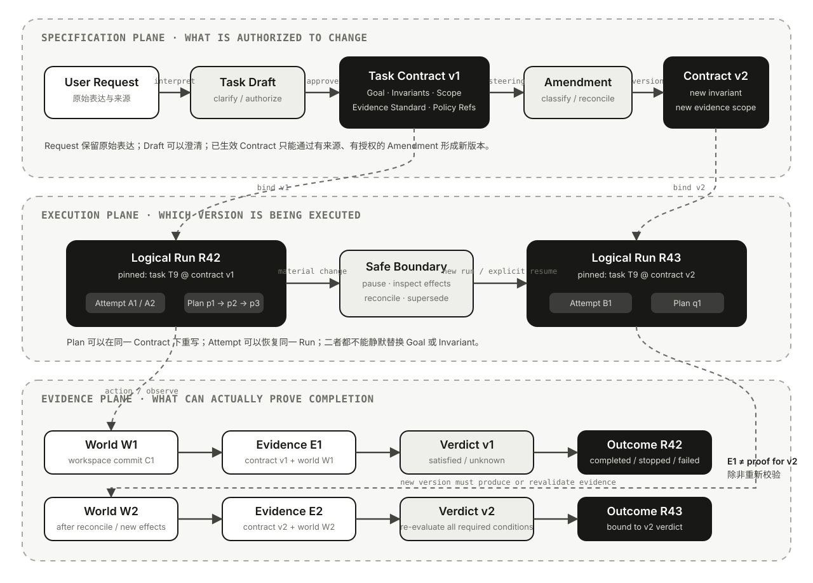

# 04｜Agent 任务的语义

> 状态：🟢 第一版

在[从模型调用到 Agent](01-agent-primer.md)中，Goal 与 Completion Contract 是动态执行闭环的起点和终点；[Agent Runtime 的执行语义](02-agent-runtime-semantics.md)解释了 Run、Attempt 与 Outcome；[Agent 状态的语义地图](03-agent-state-semantics.md)又要求每条状态声明绑定 Scope、Version 与 Provenance。把三者连起来以后，还剩下一个看似简单、实际经常缺位的对象：**这次执行究竟承诺完成什么？**

很多系统直接把最后一条用户消息传给 `runner.run()`，随后把消息历史、系统提示词、计划和工具结果都塞进同一个 Context。模型看起来知道任务，Runtime 也确实在运行，但系统未必能回答：

- 哪句话定义了 Goal，哪句话只是背景或建议？
- “不能修改公开 API”是软偏好、过程约束还是不可破坏的不变量？
- 模型发现原计划行不通以后，可以改 Plan，还是也可以降低验收标准？
- 用户中途说“顺便升级依赖”，这是补充信息、修改当前任务还是创建新任务？
- 测试通过对应哪个代码版本、哪个任务版本，能否证明现在的任务已经完成？
- 子 Agent 都返回成功，为什么父任务仍可能失败？

本文采用一套**框架无关但不假装是行业标准**的分析坐标。核心判断是：

> **Task 不是 Prompt 字符串，也不是当前 Plan。生产系统需要一个可版本化的 Task Contract：它固定期望的世界变化、受保护边界与完成证据；Plan 可以随观察重写，Contract 只能通过明确的变更协议修改，Outcome 则必须由对应版本的证据裁决。**

## 一个“测试全绿，但任务失败”的结果

继续使用贯穿前三篇文章的任务：**修复仓库中失败的认证测试，并证明修改有效。** 用户还明确要求：

- 不得修改公开 API；
- 不得覆盖工作区中已有的用户改动；
- 只处理这次失败，不顺带升级依赖；
- 最终提供测试命令、退出码和对应代码版本。

Agent 读取日志后发现，把 `Authorize(user)` 改成 `Authorize(user, policy)` 最容易通过测试。它修改生产代码，也更新了测试调用点，随后全量测试变绿，并输出“修复完成”。

从局部轨迹看，它做对了很多事情：选中了相关文件，代码可以编译，测试也真实执行过。但任务仍然失败，因为：

1. 测试通过是一个 **Postcondition Candidate**，不是整个 Goal；
2. 公开 API 不变是执行全过程必须保护的 **Invariant**；
3. 修改测试使其接受新接口，不能反向证明原需求已经满足；
4. 如果测试证据没有绑定 Workspace Commit，它甚至不能证明当前交付版本仍然通过。

这类失败不是模型“不够聪明”这么简单。系统把 Goal、Constraint、Plan 与 Completion 混成一段文本，导致它只知道“现在准备做什么”，却没有一份稳定依据判断“什么绝对不能被做”和“最终必须证明什么”。

## User Request、Intent 与 Task 不是同一个对象

用户消息首先是一份输入证据，而不是天然完整的执行契约。

```text
User Request
→ Intent Candidate
→ Task Draft
→ Clarify / Authorize
→ Task Contract Version
→ Runtime Execution
```

这几层分别回答不同问题：

- **User Request**：用户实际表达了什么，包括正文、附件、后续消息与显式撤回；
- **Intent Candidate**：系统当前怎样解释用户为什么提出请求；
- **Task Draft**：把目标、范围、约束、假设和缺口整理成可讨论结构；
- **Task Contract**：经过必要澄清和授权后，某个执行可以依赖的版本化规范；
- **Run**：Runtime 对指定 Contract Version 的一次因果执行。

从 Request 到 Contract 不是无损解析。自然语言里经常同时存在：

- 指代不清：“把它修好”中的“它”是哪一个失败？
- 隐含范围：“不要动接口”是否也禁止增加兼容重载？
- 条件冲突：“今天必须发布”与“所有回归测试必须通过”同时无法满足；
- 不可靠假设：“这个接口没人使用”可能只是用户推测；
- 外部 Policy：即使用户要求，也不能读取越权数据或绕过审批。

模型可以生成 Intent Candidate 和 Task Draft，却不应独自把高风险歧义固化成事实。缺少必要信息时，正确状态是 `NeedsClarification`；要求不受支持或违反 Policy 时，正确结果可能是 `Rejected` 或 `Stopped`。用一段自信的任务摘要掩盖歧义，只会让错误更难被发现。

Task Contract 也不是法律合同，更不要求所有 SDK 实现同名类。它是一种工程契约：只要系统承诺长期运行、暂停恢复、多人协作或产生真实副作用，就必须能重建当时执行所依据的目标与边界。

## 九个概念分别保护什么

| 概念 | 回答的问题 | 典型来源 | 可以怎样变化 | 不应替代 |
| --- | --- | --- | --- | --- |
| User Request | 用户实际说了什么 | Message、附件、UI 操作 | 只能追加、撤回或引用，原记录不应被改写 | Intent、Task |
| Intent | 用户为什么要做这件事 | 对 Request 与上下文的解释 | 可经澄清修正 | 可执行 Goal |
| Goal | 真实世界最终要发生什么变化 | 用户确认、业务需求 | 需显式 Amendment | Plan、输出文本 |
| Constraint | 解空间受到什么限制 | 用户、环境、业务规则 | 依来源和授权变更 | Preference |
| Invariant | 执行期间始终不能破坏什么 | 安全、兼容、数据完整性要求 | 通常需要更高等级授权 | 最终检查项 |
| Preference | 多个可行解之间偏好什么 | 用户偏好、成本目标 | 可按优先级降级 | 硬约束 |
| Policy | 系统允许谁在什么条件下做什么 | 组织、平台、权限控制面 | 独立于 Task 发布与撤销 | Prompt 中的提醒 |
| Plan | 当前准备怎样达成 Goal | Agent、Planner、Workflow | 可随 Observation 重写 | Contract、事实 |
| Completion / Outcome | 凭什么算完成、为何停止 | Contract、Verifier、Runtime | Verdict 随新证据重算；历史 Outcome 不改写 | Final Response |

这里有几个关键边界。

**Intent 不等于 Goal。** “我想尽快恢复服务”描述动机；“将版本回滚到 `v42` 并让健康检查恢复”才接近可执行 Goal。理解 Intent 有助于在多种方案之间取舍，却不能代替明确目标。

**Constraint 不等于 Policy。** “只改认证模块”可以来自当前任务；“生产发布必须双人审批”来自外部控制面。Task 可以引用 Policy Version，却没有权修改它。Policy 拒绝后，让模型换一种说法继续执行并不叫 Replan，而是绕过控制。

**Invariant 不只是最后再检查一次的条件。** “不得覆盖用户改动”如果在中间步骤已经被破坏，即使 Agent 最后尝试恢复文件，也可能丢失无法重建的内容。Invariant 应在高风险 Action 前形成门禁，而不只是 Completion 时做事后验尸。

**Plan 不是事实。** “下一步修改 `auth.go`”只是一条候选路径。文件结构、错误原因或权限变化都可能推翻它；计划被证伪时应该改 Plan，不应该顺便降低 Goal。

## Task Contract 固定的是执行依据

一个框架无关的 Task Contract 可以长成这样：

```python
class TaskContract:
    task_id: str
    version: int
    derived_from: list[SourceRef]
    requester: PrincipalRef

    scope: Scope
    non_goals: list[str]
    goal_conditions: list[Condition]
    invariants: list[Condition]
    process_constraints: list[Condition]
    preferences: list[WeightedPreference]

    inputs: list[VersionedReference]
    world_assertions: dict[str, str]
    budgets: Budget
    completion: CompletionContract

    assumptions: list[Assumption]
    open_questions: list[Question]
    policy_refs: list[VersionedReference]
```

这不是建议把一切都变成庞大 JSON，而是揭示一份可托付任务至少有八类信息：

1. **Identity**：这是哪个 Task、哪个版本；
2. **Provenance**：要求来自哪条消息、工单、审批或业务对象；
3. **Scope**：可以改变哪些对象，哪些明确不在范围内；
4. **Desired Delta**：完成前后的世界应有什么可观察差异；
5. **Protected Boundary**：执行中不能破坏哪些条件；
6. **Inputs and Assertions**：任务基于哪个 Workspace、Artifact、Schema 或外部资源版本；
7. **Evidence Standard**：哪些检查、回执或人工判断足以证明完成；
8. **Change Authority**：谁可以澄清、扩展、取消或替代这份契约。

Task Contract 应保存来源引用，而不是只留下模型改写后的摘要。摘要可能遗漏限定词，也可能把“最好不要”升级成“禁止”，或把“必须”弱化成“尽量”。当用户质疑结果时，系统需要从 Contract 回到原始 Request，而不是让模型解释自己当初可能理解了什么。

Contract 也不应该直接等于 Model Context。Context 是对当前 Model Turn 的有损投影，可能压缩、裁剪或隐藏敏感字段；Contract 是更稳定的事实源。模型每轮只需要看到与当前决策相关的 Contract Projection，Runtime 和 Verifier 则保留完整版本。

### Assumption 是待偿还的认知债务

从自然语言编译 Task 时，不可能消除所有未知，但系统必须区分三类信息：

- **Confirmed**：由有权来源明确确认，或者由权威系统直接观察；
- **Inferred**：根据上下文推断，带有来源、置信和失效条件；
- **Defaulted**：产品为了继续执行采用的默认值，并且用户可以看见或纠正。

“用户没有反对”不能自动把 Inferred 升级成 Confirmed，“此前一直这样”也不能把 Default 变成 Policy。一个 Assumption 是否允许保留，取决于它失真后的影响：猜错日志语言可能只影响搜索效率；猜错目标仓库、生产环境或可修改文件范围则会改变真实副作用，应当在 Action 前验证或请求澄清。

因此 Task Draft 可以携带 `assumptions` 与 `open_questions`，Ready Contract 却要为每一项给出处理结果：已验证、被授权接受、通过确定性默认解决，或仍是阻塞项。执行中 Observation 推翻 Assumption 时，系统应先评估 Contract Impact；如果它只是计划依据，Replan 即可，如果它参与 Goal、Scope、Invariant 或证据标准，就必须进入 Amendment。

这种显式处理还有一个运营价值：当任务失败时，可以区分“模型选错行动”和“任务从错误前提开始”。前者主要改进 Planner 或 Tool，后者应改进澄清、来源治理与任务编译流程。

## Goal 应描述世界变化，而不只是输出形状

对于真实任务，更有用的表达是：

```text
Task Success
= Desired World Delta
+ Protected Invariants
+ Required Deliverables
+ Sufficient Evidence
```

仍以修复测试为例：

| 类型 | 示例 | 检查时机 |
| --- | --- | --- |
| Precondition | Workspace 仍基于 Commit `C1`；失败可以复现 | 开始与恢复前 |
| Goal Condition | 认证缺陷被修复，原输入得到预期行为 | Completion |
| Postcondition | 目标测试与约定回归集通过 | Completion |
| Invariant | 公开 API 不变；用户已有修改不丢失 | 每次相关 Action 前后 |
| Process Constraint | 只修改允许路径；写入前取得审批 | Action 前 |
| Budget | 最多 40 步、30 分钟、指定成本 | 全程累计 |
| Non-goal | 不升级依赖，不重构无关模块 | Scope 判断时 |
| Preference | 在可行方案中优先选择更小 Diff | 方案排序时 |
| Policy | 不可访问密钥；禁止未经审批的生产写入 | 确定性控制面 |

这种拆分避免了两个常见错误。

第一，**把代理指标当 Goal**。测试通过只是对某些行为的采样，不代表所有业务语义都正确。修改测试、跳过用例或在错误 Workspace 运行，都可能让指标变绿而目标未达成。

第二，**把软偏好当硬约束，或反过来**。较小 Diff 通常是 Preference；保护用户改动应是 Invariant。如果二者冲突，系统可以接受稍大修改，却不能为了更漂亮的 Diff 丢失用户工作。

硬条件互相矛盾时，不存在“更聪明的 Agent 就能解决”的保证。系统应暴露冲突并请求取舍；如果操作者没有修改 Contract 的权限，Runtime 只能阻塞、停止或拒绝，而不是让模型自行决定哪条要求不再重要。

## Plan 是可替换的假设

Plan 回答“基于当前证据，准备怎样做”，因此它应当被设计成可以失败：

```text
Contract v3
├── Goal: 修复认证缺陷
├── Invariant: 公开 API 不变
└── Plan v1: 修改函数签名       ← 被 Invariant 否决
    Plan v2: 调整内部适配层     ← 测试暴露并发问题
    Plan v3: 修复缓存键与适配层 ← 当前候选
```

环境证据可以改变 Plan：搜索结果证明文件不存在，测试推翻错误归因，工具返回权限拒绝，用户提供新的日志。这些都属于正常 Replan。

环境证据不能自动改变 Contract。发现“不改 API 很难”只能说明当前计划或能力不足，不能证明“不改 API”已经失效。同样，预算即将耗尽时，Runtime 可以 Stopped 或请求扩充预算，不能把 Completion Contract 改成“尽力而为”以后宣布 Completed。

生产系统至少应区分：

- `contract_version`：目标、Scope、硬约束与验收标准的版本；
- `plan_version`：当前路径与步骤的版本；
- `state_version`：Run State 已提交到哪个版本；
- `world_version`：行动和证据对应哪个外部世界。

计划项被勾选也不是完成证据。`run_tests` Step 已结束，只说明命令运行过；只有退出码、日志、测试配置和 Workspace Version 被验证后，才能支持相应 Condition。

## Task、Run、Attempt 与 Session 怎样衔接

[Runtime 语义](02-agent-runtime-semantics.md)中的身份坐标可以继续扩展：

```text
Session / Context
└── Task T9
    ├── Task Contract v1
    │   └── Logical Run R42
    │       ├── Attempt A1
    │       └── Attempt A2 after resume
    └── Task Contract v2 or Follow-up Task T10
        └── Logical Run R43
```

这仍是分析坐标，不要求所有框架实现相同对象树。它强调四条边界：

1. **Session 不是 Task。** 一段会话可以讨论多个任务，也可以在没有活动任务时只交换消息；相同连续上下文不意味着共享同一 Goal。
2. **Run 应知道自己执行哪个 Contract Version。** 至少每个 Action、Event 与 Completion Verdict 都应能追溯到当时生效的版本。
3. **Attempt 不能顺便换目标。** Retry 或 Resume 可以创建新 Attempt，却仍要维护原 Run 的因果身份；如果任务已经实质变化，应显式决定 Amend、Supersede 或 New Run。
4. **Task 可以高于一次 Runtime 调用。** 一个产品级任务可能包含执行、独立验证和人工验收等多个 Run；反过来，一次 Handoff 也可能仍处于同一 Run。

### Task Status 不能压缩所有维度

产品经常只提供 `pending / running / done / failed`，却把四种状态压进了同一字段：

| 维度 | 回答的问题 | 示例 |
| --- | --- | --- |
| Specification | 任务规范是否已经可以执行 | Draft、Ready、Superseded |
| Execution | 当前有没有执行者、运行到哪里 | Queued、Running、Paused、Terminal |
| Satisfaction | Goal Conditions 是否被证据满足 | Unassessed、Satisfied、Unsatisfied、Unknown |
| Delivery / Acceptance | 结果是否已送达并被责任人接受 | Pending Delivery、Delivered、Accepted、Rejected |

四个维度可以产生看似矛盾、实际合理的组合：

- Contract 已 Ready，但还没有任何 Run；
- Run 已 Failed，Task 仍可由新的 Run 继续完成；
- Run 已正常结束，但 Verdict 是 `unknown`；
- Artifact 已 Delivered，用户尚未 Acceptance；
- 旧 Contract 已 Superseded，其历史 Run 与 Verdict 仍必须保留。

协议或 UI 可以为了互操作把它们投影成较少状态，但内部不能丢失原因。否则一次 Worker Crash 会被误报成“任务失败”，一次模型正常返回又会被误报成“任务完成”。



移动端可打开 [SVG 原图](../assets/images/agent-task-contract.svg) 查看细节。图中上层是 Contract 的形成与修订，下层是绑定特定版本的执行和证据链。最重要的关系是：**新 Contract 不能改写旧 Run 已经发生的事实，旧证据也不能未经重新验证就证明新 Contract。**

Contract 更新后是否允许同一 Logical Run 继续，没有唯一答案。低风险澄清可能在安全边界更新版本并继续；改变 Goal、权限、受保护对象或完成标准时，通常更适合停止旧 Run、Reconcile 已发生 Effect，再创建清晰的新 Run。无论选择哪种策略，历史 Event 都必须保留当时生效的 `contract_version`。

## Steering 首先是输入分类

Agent 运行中收到新消息，不能一律追加到 Context 后继续。系统应先判断它改变了哪一层：

| 新输入 | 示例 | 应更新什么 | 是否通常需要 Contract Version |
| --- | --- | --- | --- |
| Observation / Evidence | “这里是刚产生的完整错误日志” | Run State、Context、Plan | 否 |
| 事实纠正 | “目标分支是 `release`，不是 `main`” | World Assertion；重新验证已做工作 | 是，若执行基线改变 |
| Plan Hint | “可以先看看最近提交” | Plan Candidate | 否 |
| Constraint Amendment | “不能修改数据库 Schema” | Constraint / Invariant | 是 |
| Scope Expansion | “顺便升级依赖并清理旧代码” | Scope、Goal、Budget | 是，或创建新 Task |
| Policy / Permission Change | 审批通过、凭据撤销 | 外部 Policy、Capability | Contract 引用和执行权需重验 |
| Cancel / Supersede | “先别修了，改成只输出诊断报告” | 原 Task 终止；创建替代 Contract | 是 |
| Independent Request | “再帮另一个仓库修同类问题” | 新 Task | 新身份 |

一个可审计的变更协议可以写成：

```text
Classify Input
→ Assess Contract Impact
→ Pause at Safe Boundary
→ Reconcile Effects under Old Version
→ Draft Amendment
→ Authorize and Persist New Version
→ Resume or Start New Run
```

其中最难的是 **Reconcile**。假设 Agent 已按 v1 修改文件，用户在 v2 新增“不得修改该文件”：系统不能只替换 Context，然后假装新约束从一开始就成立。它需要说明旧修改是否保留、撤销、补偿或交给人处理，并重新建立 Workspace Version。

并非所有字段变化都具有相同影响。修正标题错别字可能只更新展示元数据；补充一条等价证据来源可能只需要重跑 Verifier；修改 Goal、Invariant、输入基线或允许的副作用集合，则可能使旧 Plan、审批、Effect 与 Evidence 全部失效。成熟系统不应只比较两份 JSON 是否不同，而要为 Contract 字段定义 **Change Impact**：

```text
cosmetic
< evidence-only
< replan-required
< reauthorization-required
< new-run-required
< incompatible / new-task
```

Amendment 还应保存 `parent_version`、修改字段、来源、授权者、理由与生效时间。这样才能回答一个生产事故中最关键的问题：某个 Action 是在新约束生效前合法发生，还是旧 Worker 在失去资格后继续执行。Contract Version 解决“依据是什么”，Attempt Lease 与 Fencing 继续解决“现在谁有资格提交”；二者不能互相替代。

“用户补充了一句话”也不自动代表有权修改所有字段。任务提出者可能可以调整 Scope，却不能覆盖组织 Policy；Reviewer 可以验收结果，却未必可以追加生产权限。完整的授权链属于 Safety 与 Harness Engineering，Task Contract 在这里只需保存来源和授权结果，避免模型把自然语言出现过的内容都当成同等有效命令。

## Completion 是一份带版本的裁决

模型停止调用工具并生成最终文本，只说明它提出了 **Final Candidate**。任务完成还需要一条更严格的链：

```text
Final Candidate
→ Completion Claim
→ Evidence Collection
→ Condition Evaluation
→ Completion Verdict
→ Run Outcome
→ Delivery / Acceptance
```

一个 Verdict 可以包含：

```python
class CompletionVerdict:
    task_id: str
    contract_version: int
    status: Literal[
        "satisfied", "unsatisfied", "unknown", "needs_human"
    ]
    condition_results: list[ConditionResult]
    evidence_refs: list[VersionedReference]
    world_versions: dict[str, str]
    unknowns: list[str]
    evaluator_version: str
    evaluated_at: datetime
```

这里的 `unknown` 非常重要。测试请求超时，不等于测试失败，也不等于测试通过；外部部署请求返回超时，可能是没有执行，也可能已经成功。不能证明完成时，系统应暴露证据缺口，而不是让模型根据语气补齐结果。

Verdict 必须回答：

- 每个 Required Condition 是否分别通过；
- 所有 Invariant 是否有足够覆盖，而不只是没有发现问题；
- Evidence 对应哪个 Workspace、Artifact 和外部资源版本；
- Evidence 是否过期、是否由同一错误假设生成；
- 哪些判断来自确定性检查，哪些来自 Judge 或人工；
- 失败是任务未满足、执行故障、策略拒绝还是结果未知。

在本文沿用的 Runtime 语义中，只有 Completion Contract 通过，Run 才进入 `Completed`。`Failed` 表示 Runtime 无法履行执行契约，`Cancelled` 与 `TimedOut` 保留停止原因，`Stopped` 表示预算或策略使其受控终止，`Paused` 则仍不是终态。

这比许多 SDK 的默认循环退出条件更强。例如 [OpenAI Agents SDK 的 Runner](https://openai.github.io/openai-agents-python/running_agents/)接收字符串、Input Items 或可恢复的 `RunState`；当模型产生符合输出类型且没有 Tool Call 的 Final Output 时，Agent Loop 可以结束。[Input/Output Guardrails](https://openai.github.io/openai-agents-python/guardrails/) 能检查输入与最终输出，但“最终输出已经形成”仍不自动证明外部业务 Goal 达成。应用需要把测试、数据库状态、Artifact 或人工验收组合成自己的 Completion Contract。

**Delivery 与 Acceptance 也应分开。** 报告已经写入 Artifact Store，说明交付物可用；用户是否认可开放式分析、设计或创作，可能仍需要 `needs_human`。系统不应为了获得一个漂亮的自动成功率，假装所有任务都有客观判定器。

### Completion Contract 是证据策略，不是一句标准答案

每个可执行 Condition 至少需要五类元数据：

```text
Condition
= Predicate or Rubric
+ Required Evidence Type
+ Evaluator and Version
+ Freshness / World Scope
+ Failure Semantics
```

`Predicate` 说明判断什么；Evidence Type 说明接受测试回执、数据库查询、Artifact Hash 还是人工签字；Evaluator Version 说明由哪版规则或 Judge 评估；Freshness 说明证据对应哪个世界、多久后失效；Failure Semantics 则区分 `false`、`unknown`、`not_applicable` 和 `evaluator_failed`。

多个 Condition 也不是简单统计通过率。生产发布可能要求：

```text
all(required_invariants)
AND all(required_postconditions)
AND any(approved_delivery_routes)
AND no(blocking_unknowns)
```

某个可选质量 Rubric 得分偏低可以触发人工复核；一个安全 Invariant 未验证却不能被另外十个绿色指标“平均掉”。因此 Completion Contract 需要逻辑组合、阻塞等级和证据归属，而不是一张没有权重语义的 Checklist。

Verifier 也不是事实制造者。LLM-as-Judge 可以判断文风或解释质量，却不应仅凭 Transcript 断言生产资源已经创建；单元测试可以证明特定输入集的行为，却不能证明没有越权读取。每个 Condition 应选择离事实源最近、权限边界最清楚的证据通道，并把 Judge 的推断与环境 Observation 分开记录。

## 委派的是子契约，不是一段 Prompt

Multi-Agent 系统常把任务拆给 Specialist，但真正需要传递的不只是目标摘要。一个 Child Assignment 至少应携带：

```text
parent_task_id + parent_contract_version
derived_goal + allowed_scope
inherited_constraints + policy references
input versions + budget
expected artifact + evidence requirements
acceptance owner
```

子 Agent 可以在自己的 Scope 内动态规划，却不能放宽父任务的不变量。例如父任务禁止修改公开 API，子 Agent 不能因为自己的测试更容易通过就移除这条约束。父 Agent 也不能看到三个子任务都 `Completed` 便直接宣布成功；它还要验证：

- 子结果是否基于同一个父 Contract Version；
- 多个 Patch、Artifact 或 State Delta 是否彼此兼容；
- 全局 Invariant 在合并后是否仍成立；
- 子任务留下的 Unknown 和 Residual Risk 是否可接受；
- 父 Completion Contract 是否获得端到端证据。

Handoff 与 Child Task 也不是同义词。[OpenAI Agents SDK 的 Handoff](https://openai.github.io/openai-agents-python/handoffs/) 可以在同一 Run 内更换当前 Agent；[tRPC-Agent-Go](https://trpc-group.github.io/trpc-agent-go/tool/) 使用 InvocationID 与 ParentInvocationID 描述父子 Agent 调用；[A2A](https://a2a-protocol.org/latest/topics/life-of-a-task/) 则把跨 Agent 的有状态工作暴露为显式 Task。它们解决的执行或协议边界不同，应用仍需决定任务契约怎样派生和验收。

## 八类失败：从“看起来完成”追到契约缺口

| 失败模式 | 被混淆的对象 | 典型后果 | 应维护的不变量 |
| --- | --- | --- | --- |
| Prompt-as-Task | Request = Contract | 过期消息、背景信息或注入内容变成任务要求 | Contract 有明确来源与授权 |
| Silent Goal Drift | Plan = Goal | 遇到困难后偷偷降低目标 | 只有 Amendment 能改变 Goal |
| Plan-as-Proof | Step Done = Condition Satisfied | 命令运行过就宣布成功 | Completion 依赖证据而非步骤状态 |
| Constraint Laundering | Hard = Soft | 不变量被模型重新解释成偏好 | 条件类型与变更权限固定 |
| Moving Goalpost | Context Update = Contract Update | Run 不知道自己执行哪个版本 | Action 与 Event 绑定 Contract Version |
| Stale Evidence | Evidence = Timeless Truth | 旧测试证明新代码或新需求 | Evidence 绑定 World Version 与时间 |
| Scope Creep | Follow-up = Same Task | “顺便”不断扩大权限、成本和风险 | Scope 扩展需修订或新 Task |
| Local Success | Child Completed = Parent Completed | 子结果冲突、合并后破坏全局条件 | 父任务独立验收端到端结果 |

这些控制不保证需求永远清晰，也不保证 Verifier 永远正确。它们的价值是让失败类型可见：系统知道当前缺的是授权、信息、可行方案、环境证据还是人工判断，而不是把一切包装成新的 Prompt 再试一次。

## 不同框架和协议怎样落在这套坐标上

以下映射锁定到 2026-08-03 检查的官方资料与源码：A2A [`2cdf197`](https://github.com/a2aproject/A2A/tree/2cdf197805cf3eb780714f730cdfd24bce1c9998)、tRPC-Agent-Go [`0cf9fb2`](https://github.com/trpc-group/trpc-agent-go/tree/0cf9fb2bfd0204230ac694b3f16732979110dded)、Google ADK Python [`f4e7233`](https://github.com/google/adk-python/tree/f4e7233469e3595336dfb0d84c281b2f6245ce4c)、OpenAI Agents SDK Python [`e943ded`](https://github.com/openai/openai-agents-python/tree/e943deda36b4dd43249df1236e32318acbc61473)、LangGraph [`b2926a0`](https://github.com/langchain-ai/langgraph/tree/b2926a0ff9589c28c7e01fe7cdbb337b86d5a4b4)。它比较的是语义位置，不表示类型可以直接互换。

| 系统 | 暴露的相关对象 | 可以确认的语义 | Task Contract 仍需谁负责 |
| --- | --- | --- | --- |
| A2A | `contextId`、`Task`、`TaskState`、Message、Artifact | Context 可包含多个 Task；Task 有中断与终态；终态 Task 不重启，后续精炼创建同 Context 下的新 Task | 协议不替客户端定义领域 Goal、Invariant 与充分证据 |
| tRPC-Agent-Go | Run Input、RequestID、InvocationID、Session、Event | API 将 Session、Input、Profile 与 RunOptions 转成一次 Runner Run；父子 Invocation 可独立关联 | 应用或上层 Workflow 编译需求并把版本写入 State/Options/Event |
| Google ADK | User Query、Invocation、Session、Event、Artifact | Invocation 表示响应单次用户查询的执行；Runner 通过 Event 提交状态与 Artifact | 应用 State 与 Agent Logic 定义任务字段、修订和验收 |
| OpenAI Agents SDK | Run Input、RunState、Guardrail、Handoff、RunResult | Runner 驱动 Tool/Handoff 循环；RunState 可恢复中断；Guardrail 检查输入、工具与最终输出 | 应用定义领域 Goal、外部世界检查和 Completion Verdict |
| LangGraph | Thread、Graph State、Task、Checkpoint、Interrupt | Thread 聚合多次 Run 的 Graph State；Checkpoint/Interrupt 支持更新、暂停和恢复 | State Schema 与 Workflow 必须显式保存 Contract Version 和变更规则 |

A2A 的 Task 最接近一个跨 Agent 可追踪 Unit of Work。其官方 [Life of a Task](https://a2a-protocol.org/latest/topics/life-of-a-task/) 文档区分无状态 Message 与有状态 Task，使用 `contextId` 聚合相关交互，并要求终态 Task 的 Refinement 创建新 Task。这为协议可追溯性提供了清晰身份，但 A2A Task 的 `status`、`artifacts` 与 `history` 仍不是本文完整的 Task Contract：一个协议可以说 Task 已 `completed`，领域应用仍要说明由谁、根据哪些条件得出这一状态。

另外四类 Runtime 更直接说明了另一条边界：**拥有 Run、Invocation、Thread 或可恢复 State，不代表自动拥有稳定任务规范。** 如果应用只把自然语言输入放进历史，Resume 可以恢复执行位置，却仍可能恢复到一个已经漂移的目标。

## 任务设计的八条不变量

可以把全文压缩成八条产品级约束：

1. **每个可执行 Task 必须拥有稳定身份、来源和明确的 Contract Version。**
2. **Goal、Constraint、Invariant、Preference 与 Policy 必须可以被机器或审查者区分。**
3. **Plan 可以被证据重写，Contract 只能被有权限的 Amendment 修改。**
4. **每个 Action、Event 和 Verdict 必须能追溯到当时生效的 Contract Version。**
5. **Session 连续性不能替代 Task 身份，Attempt 恢复不能顺便更换 Goal。**
6. **Completion Evidence 必须绑定 Condition、World Version、来源与新鲜度。**
7. **Unknown、NeedsClarification 与 NeedsHuman 必须是可表达状态，而不是失败文案。**
8. **子任务成功必须经过父契约的合并与端到端验收。**

## 阅读或设计任务系统时的检查清单

面对一个 Agent Framework、Harness 或产品，可以继续追问：

1. 原始 User Request 与系统解释后的 Intent 分别保存在哪里？
2. Task 何时从 Draft 进入可执行状态，谁有权确认？
3. Goal 描述的是输出、步骤，还是可观察的世界变化？
4. Constraint、Invariant、Preference 与 Policy 怎样区分？
5. Scope 与 Non-goal 是否显式，Agent 能否自行扩张？
6. Task Contract、Plan、Run State 与 World 分别怎样版本化？
7. Run、Attempt、Event 和 Tool Effect 是否记录 `contract_version`？
8. 新消息怎样分类为证据、计划提示、契约修订或新 Task？
9. Amendment 生效前，旧版本已经产生的副作用怎样 Reconcile？
10. 权限或 Policy 变化后，已批准 Action 是否重新验证？
11. Completion Contract 在何时建立，能否被执行者临时降低？
12. Evidence 是否绑定 Workspace、Artifact、Schema 与外部资源版本？
13. Verdict 怎样表达 Unsatisfied、Unknown 与 NeedsHuman？
14. Runtime Outcome、Artifact Delivery 与用户 Acceptance 是否分离？
15. 子任务怎样继承约束、提交证据并由父任务验收？
16. 终态 Task 的修订是改写历史、创建新版本，还是创建关联的新 Task？

如果这些问题没有答案，“Agent 正在执行一个任务”通常只意味着模型正在消费一段上下文。

## 结论

一个任务系统真正保护的不是 Prompt，而是人的意图在多步执行中的稳定性：

- Request 保存原始表达；
- Intent 解释为什么；
- Goal 描述期望的世界变化；
- Constraint 与 Invariant 划定不可越过的边界；
- Plan 提供可随证据更新的路径；
- Task Contract 固定执行与变更依据；
- Completion Verdict 用对应版本的环境证据判断满足程度；
- Outcome 说明一次 Run 为什么不再继续。

Agent 的自治不来自自由解释任务，而来自在稳定契约内动态选择行动。最值得保留的工程边界是：

> **证据可以改变 Plan，授权才能改变 Contract；模型可以提出完成，只有绑定任务版本和真实世界的证据才能裁决完成。**

## 参考资料

- [Life of a Task — Agent2Agent Protocol](https://a2a-protocol.org/latest/topics/life-of-a-task/)
- [A2A Protocol Specification](https://github.com/a2aproject/A2A/blob/2cdf197805cf3eb780714f730cdfd24bce1c9998/docs/specification.md)
- [tRPC-Agent API — tRPC-Agent-Go](https://trpc-group.github.io/trpc-agent-go/trpcagent/)
- [Agent — tRPC-Agent-Go](https://trpc-group.github.io/trpc-agent-go/agent/)
- [Tool — tRPC-Agent-Go](https://trpc-group.github.io/trpc-agent-go/tool/)
- [Runtime Event Loop — Google ADK](https://adk.dev/runtime/event-loop/)
- [Running agents — OpenAI Agents SDK](https://openai.github.io/openai-agents-python/running_agents/)
- [Results — OpenAI Agents SDK](https://openai.github.io/openai-agents-python/results/)
- [Guardrails — OpenAI Agents SDK](https://openai.github.io/openai-agents-python/guardrails/)
- [Handoffs — OpenAI Agents SDK](https://openai.github.io/openai-agents-python/handoffs/)
- [Persistence — LangGraph](https://docs.langchain.com/oss/python/langgraph/persistence)
- [Interrupts — LangGraph](https://docs.langchain.com/oss/python/langgraph/interrupts)
- [A2A @ 2cdf197](https://github.com/a2aproject/A2A/tree/2cdf197805cf3eb780714f730cdfd24bce1c9998)
- [tRPC-Agent-Go @ 0cf9fb2](https://github.com/trpc-group/trpc-agent-go/tree/0cf9fb2bfd0204230ac694b3f16732979110dded)
- [Google ADK for Python @ f4e7233](https://github.com/google/adk-python/tree/f4e7233469e3595336dfb0d84c281b2f6245ce4c)
- [OpenAI Agents SDK for Python @ e943ded](https://github.com/openai/openai-agents-python/tree/e943deda36b4dd43249df1236e32318acbc61473)
- [LangGraph @ b2926a0](https://github.com/langchain-ai/langgraph/tree/b2926a0ff9589c28c7e01fe7cdbb337b86d5a4b4)
