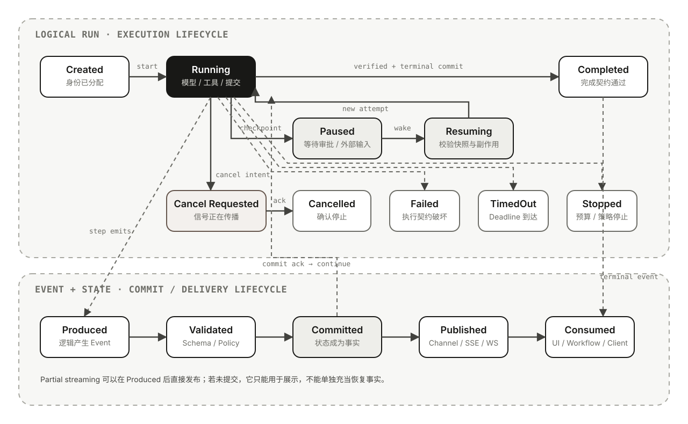

# 04｜Agent Runtime 的执行语义

> 状态：🟢 第一版

在[从模型调用到 Agent](01-agent-primer.md)中，Agent Runtime 被描述为确定性控制面：它驱动模型与工具之间的循环，处理状态、权限、取消、错误和完成判定。但只知道“Runtime 负责运行 Agent”还不够。真正进入框架源码或生产系统后，很快会遇到一组看似直观、实际并不统一的对象：

- 一次用户提问是一个 Turn，还是一个 Run？
- 一个 Run 里调用了三次模型，究竟有几个 Turn？
- Tool Call、Tool Result 和状态提交分别算 Step 还是 Event？
- 流里已经出现最终文本，Run 为什么仍未完成？
- Session 保存了全部消息，服务重启后为什么仍不能从原位置恢复？
- Cancel、Timeout、Pause、Stop 和 Fail 是否只是不同错误码？

这些问题不是命名洁癖。它们决定取消信号发给谁、预算按什么累计、状态何时提交、事件能否重放、失败后是否可以重试，以及 UI 何时有资格向用户显示“任务完成”。

本文采用一套**框架无关但不假装是行业标准**的词汇，再把它映射到 tRPC-Agent-Go、Google ADK 和 OpenAI Agents SDK。核心判断是：

> **Runtime 不只是包住模型的 `while` 循环，而是一套执行协议：它把概率性的模型决策转换成可标识、可观察、可中断、可恢复，并且具有明确终态的系统行为。**

## 从一个任务看出不同运行边界

继续使用一个具体任务：**修复仓库里失败的测试，并证明修改有效。**

用户此前已经在同一对话中说明了仓库位置和限制。新消息到达后，Runtime 可能经历：

1. 从 Session 加载历史和会话状态；
2. 创建本次执行身份；
3. 调用模型，让它决定先搜索测试还是读取日志；
4. 执行搜索工具并把结果送回模型；
5. 模型生成文件修改，Runtime 在写入前请求审批；
6. 执行暂停，HTTP 请求或事件流可能先结束；
7. 用户批准后，从待审批动作处继续，而不是让模型重新猜一遍；
8. 工具修改文件，随后运行测试；
9. Runtime 根据测试结果验证 Completion Contract；
10. 提交最终状态、发出终态事件、持久化 Session，并关闭事件流。

从用户界面看，这可能只是“一问一答”；从模型看，是多轮生成；从 Runtime 看，是带暂停和恢复的一次逻辑执行；从进程看，恢复前后甚至可能是两次执行尝试；从事件消费者看，则是一串文本、工具、状态和控制事件。

如果把它们全部叫作“对话轮次”，生命周期会立刻失真。

## 先建立一套可推理的坐标

可以先用下面的关系建立直觉：

```text
Session
└── Conversation Turn
    └── Logical Run
        ├── Attempt 1
        ├── Attempt 2 after resume
        ├── Agent Invocation(s)
        ├── Model Turn(s)
        ├── Step(s)
        └── Event Stream
```

这不是要求所有框架都实现同一棵对象树，而是一套分析坐标。Graph、并行工具和 Multi-Agent 会让实际执行变成 DAG；关键是不要把不同生命周期压进同一个 ID。

| 概念 | 本文定义 | 典型生命周期 | 不应混淆 |
| --- | --- | --- | --- |
| Session | 一段对话或任务上下文的连续性边界 | 分钟到数月，可包含多个 Run | 不是当前正在执行的任务，也不天然是 Checkpoint |
| Conversation Turn | 一次用户输入到一次面向用户结果的交互边界 | 一次前台交互 | 不等于一次模型调用 |
| Logical Run | 围绕一个输入或目标形成的因果执行单元 | 从创建到某个明确终态 | 不等于某个进程、线程或 HTTP 请求 |
| Attempt | Logical Run 的一次具体执行尝试 | 从获得执行权到退出或失去执行权 | Retry/Resume 可以产生新 Attempt，而不必产生新 Run |
| Agent Invocation | 某个 Agent 在 Run 中的一次调用 | 一次 Agent 进入到返回、转交或停止 | 一个 Run 可以调用多个 Agent |
| Model Turn | 一次模型请求与响应 | 一次模型 I/O | 工具执行通常由它触发，但属于 Runtime 行动 |
| Step | 一次具有独立语义的状态转换或调度单元 | 模型决策、工具批次、Handoff、验证等 | 框架对 Step 粒度没有统一标准 |
| Event | 对已发生事实、状态增量或控制信号的带身份记录 | 产生、提交、发布、消费 | 不只是 Token，也不等于 Trace Span |

### Turn 必须带限定词

`Turn` 是最容易造成误解的词。

- 产品层常把“一次用户输入 + 一次可见回复”称为 Conversation Turn。
- Runtime 可能把“一次模型生成，以及由它触发的工具工作”称为 Turn。
- 有些代码又把每次循环、Agent 调用或事件称为 Turn。

因此本文只使用 **Conversation Turn** 和 **Model Turn**。引用框架原生 `turn` 字段或 `max_turns` 时，会明确说明它的计数单位，而不会假设它与用户回合相同。

### Run 与 Attempt 的分离很重要

许多实现只有 `run_id`，但生产系统通常还需要 `attempt_id`。

假设 Run `R42` 在工具写入文件后进程崩溃。调度器重新拉起 Worker：

- 如果创建全新的 Run，原审批、预算和因果链会被切断；
- 如果复用同一个 Attempt，日志和租约又无法区分崩溃前后的执行者；
- 更清晰的做法是保留 `run_id=R42`，创建 `attempt_id=A2`，从可验证的恢复点继续。

Logical Run 表示“这是同一个目标执行”，Attempt 表示“这是该执行的一次物理承载”。这个分离也让最大重试次数、Worker 租约、幂等键和故障归因有了明确挂载点。

## Runtime 实际承诺了什么

框架的 API 可能只暴露 `runner.run(...)`，但一个完整 Runtime 通常隐含以下责任：

1. **身份**：分配或接受 Run、Attempt、Invocation、Step 和 Event 标识；
2. **输入**：读取 Session、当前状态、工具集合、策略与预算；
3. **驱动**：调用模型，解析 Final Candidate、Tool Call 或 Handoff；
4. **治理**：校验 Schema、权限、审批、并发和资源限制；
5. **执行**：调度工具，把环境结果转成 Observation；
6. **提交**：持久化状态变化、工具回执、审批结果和运行进度；
7. **发布**：向 UI、API 或上层 Workflow 发送语义事件；
8. **控制**：响应暂停、取消、超时、用户 Steering 和外部唤醒；
9. **终止**：区分完成、受控停止、失败、取消和超时；
10. **清理**：关闭流、释放 Sandbox、连接、锁与临时资源。

一个框架无关的接口可以长成这样：

```python
class RunHandle:
    run_id: str
    session_id: str

    async def events(self) -> AsyncIterator["EventEnvelope"]: ...
    async def cancel(self, mode: str = "cooperative") -> None: ...
    async def snapshot(self) -> "RunSnapshot": ...


class EventEnvelope:
    event_id: str
    run_id: str
    attempt_id: str
    invocation_id: str | None
    step_id: str | None
    sequence: int
    kind: str
    payload: object
    state_delta: dict | None
    causation_id: str | None


RunOutcome = Completed | Paused | Stopped | Failed | Cancelled | TimedOut
```

这些字段不要求原样进入每个 SDK，却揭示了 Runtime 必须回答的问题：

- `correlation` 说明哪些事件属于同一次执行；
- `causation` 说明哪个模型输出、工具调用或审批触发了当前事件；
- `sequence` 说明同一 Run 内如何重建顺序；
- `attempt_id` 说明事件来自哪次实际执行；
- `outcome` 说明“循环不再继续”的业务语义。

只提供一串 Message 而没有这些边界，仍可做 Demo，却很难安全恢复、并发执行或解释失败。

## 生命周期是两套耦合状态机



移动端可打开 [SVG 原图](../assets/images/agent-runtime-lifecycle.svg) 查看细节。

上层是 **Run 执行状态机**：

- `Created`：身份已经分配，但尚未获得执行资源；
- `Running`：Runtime 正在调用模型、执行工具或处理状态；
- `Paused`：Run 尚未结束，正在等待审批、用户输入或外部结果；
- `Resuming`：Runtime 正在校验快照、版本、权限和外部副作用；
- `CancelRequested`：停止意图已发出，但执行栈尚未确认退出；
- `Completed / Failed / Cancelled / TimedOut / Stopped`：语义不同的终态。

下层是 **Event 与状态提交链**：

```text
Produced → Validated → Committed → Published → Consumed
```

两者不能合并成一个布尔值 `done`。例如：

- 模型已经生成最终文本，但 Completion Contract 尚未验证；
- Tool Result Event 已产生，但 Session 写入失败；
- 状态已经提交，但客户端在收到 Event 前断线；
- Run 已 Completed，但终态 Event 仍在队列中；
- 用户已请求 Cancel，但外部工具还没有响应取消信号。

因此，下面五个时刻可能完全不同：

1. 最后一个 Token 到达；
2. 模型生成 Final Response；
3. Runtime 判定 Run 进入终态；
4. 终态与 Session 状态持久化完成；
5. 调用方消费完事件流并完成清理。

> **Streaming 是观察执行的方式，不是定义执行完成的方式。**

### Pause 不是终态，但一次 API 调用可能已经结束

等待审批时，某次 HTTP 请求、协程或异步迭代器可以正常返回；Logical Run 却仍处于 `Paused`。如果系统只记录“请求已结束”，就会误把等待外部输入的任务当成 Completed。

一个有效的 Pause 至少需要：

- 暂停原因与等待对象；
- 待审批或待完成动作的稳定标识；
- 可序列化的继续执行状态；
- 已提交到哪里的明确边界；
- 恢复前必须重新校验的权限与版本。

没有这些信息的“暂停”，实际只是停止并希望下一次模型调用能够猜回原进度。

## Event 不是 Token，也不是 Trace

Token Delta 只是 Event 的一个低层类别。对 Agent Runtime 更有价值的是能够表达行动和状态变化的语义事件。

| Event 类别 | 例子 | 是否通常需要持久化 |
| --- | --- | --- |
| 原始模型流 | Token、Response Delta、Reasoning 摘要片段 | 通常不逐片持久化 |
| 语义输出 | Message、Final Candidate、结构化结果 | 通常需要 |
| 行动 | Tool Call、Tool Result、Handoff | 需要，尤其涉及副作用时 |
| 状态 | State Delta、Artifact Delta、Checkpoint | 需要 |
| 控制 | Approval Required、Paused、Cancel Requested、Escalated | 需要 |
| 终态 | Completed、Failed、Cancelled、TimedOut、Stopped | 必须可追溯 |

### Event 应该携带因果，而不只是内容

一个 `tool_result` 如果只有 `{result: "ok"}`，无法回答：

- 它回应的是哪个 Tool Call？
- 属于哪个 Run、Attempt 和 Agent Invocation？
- 是第几个 Step？
- 是否已经写入 Session？
- 失败重放时能否去重？

因此成熟的 Event Envelope 通常包含稳定 ID、关联 ID、因果 ID、序号、时间戳和版本。事件内容告诉消费者“发生了什么”，因果元数据告诉系统“为什么发生、属于哪里、能否安全重放”。

### Event 与 Trace 的责任不同

- **Event** 是 Runtime 的内带协议，可能驱动 UI、状态提交、审批和上层 Workflow；
- **Trace** 是观测投影，用 Span 关联延迟、模型调用、工具执行和错误。

Event 丢失可能改变业务行为；Trace 丢失主要影响诊断。Event 可以成为 Trace 的来源，但不能因为已经打了 Span，就省略恢复所需的业务事件。

### 背压和断连也是执行语义

事件流常由 Channel、Async Generator、SSE 或 WebSocket 承载。调用方如果停止消费：

- 生产者可能阻塞在满队列；
- Runtime 可能无法发出终态事件；
- Session 持久化或 Sandbox 清理可能尚未完成；
- 客户端断连未必自动传播为底层 Cancel。

因此消费者应明确选择：继续 drain、发送取消、转交后台消费者，或使用可恢复订阅。Channel 关闭只表示传输结束；是否成功必须读取明确的 Run Outcome 或 Terminal Event。

传输也不应被笼统宣称为 exactly-once。网络重连、Worker 重试和发布失败都可能产生重复或缺口。Event ID、单调序号、持久游标和幂等消费者比乐观假设更可靠。

## 退出循环不等于同一种结果

| 状态 | 是否是 Logical Run 终态 | 能否原地继续 | 已发生副作用 | 典型含义 |
| --- | --- | --- | --- | --- |
| Paused | 否 | 应当可以 | 保留 | 等待审批、用户输入或外部结果 |
| Completed | 是 | 无需 | 已提交 | Completion Contract 已通过 |
| Stopped | 是 | 通常创建新 Run 或显式恢复 | 保留 | 预算耗尽、策略停止或人工终止 |
| Failed | 是 | 取决于 Checkpoint 与错误类型 | 可能部分成功 | Runtime 无法履行执行契约 |
| Cancelled | 是 | 通常不能直接继续 | 不回滚 | Runtime 已确认响应取消 |
| TimedOut | 是 | 视恢复能力而定 | 不确定 | Deadline 到达并结束本次执行 |

### Cancel 是请求，不是回滚

取消通常是协作式的：

1. 调用方发出 Cancel；
2. Runtime 标记 `CancelRequested`；
3. 信号向模型请求、工具、子 Agent 和回调传播；
4. 各层在安全点检查信号并退出；
5. Runtime 清理资源并记录 `Cancelled`。

如果工具不检查信号，或者外部 API 已经接受请求，副作用仍可能完成。即使 Runtime 最终记录 Cancelled，也不能推导出“环境没有变化”。

因此取消后的正确问题不是“如何自动回滚一切”，而是：

- 哪些动作尚未开始？
- 哪些动作已确认完成？
- 哪些动作结果未知？
- 哪些动作支持补偿？

### Timeout 是原因，Cancellation 常是机制

Deadline 到达后，Runtime 常通过同一取消信号停止执行。但观测与策略上仍应保留 `TimedOut`：

- 它说明停止由时间预算触发，而不是用户主动取消；
- 可以进入不同的重试、告警和容量分析；
- 能区分模型太慢、工具超时和队列等待过长。

### Tool Error 不一定让 Run Failed

工具返回“文件不存在”可以成为 Observation，让模型换路径；权限拒绝可以让 Run Paused 或 Stopped；网络瞬时错误可以按策略重试。只有当 Runtime 无法继续履行执行契约，或者错误策略明确要求终止时，Run 才应进入 Failed。

把所有异常都抛到最外层，会让模型无法从可恢复错误中学习；把所有异常都包装成普通文本，又会掩盖策略拒绝、状态损坏和重复副作用。

## Resume、Retry、Replay 和 New Run

| 操作 | 身份关系 | 从哪里继续 | 主要风险 |
| --- | --- | --- | --- |
| Resume | 同一 Logical Run，新 Attempt | Checkpoint 或可序列化 RunState | 快照不完整、版本不兼容 |
| Retry | 同一 Run 的 Step/Attempt，或由策略创建新 Run | 重新执行失败单元 | 重复副作用 |
| Replay | 通常不继续真实执行 | Event Log、Trace 或记录输入 | 重放外部动作会污染环境 |
| New Run with Session History | 新 Logical Run | 历史消息或 Session State | 只能语义接续，不能精确恢复 |

### 历史记录不能替代 Checkpoint

Session 中可能完整保存：

```text
user: 修复测试
assistant: 我准备修改 auth.go
tool: patch applied
```

这仍不足以安全恢复。Runtime 还需要知道：

- 当前 Agent 和 Step；
- Patch 的调用 ID、幂等标识与真实环境回执；
- 待执行的是测试、验证还是最终回答；
- 已消耗的步数、Token、时间和成本；
- 当时使用的工具 Schema、权限策略和代码版本；
- 是否存在未完成的并行分支或待审批动作。

把对话历史重新送给模型，模型也许能“接着聊”，但这属于语义续写，不是执行位置恢复。

### 最危险的是结果未知

假设文件修改工具已经写入磁盘，但进程在记录 Tool Result 前崩溃。新的 Attempt 如果直接重放工具调用，可能重复修改或覆盖用户后续工作；如果直接假设成功，又可能在写入未发生时继续测试。

安全恢复需要先查询环境：

1. 检查目标文件或版本状态；
2. 用 Tool Call ID、幂等键或效果回执判断动作是否发生；
3. 把确认结果补成 Observation；
4. 再决定继续、补偿或人工介入。

这正是“Action Candidate”和“已确认环境事实”必须分开的原因。

### 可恢复快照至少要保存什么

- 稳定的 `run_id` 与递增或唯一的 `attempt_id`；
- 当前 Agent、Step、待处理 Tool Call 和审批；
- 已提交 Event 的位置或游标；
- Session 版本、Workspace/Artifact 引用；
- 模型、Prompt、Tool Schema、Graph 和策略版本；
- 预算与使用量；
- 外部副作用的幂等键、回执和未知结果；
- 快照 Schema 版本与迁移策略。

能够序列化一个 Python/Go 对象只是第一步。Durable Resume 还需要可靠存储、租约、并发控制、版本兼容和副作用治理。

## Run 是执行边界，Session 是连续性边界

Session 通常回答：

- 这是哪个用户、哪个应用下的哪段对话？
- 之前说过什么、发生过哪些事件？
- 当前对话状态是什么？

Run 则回答：

- 这一次要完成什么目标？
- 当前执行到哪里？
- 哪个 Attempt 正在持有执行权？
- 预算、取消、审批和终态属于谁？

| 数据 | 更合适的所有者 |
| --- | --- |
| 对话历史、会话级偏好、跨 Run 的上下文 | Session |
| 当前 Step、待处理 Tool Call、审批、预算、Outcome | Run / RunState |
| Worker 租约、重试次数、当前进程信息 | Attempt |
| 跨 Session 的用户偏好或经验 | Memory / Profile |
| 外部事实与可引用资料 | Knowledge / Store |
| 文件、报告、代码修改等任务产物 | Artifact / Workspace |

Session 可以持久化 Event 和 State，却不因此自动成为 Runtime Checkpoint。相反，一个无对话产品也可以有 Durable Run：例如后台研究任务、定时 Agent 或事件触发的运维 Agent。

### 同一 Session 并发 Run 会发生什么

假设两个请求同时读取 Session 版本 7：

- Run A 追加工具调用与结果；
- Run B 按旧历史生成回答；
- 两者都写入版本 8；
- Event 顺序、State Delta 或 Tool Call / Tool Result 邻接关系可能损坏。

常见控制方式包括：

- 一个 Session 同时只允许一个活动 Run；
- 使用乐观版本号，提交冲突后重新读取；
- 每个 Run 使用隔离分支，完成后按规则合并；
- 用租约或锁保护关键状态；
- 明确支持 Steering，把新用户消息排到当前安全边界，而不是启动竞争 Run。

这也是为什么 `session_id` 不能同时充当 `run_id`：连续性相同，不代表执行可以随意交错。

## 三个框架怎样映射这些概念

以下比较锁定到 2026-07-30 检查的官方资料与源码：tRPC-Agent-Go [`4b64469`](https://github.com/trpc-group/trpc-agent-go/tree/4b644694756e63de58cafbf18fec3c4634b42b11)、Google ADK Python [`2c6a7ff`](https://github.com/google/adk-python/tree/2c6a7ffb4a8f46e2bf94359290476a2664ddf8b6)、OpenAI Agents SDK Python [`992abf7`](https://github.com/openai/openai-agents-python/tree/992abf763d24881bab55663de6a93cf58f1c6118)。它比较的是语义位置，不表示类型可以直接互换。

| 问题 | tRPC-Agent-Go | Google ADK Python | OpenAI Agents SDK Python |
| --- | --- | --- | --- |
| 根执行入口 | 每次 `Runner.Run` 是一个 Run | `runner.run_async()` 处理一次 Invocation | 每次 `Runner.run*()` 驱动一个 Agent Run |
| 根身份 | `RequestID` 是 Run 控制 ID；`InvocationID` 标识 Agent 调用，并支持父子关系 | `invocation_id` 关联一次用户消息到最终响应及其全部 Event | Run 主要由调用、`RunResult` / `RunState` 表达；Trace ID / Group ID 另做观测关联 |
| Session | 持有 State、Events、Summary 等 | 持有有序 Events 与 Session State | `Session` 协议管理跨 Run 的输入/输出历史；也可选择服务端 Conversation 状态 |
| Turn / Step | 文档使用 Assistant Round；内部安全边界围绕一次模型输出及完整 Tool Batch | 明确定义 Step：一次 LLM 调用及它请求的工具，工具总结会形成下一 Step | `max_turns` 中一个 Turn 是一次 AI Invocation，包括相应 Tool Calls |
| Event | `event.Event` 携带 Request/Invocation、Response、StateDelta、Actions；Runner Completion 是统一终止信号 | `Event` 携带内容、Actions 和 `invocation_id`；非 Partial Event 可作为状态提交边界 | 同时提供原始 Response Event、语义 Run Item Event 与 Agent Updated Event |
| Pause / Resume | 支持等待用户回复、运行控制和安全边界 Steering；跨进程恢复能力需看具体 Agent/Graph/Task Runtime | Resumability 需显式启用；可按原 `invocation_id` 恢复，Custom Agent 需自行支持 | 审批产生 `interruptions`；`RunState` 保存当前 Step 后可审批并继续 |
| Cancel | Context 或 `ManagedRunner.Cancel(requestID)`，依赖各层协作响应 | 部分语言使用 AbortSignal；已提交 Event 不回滚 | Streaming Result 支持立即取消或完成当前 Turn 后取消 |
| 完成信号 | `IsRunnerCompletion()` 是消费整个 Run Event Stream 的统一信号 | Event Generator 结束，应用需识别 Final Response；Partial Event 不代表完成 | 非流式返回 `RunResult`；流式需消费完 `stream_events()`，再读取完整结果 |

这张表揭示了三个重要差异。

### tRPC-Agent-Go：Run 控制与 Agent Invocation 分开

tRPC-Agent-Go 把 `RequestID` 用作 Run 控制标识，注入每个 Event；Agent `InvocationID` 则描述根 Agent 或子 Agent 的具体调用，并记录父子关系。这样，同一 Run 中的 Handoff、AgentTool 和并行子 Agent 不必共享一个模糊 ID。

其 Runner 还把 Steering 放到 Assistant Round 的安全边界：如果一次模型输出包含多个 Tool Call，新用户消息必须等待整个 Tool Batch 的结果返回后才能插入，避免破坏 Tool Call 与 Tool Result 的结构。

### Google ADK：Event 是执行逻辑与 Runner 的提交协议

ADK 的 Execution Logic 产生 Event 后，Runner 处理 Event、应用 State/Artifact Delta、追加 Session，再让逻辑继续。Python 源码中的 InvocationContext 甚至为非 Partial Event 设置确认机制：主循环追加到 Session 后才解除等待。

这使 Event 不只是“通知 UI 的消息”，而是执行逻辑与持久化控制面之间的协作边界。Partial Streaming Event 则可以被观察而不逐片进入 Session。

### OpenAI Agents SDK：用户逻辑回合与内部 Turn 不是一个计数

一次 `Runner.run()` 可以代表一个 Conversation Turn，却在内部经历多个 `max_turns` 计数单位。SDK 将一个 Turn 定义为一次 AI Invocation，包括它触发的 Tool Calls。审批中断时，`RunState` 还会保存当前 Step、最后处理的模型响应、已持久化项目数量和快照 Schema 版本。

流式调用返回得更早：调用方必须消费完 `stream_events()`，才能可靠读取最终输出、中断信息和完整使用量。`cancel(mode="after_turn")` 又说明“立刻停止”和“完成当前安全单元后停止”是不同契约。

因此，跨框架比较不能只问“是否支持 Session、Streaming、Resume”，而应继续追问：

- ID 的作用域是什么？
- Turn 或 Step 到底以什么为边界？
- 哪类 Event 会持久化，何时提交？
- Pause 保存了哪些继续执行状态？
- Cancel 是否传播到 Tool 与子 Agent？
- 最终文本、终态和流关闭分别由什么表示？

## 阅读或设计 Runtime 时的检查清单

面对任何 Agent Framework，可以用下面的问题检查它的执行语义：

1. 一次根执行由哪个 API 创建，稳定 Run ID 在哪里？
2. Run、Agent Invocation、模型调用和工具调用怎样关联？
3. `Turn`、`Step`、`Round` 分别以什么为边界？
4. Event 是否有稳定 ID、序号、因果关系和版本？
5. Partial Event、业务 Event 与持久化 Event 怎样区分？
6. 状态在 Event 发布前还是发布后提交？失败时谁是事实源？
7. 调用方停止消费 Streaming 后，底层 Run 会怎样？
8. Pause 是否保存待处理动作、审批和恢复游标？
9. Cancel 是立即中断、协作式停止，还是在安全边界生效？
10. 工具已经产生副作用但结果未知时，怎样恢复？
11. Session 并发 Run 的顺序、一致性和冲突策略是什么？
12. Run 的 Completed、Failed、Cancelled、TimedOut 和 Stopped 如何表达？
13. Resume、Retry、Replay 和新 Run 是否拥有不同 API 与身份？
14. 快照如何处理 Tool、Prompt、Graph 和 Schema 版本变化？

这些问题也补充了 [Framework Lens](02-comparison-methodology.md)：一个框架拥有名为 Runner、Session 或 Event 的类型，不代表它已经提供相同的执行保证。

## 结论

Run、Turn、Step、Event 和 Session 不是越多越专业的名词，而是对不同工程边界的回答：

- **Session** 回答“哪些执行共享连续上下文”；
- **Run** 回答“当前哪个目标正在被执行”；
- **Attempt** 回答“哪次物理执行正在承载它”；
- **Model Turn 与 Step** 回答“决策和行动怎样推进”；
- **Event** 回答“哪些事实、状态变化和控制信号可以被观察与重建”；
- **Outcome** 回答“为什么不再继续”。

模型让下一步具有动态性，Runtime 则让这份动态性拥有可验证的因果、状态和终点。一个 Runtime 的成熟度，不取决于它能循环多少次，而取决于它能否清楚说明：

> **现在执行的是谁、状态已经提交到哪里、停止意味着什么，以及下一次继续时凭什么不会重复伤害真实环境。**

## 参考资料

- [Runner — tRPC-Agent-Go](https://trpc-group.github.io/trpc-agent-go/runner/)
- [Session — tRPC-Agent-Go](https://trpc-group.github.io/trpc-agent-go/session/)
- [Agent — tRPC-Agent-Go](https://trpc-group.github.io/trpc-agent-go/agent/)
- [Runtime Event Loop — Google ADK](https://adk.dev/runtime/event-loop/)
- [Events — Google ADK](https://adk.dev/events/)
- [Session、State 与 Memory — Google ADK](https://adk.dev/sessions/)
- [Resume stopped agents — Google ADK](https://adk.dev/runtime/resume/)
- [Cancel agent runs — Google ADK](https://adk.dev/runtime/cancel/)
- [Running agents — OpenAI Agents SDK](https://openai.github.io/openai-agents-python/running_agents/)
- [Results — OpenAI Agents SDK](https://openai.github.io/openai-agents-python/results/)
- [Streaming — OpenAI Agents SDK](https://openai.github.io/openai-agents-python/streaming/)
- [Sessions — OpenAI Agents SDK](https://openai.github.io/openai-agents-python/sessions/)
