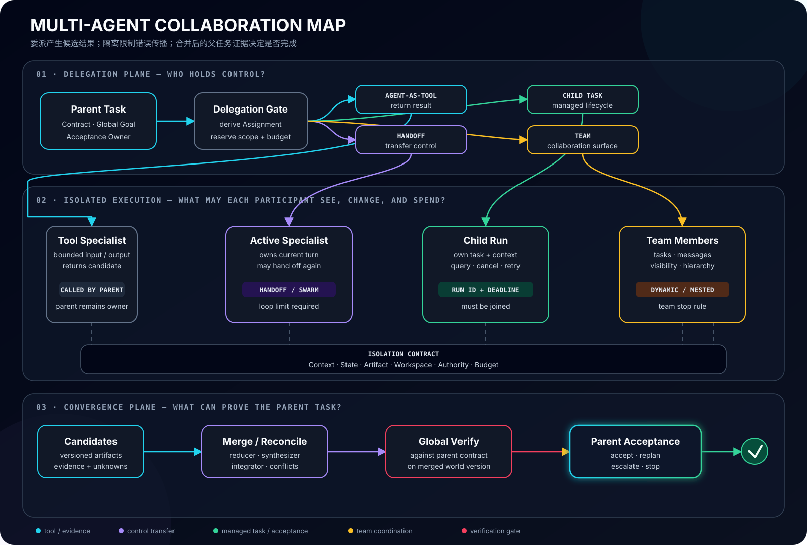

# 05｜Multi-Agent：委派、协作与团队收敛

在前四篇里，我们依次建立了 Agent 的[最小判定](01-agent-primer.md)、一次 Run 的[执行边界](02-agent-runtime-semantics.md)、Context / Session / Artifact 的[状态边界](03-agent-state-semantics.md)，以及 Goal、Plan 与 Completion 的[任务边界](04-agent-task-semantics.md)。当一个父任务被拆给多个 Agent 时，这些边界不会消失，反而必须被复制、收紧并重新汇合。

Multi-Agent 最容易被一张组织架构图误导：一个 Manager、三个 Specialist、一个 Reviewer，看起来已经像一支团队。可如果所有角色共享同一段 Context、同一可写 Workspace 和同一个停止判断，它们可能只是同一个 Agent 的多次模型调用；如果子 Agent 各自返回“完成”，父任务也仍可能因为结果冲突、版本漂移或缺少全局证据而失败。

本文采用的框架无关定义是：

> **Multi-Agent 不是多个模型调用或多个角色名，而是多个具有独立决策上下文或执行生命周期的参与者，在显式的任务、权限、通信和验收边界下，共同推进一个父任务。**

这个定义刻意不要求参与者使用不同模型，也不要求它们同时运行。两个相同模型实例只要拥有独立上下文、任务身份和生命周期，就可能构成 Multi-Agent；相反，把“研究员”“审核员”依次写进一个 Prompt，并不会自动形成真正的协作系统。

## 先问为什么拆：Multi-Agent 有一笔协调税

假设要判断一个新市场是否值得进入。把法规、技术可行性、竞品和风险证据分给相互隔离的研究 Agent，它们可以并行查找不同来源，再由一个综合者交叉验证。这里的收益来自并行探索、上下文隔离、专业工具和独立证据。

换成一次严格的数据迁移：创建新 Schema、回填、校验、切流，每一步都依赖前一步真实产生的世界状态。强行让多个 Agent 同时推进，不仅不能消除依赖，还会增加锁、回滚、版本对齐和沟通成本。这个任务更适合一个显式 Workflow，在个别可并行的调查或验证节点才委派 Agent。

可以用一个非精确但有用的决策式检查采用理由：

```text
Multi-Agent Value
= parallelism + context isolation + expertise
 + authority isolation + independent verification
 - communication + scheduling + state conflicts
 - merge rework + extra tokens + extra latency
```

只说“任务很复杂”还不足以采用 Multi-Agent。复杂任务可能更需要更好的工具、Context、计划或确定性工作流。至少有一项正收益能被验证，并且收益大于协调税，拆分才有意义。

### 五种真实收益

1. **并行性**：多个相对独立的搜索、分析或候选生成可以同时推进，缩短墙钟时间；
2. **上下文隔离**：不同参与者只加载与职责有关的信息，降低长上下文干扰和注意力竞争；
3. **专业能力**：参与者可以使用不同模型、Instructions、工具、知识源或执行环境；
4. **权限隔离**：研究者只读，执行者有限写，审批者没有执行凭据，降低单点越权面；
5. **独立验证**：验证者不继承生成者的结论和辩护轨迹，保留真正发现错误的机会。

这些收益不是免费的。并行分支可能重复检索同一材料，角色之间会损失隐含上下文，共享状态会出现写冲突，最后的合并还可能比独立执行更贵。[Google Research 对 Agent 系统扩展的实验](https://research.google/blog/towards-a-science-of-scaling-agent-systems-when-and-why-agent-systems-work/)也提示：任务是否可并行、工具使用方式和协调结构会显著改变多 Agent 的收益；顺序依赖强的任务并不会因为增加参与者自然变快。

### 先保留单 Agent 基线

Multi-Agent 设计必须和一个可运行的单 Agent 或确定性 Workflow 基线比较。至少记录：

- 端到端任务成功率，而不是子 Agent 的自报成功率；
- 墙钟时间与串行时间之和；
- 模型 Token、工具调用和基础设施成本；
- 分支重复工作、冲突与合并返工；
- 违反父任务约束或需要人工接管的比例；
- 多次 Trial 下的稳定性，而不是一次漂亮演示。

如果团队版本只让 Trace 更热闹，却没有改善任务级结果、延迟、风险或可恢复性，就应退回更简单的结构。

## 委派不是一种动作：四种语义必须分开

“调用另一个 Agent”至少可能表示四种不同契约。它们决定当前参与者是否继续持有控制权、子执行是否有独立身份、结果怎样返回，以及谁对最终答案负责。

| 委派语义 | 控制权 | 生命周期与结果 | 适合场景 | 最常见误用 |
| --- | --- | --- | --- | --- |
| **Agent-as-Tool** | 父 Agent 仍是当前决策者 | 像调用工具一样同步或受控等待，子 Agent 返回结果给父 Agent | 有清晰输入输出的专家咨询、翻译、检索、局部生成 | 把子 Agent 的自然语言结论当成已验证事实 |
| **Handoff / Transfer** | 当前会话的主动控制权转给目标 Agent | 接收者继续处理当前请求，原 Agent 通常不等待一个“函数返回值” | 分诊、跨专业接管、把用户带到更合适的 Agent | 用户以为仍在和原 Agent 协作，责任主体却已静默变化 |
| **Child Task / Task Run** | 父任务保留治理权，子任务独立运行 | 有独立 Task / Run ID，可查询、等待、取消、超时并返回 Artifact / Evidence | 长任务、后台并行、需要进度和恢复的工作 | 只 `spawn` 不 `join`，父任务提前完成，遗留孤儿执行 |
| **Team** | 由团队协议分配或转移 | 持续存在的成员、任务、消息、可见性和共同停止规则 | 多轮协作、动态成员、层级团队、共享任务板 | 把 Team 当名单，不定义成员可见性、冲突和团队完成条件 |

### Agent-as-Tool：专业能力，不是新的负责人

父 Agent 把结构化 Assignment 交给 Specialist，等待结果，再把结果纳入自己的计划。子 Agent 可以拥有独立 Context 和工具，但父 Agent 仍负责：

- 判断何时调用、调用几次以及是否并行；
- 校验返回的 Schema、来源和证据；
- 处理超时、失败或互相矛盾的结果；
- 合并产物并对父任务 Completion Contract 负责。

因此 Agent-as-Tool 最适合边界清晰的能力复用。若返回的是开放式自然语言，调用方仍要把它视为 **Candidate Result**，不能把“专家说完成了”直接升级为父任务证据。

### Handoff：转移的是主动权与责任表面

Handoff 更像客服分诊后的接管：路由 Agent 识别到请求属于退款领域，把当前会话交给 Refund Agent；后者读取被允许的历史并直接与用户继续交互。这里关键不是谁调用谁，而是：

- 接管后谁可以向用户承诺结果；
- 原 Agent 是否仍在栈中，能否取回控制权；
- 哪些 Context、权限、未决事项随交接移动；
- 用户是否能看到责任主体变化；
- Handoff 失败或目标拒绝时怎样回退。

**内部 Transfer 不等于用户可见 Handoff。** Runtime 可以在 Agent 之间切换执行，但产品仍以一个统一助手呈现；也可以显式告诉用户“已转交人工 / 专家 Agent”。控制拓扑和交互设计必须分别说明。

### Child Task：委派的是可管理的子契约

长时间研究、代码修改或后台数据处理不能只靠一次嵌套调用。父 Agent 应创建可寻址的 Child Task，写入[第 04 篇](04-agent-task-semantics.md)定义的派生契约：

```text
Child Assignment
= parent_task_id + parent_contract_version
 + derived_goal + allowed_scope + inherited_invariants
 + pinned_inputs + authority + budget + deadline
 + expected_artifacts + evidence_standard + acceptance_owner
```

子 Agent 可以在授权 Scope 内重写自己的 Plan，却不能降低父任务的不变量。子任务的 `completed` 只表示它到达自己的终态，不表示父任务已经接受结果。

### Team：协作容器，不是第五种拓扑

Team 通常提供成员目录、可见性规则、任务分配、消息或共享工作面、预算与团队级终止条件。它可以内部采用 Coordinator，也可以采用 Swarm、Graph 或层级 Team of Teams。因此 Team 更接近持久协作容器，不能和 Chain、Parallel、Swarm 平铺成同一层概念。

下图把四种委派方式放进同一条父任务生命周期：委派只产生候选结果；隔离边界保护执行；所有分支最终仍需经过合并、验证与父级验收。移动端可打开 [SVG 原图](../assets/images/multi-agent-collaboration-map.svg) 查看细节。



## 拓扑要分层选择：数据流、控制权和成员关系不是一回事

一个系统可能同时是“Graph + Coordinator + Team”：Graph 规定确定性阶段，Coordinator 在某个节点动态分派 Worker，Team 则管理成员与可见性。只用一个拓扑名描述整个系统，会把三种不同决策压扁。

### 第一层：确定性数据流

这一层回答**节点按什么依赖关系执行**：

- **Chain**：前一节点输出是后一节点输入，适合严格阶段化处理；
- **Parallel / Fan-out**：独立分支同时运行，随后 Fan-in；
- **Cycle**：生成—评审—修订反复执行，但必须有停止条件；
- **Graph**：用显式节点、边、条件路由和状态转换表达复杂控制流。

这些结构本身不要求每个节点都是 Agent。一个 Graph 可以混合确定性函数、工具、Human Approval 和 Agent 节点。Graph 的检查点、恢复、边条件和调度实现详见 [Graph Engineering](../engineering/graph-engineering.md)；在多 Agent 协作中，Graph 主要负责承载参与者之间的依赖和控制边界。

### 第二层：决策权怎样分配

这一层回答**谁决定下一位参与者和下一步工作**：

- **Coordinator / Manager–Worker**：中心 Agent 拆解、分派和综合；治理清晰，但可能成为瓶颈或单点偏见；
- **Handoff Chain / Swarm**：当前 Agent 根据局部判断把控制权交给下一位；响应灵活，但更难保证全局进度和停止；
- **Peer / Blackboard**：成员读取任务板或共享产物，领取、发布和修订工作；能动态协同，但需要更强的所有权和冲突协议；
- **Dynamic Workflow**：模型根据当前任务生成或选择临时工作流，再由受控执行器运行；适合结构事先未知但动作集合可治理的任务。

中心化不是“低级”，去中心化也不是“更智能”。当父任务约束严格、错误代价高或需要统一验收时，中心化控制通常更容易限制错误传播；当路由信息只在局部参与者手里、领域边界清晰时，Handoff 可能更自然。

### 第三层：成员怎样组织

这一层回答**参与者集合是否固定、能否嵌套**：

- **静态成员**：启动前注册全部 Agent，能力和权限易于审计；
- **动态 / Lazy Member**：运行时按描述发现或创建 Agent，节省初始 Context，但必须冻结版本与来源；
- **Hierarchy / Team of Teams**：上层只与子团队负责人交互，控制 Context 和扇出；
- **临时成员**：为一个子任务创建，结束后销毁凭据、Workspace 和资源。

层级团队可以控制单个 Manager 的 Context 压力，却不会消除协调成本；它只是把成本分层。动态成员也不等于任意 Agent 都可加入：发现、实例化、授权和纳入当前任务是四个独立步骤。

### 用任务性质选结构

| 任务性质 | 首选结构 | 原因 | 需要重点防护 |
| --- | --- | --- | --- |
| 严格顺序、状态依赖强 | Chain / 显式 Graph | 依赖和恢复点可见 | 不要伪并行；每步校验真实世界版本 |
| 多个独立证据源 | Parallel + Reducer | 并行收益真实，易做来源隔离 | 重复检索、证据相关性和合并偏差 |
| 开放式拆解、子任务可独立验收 | Coordinator–Worker | 父级可以动态分派并统一验收 | Manager 瓶颈、错误拆解和上下文爆炸 |
| 请求在专业域之间自然流转 | Handoff / Swarm | 局部 Agent 最清楚下一责任方 | 循环转交、责任漂移、权限随交接泄漏 |
| 候选需要反复改进 | Generator–Critic Cycle | 反馈可以转化为下一轮行动 | 共享偏见、无进展循环、成本失控 |
| 参与者很多且可分层聚合 | Hierarchy / Team of Teams | 限制扇出和 Context 面积 | 层间信息损失、局部成功掩盖全局失败 |

## 协作契约：角色之外还有六条硬边界

“你是资深研究员”只是 Prompt 中的行为提示。工程角色应由**责任、允许输入、可执行动作、拥有的产物和验收义务**定义。真正决定协作可靠性的，是下面六条边界。

| 边界 | 必须显式定义 | 典型事故 | 工程控制 |
| --- | --- | --- | --- |
| **Context** | 子 Agent 可见哪些指令、历史、证据与其他成员结论 | 全量复制历史导致噪声和立场污染 | 最小 Context Projection、来源标记、独立评审盲区 |
| **State** | 私有 Run State、Session、共享状态分别由谁读写 | 并行成员覆盖同一字段，最后写入者“获胜” | Namespace、Owner、Version、Compare-and-Set、事件化更新 |
| **Artifact** | 交付物名称、Schema、版本、Provenance 与不可变引用 | “final.md”被后续分支覆盖，父级验收错版本 | 内容摘要 / Commit 固定、Manifest、只传引用不传模糊文件名 |
| **Workspace** | 是否共享文件系统、分支、数据库快照或浏览器状态 | 两个 Coding Agent 同改一个工作树并互相踩写 | 独立 Worktree / Sandbox、明确合并者、冲突检测 |
| **Authority** | 可用工具、数据、凭据、网络、审批和副作用范围 | 只读 Reviewer 实际继承了执行者的写权限 | 最小权限、短期凭据、Capability Delegation、确定性策略 |
| **Budget** | Token、时间、工具调用、并发、深度与重试额度 | 子 Agent 递归创建子 Agent，成本无界扩散 | 预算树、扇出上限、深度限制、Deadline 继承 |

### Context 隔离既是效率手段，也是验证手段

并不是所有成员都应该看到彼此的完整推理和结论。让 Reviewer 先独立读取需求、产物和原始证据，再看作者摘要，往往比“请检查上面这份自信的分析”更能发现问题。独立性并非绝对：Reviewer 仍需要父任务 Contract 和待验收 Artifact，但不需要继承生成者所有中间辩护。

Context 中还要区分：

- **Authoritative Input**：父契约、Policy、固定版本的事实源；
- **Working Hypothesis**：某个成员当前推断，可被推翻；
- **Peer Message**：其他成员的候选结论，不自动成为事实；
- **Evidence Reference**：可追溯到工具回执、URL、Commit 或数据快照；
- **Coordination Metadata**：任务状态、Owner、Deadline、依赖和阻塞原因。

如果 Peer Message 一进入共享历史就被当作事实，错误会以“团队共识”的形式快速放大。

### 共享状态应该少，Artifact 应该明确

共享一个巨大的可变 State 看起来方便，实际很难回答谁写了什么、覆盖是否合理以及恢复时相信哪个版本。更稳妥的默认是：

1. 每个成员保留私有 Run State；
2. 用版本化 Assignment、Message 和 Artifact 交换边界结果；
3. 共享层只保存任务注册、依赖、租约、Artifact 引用与少量团队事实；
4. 只有明确 Reducer 的字段允许并发合并；
5. 每次合并保留 Provenance，而不是把来源压成一段新文本。

对 Coding Agent，**多个 Agent 不应默认共享一个可写工作树**。独立 Worktree 或 Sandbox 能把局部修改、命令副作用和验证证据绑定到明确版本；最后由指定 Integrator 合并。共享 Branch 只适合对写入区域有硬性划分且冲突协议清楚的场景。

### Authority 不能只写在角色提示词里

“你是只读研究员，请不要修改文件”是软约束，不是权限边界。真正的只读角色应拿不到写工具或写凭据，文件系统和网络策略也应确定性限制其作用域。[tRPC-Agent-Go 的 Explorer 示例](https://trpc-group.github.io/trpc-agent-go/zh/multiagent/)把只读行为放进 Agent 指令有助于表达意图，但生产系统仍需由工具集、Sandbox 和 Policy 执行边界。

## Team Runtime：创建参与者只是开始

单 Agent Runtime 管理一个 Run 的开始、暂停和结束；Team Runtime 还要管理父子关系、并发和部分失败。一个可靠的团队生命周期至少包含：

```text
derive assignment
→ reserve authority and budget
→ spawn / dispatch
→ observe progress and heartbeats
→ collect terminal result and artifacts
→ reconcile partial effects
→ merge and verify
→ accept, retry, compensate, or escalate
```

### 同步、异步和后台不是性能开关

- **同步调用**：父执行等待子结果，控制简单，但会占住调用栈并放大长尾延迟；
- **并发等待**：多个子任务同时运行，父级在 Join Barrier 收集结果；必须定义 `all`、`any`、`quorum` 或 Deadline；
- **异步 / Background**：父级获得 Task ID 后可以继续、暂停或返回用户；必须有持久状态、查询、通知、取消和过期清理；
- **Detached**：父级不等待也不负责结果，通常不应成为任务型 Agent 的默认委派语义。

一次 `spawn()` 成功只说明调度请求被接受。只有子任务进入可查询状态、权限和预算已绑定、父级保存关联 ID，委派才具有恢复意义。

### Cancel、Timeout 和 Retry 必须沿任务树传播

父任务取消时，Runtime 需要决定：

- 尚未启动的 Child Task 是否撤销；
- 正在运行的子任务是否收到协作式 Cancel；
- 已提交的外部副作用怎样查询、保留或补偿；
- 已完成 Artifact 是否保留供审计；
- 下层新建任务是否被 Deadline 和预算截断。

取消不是回滚，团队取消更不是瞬间消失。父级进入 `Cancelled` 前至少要知道哪些子任务已经确认停止、哪些仍处于 Unknown Effect、哪些无法中断只能标记为孤儿并交给 Reaper 处理。

Retry 也应发生在正确层级：

- 可重试的工具调用由子 Run 在幂等边界内重试；
- 子任务失败但 Contract 未变，可以创建新 Attempt；
- 拆解本身错误，应由父级修改 Assignment，而不是让子 Agent 无限重试；
- 全局结果冲突，需要回到 Merge / Verification，而不是重跑所有成员碰碰运气。

### 部分失败是常态，不是异常分支

Fan-out 十个研究任务，八个成功、一个超时、一个来源不可访问，父级不一定要把整个任务标为失败。它应按 Completion Contract 决定：

- 已收集证据是否足以覆盖所需范围；
- 缺失分支是可降级、可替代还是必须阻塞；
- 是否允许用新 Agent 接管同一 Assignment；
- 旧分支稍后返回时是丢弃、纳入新版本还是触发重新验收。

因此团队结果不应只有 `success: true/false`。至少需要已完成项、缺失项、失败原因、Artifact 版本、未决副作用和覆盖度。

### 预算必须是一棵树

父任务的 100k Token、30 分钟和 20 次外部查询，不能被每个子 Agent 各自完整继承。父级应分配或保留额度，并在 Join 时核算实际消耗：

```text
parent_budget
= reserved_for_children + spent_by_parent + unallocated_buffer
```

嵌套 Team 还需要最大深度、最大并发、每层 Handoff 次数和全局 Deadline。否则局部 Agent 都“没有超预算”，团队总量却已经失控。

## 合并与验收：团队共识不等于正确

Multi-Agent 的核心难点不是让成员说话，而是把多个不完整、可能相关甚至冲突的候选结果变成可验收的父任务产物。

### Artifact-first，而不是 Transcript-first

完整对话适合诊断，不适合作为唯一协作接口。子 Agent 最好交付：

- 符合 Schema 的结构化 Result；
- 版本固定的 Artifact；
- Evidence Manifest：来源、观察时间、适用 Scope 和校验方式；
- 未解决问题、假设和置信限制；
- 实际消耗、终态和未决副作用。

父级可以按需读取 Transcript，却不应通过猜测自然语言聊天记录来恢复子任务承诺。

### Merge 是显式策略

不同任务需要不同合并器：

- **Reducer**：按可结合规则聚合计数、集合或结构化条目；
- **Ranker**：用预定标准对候选排序，但要防止 Judge 偏差；
- **Synthesizer**：把互补证据组织成整体，同时保留来源；
- **Integrator**：合并代码、配置或数据变更，并解决真实冲突；
- **Verifier**：对合并后的新版本重新执行测试、规则或环境检查；
- **Human Gate**：对高风险、主观或证据不足的结果做最终判断。

投票只适用于候选相对独立、问题有明确答案且多数机制合理的场景。五个 Agent 使用同一模型、同一 Context 和同一错误来源达成一致，并不是五份独立证据。

### 父任务只能在全局验收后完成

一个最小的协调循环可以写成：

```python
assignments = derive(parent_contract, topology, budgets)
handles = spawn_isolated(assignments)
results = collect(handles, deadline=parent_contract.deadline)

candidate = reconcile_and_merge(results)
evidence = verify(candidate, against=parent_contract)
verdict = accept(parent_contract, candidate, evidence)

if verdict.is_unknown:
    escalate_or_replan(verdict.missing_evidence)
return verdict
```

这里最重要的不是 API 名，而是顺序：**先派生子契约，再隔离执行；先合并真实 Artifact，再验证合并后的版本；最后由父任务验收。** 子 Agent 的 Final Message、Team 的共识、Reducer 的输出都只能是 Completion Candidate。

### 评测对象必须升级到团队

除了单 Agent 常见的 Outcome、Trajectory、Policy 和成本，还要增加：

- **Decomposition Quality**：子任务是否可独立推进，接口是否完整；
- **Coordination Overhead**：消息、等待、重复工作和合并时间占比；
- **Isolation Quality**：Context / Workspace / Authority 是否真的分离；
- **Merge Quality**：冲突是否被发现，来源和不确定性是否保留；
- **Error Amplification**：一个错误会传播给多少成员，中心控制能否截断；
- **Recovery Quality**：父子 Run 在取消、Worker 丢失和重复投递后能否收敛。

[Anthropic 的多 Agent Research 系统复盘](https://www.anthropic.com/engineering/multi-agent-research-system)强调并行研究、持久 Artifact、完整 Trace 和面向最终结果的评测；其[并行构建 C 编译器的工程记录](https://www.anthropic.com/engineering/building-c-compiler)也展示了长任务中任务划分、共享代码和集成验证的真实成本。这些经验共同说明：团队吞吐必须和集成后的正确性一起衡量。

## 把框架能力放回统一坐标

框架使用相似名称表达不同层，也会用不同名称表达相似能力。下面的映射只说明主要语义，不宣称实现完全等价。

| 能力面 | tRPC-Agent-Go | 其他代表性实现 | 应怎样理解 |
| --- | --- | --- | --- |
| 专家嵌套调用 | `AgentTool`、SubAgent、动态 / Lazy Agent | OpenAI manager 的 agents-as-tools；Claude Code subagent | 父 Agent 保留控制权，子结果返回父级；动态发现还需版本与权限治理 |
| 主动权转移 | Transfer、跨轮接管、Swarm | OpenAI Handoff；AutoGen Swarm | 改变当前决策者，不等于创建可后台管理的 Child Task |
| 可管理子任务 | Task Run 的运行、查询、等待与取消 | A2A Task；Coding Agent 后台子任务 | 独立生命周期、身份和终态，需要父级 Join 与验收 |
| 团队容器 | Team Coordinator、Swarm、层级 Team、动态成员与可见性 | AutoGen Team；Claude Code agent teams | 成员、任务、消息和停止规则的协作表面，可承载不同拓扑 |
| 确定性组合 | ChainAgent、ParallelAgent、CycleAgent | Workflow / Graph 中的顺序、并行和循环节点 | 描述数据流，不代表每个节点都具备自治 |
| 动态编排 | Dynamic Workflow | 模型生成受限计划，再由执行器运行 | 动态产生结构与自由执行代码不同，仍需工具、并发和预算限制 |
| 显式状态图 | Graph Agent | LangGraph 等 Graph Runtime | 节点、边、状态与恢复由图协议管理，适合强依赖和可恢复流程 |

[tRPC-Agent-Go 的 Multi Agent 文档](https://trpc-group.github.io/trpc-agent-go/zh/multiagent/)把 SubAgent、AgentTool、Transfer、Chain / Parallel / Cycle 和动态发现放在一个能力入口；[Team](https://trpc-group.github.io/trpc-agent-go/zh/team/)补充 Coordinator、Swarm、层级与成员可见性；[Task Run](https://trpc-group.github.io/trpc-agent-go/zh/taskrun/)则把可管理后台任务从同步专家调用和当前轮交接中分离出来。[Dynamic Workflow](https://trpc-group.github.io/trpc-agent-go/zh/dynamic-workflow/)与[Graph Agent](https://trpc-group.github.io/trpc-agent-go/zh/graph/)进一步说明，运行时生成的临时编排和显式状态图也不是同一抽象。

[OpenAI Agents SDK](https://openai.github.io/openai-agents-python/multi_agent/)明确区分 manager 通过 tool 调用专家与 Handoff 转交控制权；[AutoGen Teams](https://microsoft.github.io/autogen/stable/user-guide/agentchat-user-guide/tutorial/teams.html)展示了 selector、round-robin、swarm 等团队协作；[A2A](https://a2a-protocol.org/latest/topics/key-concepts/)则在跨服务互操作层定义 Agent Card、Message、Task、Artifact 和更新机制。它们解决的层次不同：SDK 组织进程内 Agent，Team Runtime 管理协作，A2A 让远端参与者交换任务与产物。协议可连接边界，却不会替应用定义父任务怎样拆解和验收。

无论具体框架怎样命名，层次仍不能混淆：Model 提供推理与生成能力；Agent Runtime 驱动单参与者闭环；Workflow / Multi-Agent 组织控制流与协作；Harness 提供 Workspace、工具、权限和交互表面；垂直应用与平台再把它们固化为领域产品。

## Multi-Agent 设计检查

面对一套多 Agent 方案，可以依次问：

1. **采用理由是什么**：收益来自并行、隔离、专业、权限还是独立验证？单 Agent 基线是多少？
2. **参与者是否真的独立**：是否拥有独立决策 Context 或执行生命周期，而不只是角色 Prompt？
3. **委派语义是哪一种**：Agent-as-Tool、Handoff、Child Task 还是 Team？谁持有主动权？
4. **子契约能否追溯**：父版本、派生 Goal、继承约束、输入版本、预算、Artifact 和验收者是否明确？
5. **拓扑分层了吗**：数据流、决策权和成员组织是否被混成一个名词？
6. **隔离边界在哪里**：Context、State、Artifact、Workspace、Authority 与 Budget 分别怎样约束？
7. **生命周期能否闭合**：Spawn、Join、Cancel、Timeout、Retry、Partial Failure 和 Orphan 谁负责？
8. **共享事实怎样形成**：Peer Message 怎样经过来源校验后才能进入共享状态？
9. **Merge 策略是什么**：Reducer、Ranker、Synthesizer、Integrator 或 Human Gate 依据什么工作？
10. **验证是否针对合并版本**：子分支证据能否证明最终 Artifact，冲突后是否重新验证？
11. **团队何时算完成**：谁对父 Completion Contract 做全局 Verdict？Unknown 怎样升级？
12. **复杂度是否值得**：成功率、延迟、成本、错误传播和恢复性相对基线是否真的改善？

## 结论

Multi-Agent 的价值不是“拥有更多智能”，而是把一个任务的决策面拆成多个可治理的执行边界。拆分只有在并行性、上下文隔离、专业能力、权限隔离或独立验证产生可测收益时才成立。

真正可靠的协作遵循一条完整链路：

```text
Parent Contract
→ Delegation Semantics
→ Child Assignments
→ Isolated Execution
→ Versioned Artifacts and Evidence
→ Explicit Merge
→ Global Verification
→ Parent Acceptance
```

Agent-as-Tool、Handoff、Child Task 和 Team 决定控制权与生命周期；Chain、Parallel、Graph、Coordinator、Swarm 和 Hierarchy 处在不同拓扑层；Context、State、Artifact、Workspace、Authority 与 Budget 决定错误能传播多远；最后的 Merge 与 Verification 决定团队是否真正收敛。

最值得保留的工程判断是：

> **子 Agent 可以完成自己的 Assignment，团队可以形成一致意见，但只有父任务针对合并后的真实世界版本完成验收，Multi-Agent 系统才有资格宣布完成。**

## 参考资料

- [Multi Agent — tRPC-Agent-Go](https://trpc-group.github.io/trpc-agent-go/zh/multiagent/)
- [Team — tRPC-Agent-Go](https://trpc-group.github.io/trpc-agent-go/zh/team/)
- [Task Run — tRPC-Agent-Go](https://trpc-group.github.io/trpc-agent-go/zh/taskrun/)
- [动态工作流 — tRPC-Agent-Go](https://trpc-group.github.io/trpc-agent-go/zh/dynamic-workflow/)
- [Graph Agent — tRPC-Agent-Go](https://trpc-group.github.io/trpc-agent-go/zh/graph/)
- [Multi-agent orchestration — OpenAI Agents SDK](https://openai.github.io/openai-agents-python/multi_agent/)
- [Handoffs — OpenAI Agents SDK](https://openai.github.io/openai-agents-python/handoffs/)
- [Subagents — Claude Code](https://code.claude.com/docs/en/sub-agents)
- [Agent teams — Claude Code](https://code.claude.com/docs/en/agent-teams)
- [Teams — Microsoft AutoGen](https://microsoft.github.io/autogen/stable/user-guide/agentchat-user-guide/tutorial/teams.html)
- [A2A Key Concepts](https://a2a-protocol.org/latest/topics/key-concepts/)
- [Towards a Science of Scaling Agent Systems — Google Research](https://research.google/blog/towards-a-science-of-scaling-agent-systems-when-and-why-agent-systems-work/)
- [How we built our multi-agent research system — Anthropic](https://www.anthropic.com/engineering/multi-agent-research-system)
- [Building a C compiler with a team of parallel agents — Anthropic](https://www.anthropic.com/engineering/building-c-compiler)
