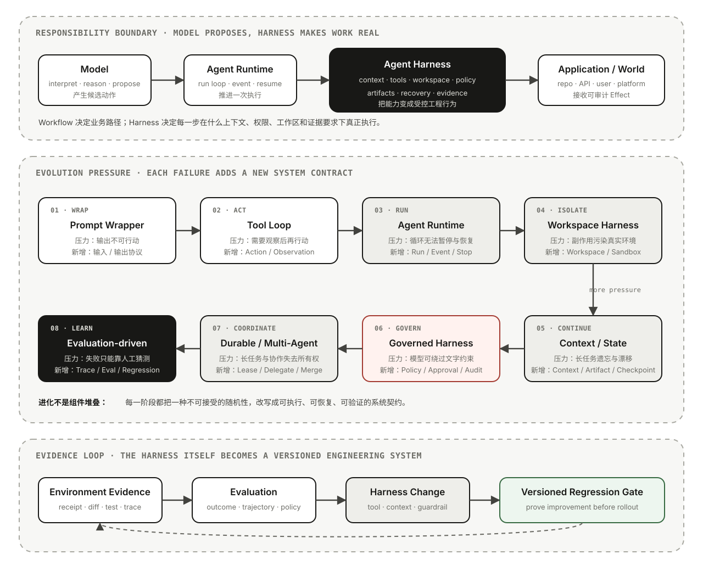

# 06｜Agent Harness 的进化：从 Prompt Wrapper 到可托付的执行系统

给同一个模型两套不同的运行环境，最终表现可能像两个不同的 Agent。

第一套环境只有一段 System Prompt、一个模型 API 和一个“请修复测试”的用户输入。模型能解释错误、生成 Patch，也可能自信地说任务已经完成；但它看不到真实仓库，不知道用户已有修改，更不能运行测试证明结果。

第二套环境会定位仓库、读取项目说明、建立隔离 Worktree、只暴露允许的文件和命令工具、把执行结果送回下一轮、在高风险动作前请求审批、在崩溃后恢复进度，并用真实测试和 Commit 固定完成证据。模型参数可以完全相同，系统可托付程度却已经改变。

造成差异的不是又一段更长 Prompt，而是模型周围的 **Agent Harness**。

Harness 不是行业统一标准类型。不同项目可能把它叫作 Agent、Runtime、SDK、Computer Interface、Middleware Stack 或 Super-Agent。本文不试图统一这些代码名称，而是给出一套工程坐标：

> **Agent Harness 是包围模型决策面的执行与控制环境。它装配模型当前能看到的 Context，定义可使用的 Action Space，把候选行动送入受控 Workspace，记录状态与 Artifact，承接暂停和恢复，并用环境反馈与评测判断系统是否仍在正确前进。**

它的进化也不是一张厂商发布日期表。真实系统会跳过某些阶段，也会把多个阶段一次实现。更有用的阅读方式，是追踪每一代形态背后的失败压力：上一代把什么假设留在 Prompt 或内存里，下一代又怎样把它变成可执行契约。

本文继续使用前五篇的 Coding Agent 任务：**修复仓库中失败的认证测试，保留用户已有修改，并提供可验证结果。**

## Harness 不是模型、Runtime 或产品的另一个名字

很多争论来自把不同责任都叫作“Agent”。先用一个责任矩阵固定边界：

| 层次 | 主要回答什么 | 典型责任 | 不能由它单独保证什么 |
| --- | --- | --- | --- |
| **Model** | 下一步建议做什么 | 理解输入、生成候选计划、选择工具、形成参数和结果候选 | 真实权限、持久状态、外部副作用与完成证明 |
| **Agent Runtime** | 一次执行怎样推进 | Run / Attempt、模型—工具循环、Event、Streaming、取消、暂停、预算与终态 | 完整 Workspace、领域工具、产品交互和组织治理 |
| **Agent Harness** | 模型在什么受控环境里工作 | Context 编译、工具接入、Workspace/Sandbox、Policy/Approval、Artifact、恢复、观测与验证 | 领域 Goal、业务规则和组织最终责任 |
| **Workflow / Multi-Agent** | 多个执行边界怎样组合 | 显式步骤、Graph、路由、并行、Handoff、Child Task、Merge | 每个节点内部天然可靠，或团队共识自动正确 |
| **垂直应用** | 为谁完成哪类任务 | Coding、Research、Data、Support 等领域对象、交互和验收 | 底层框架拥有相同语义，或产品标签能替代工程契约 |
| **产品与平台** | 怎样规模化交付和治理 | 身份、租户、计费、部署、队列、运营、团队与合规 | 模型因此获得更强推理能力 |

Runtime 更像 Harness 的时间内核：它让一次动态循环有身份、因果和终点。Harness 的边界更宽，它还要决定本轮给模型什么信息、工具在哪个环境执行、哪些动作必须拦截，以及状态和证据怎样进入下一次运行。具体实现可以把两者放在同一个包中，语义上仍值得分开。

Framework 则是交付形式，不是固定层次。LangChain 更接近组件层，LangGraph突出状态图和可恢复 Runtime；AgentScope 与 DeerFlow 已把 Workspace、工具、Memory、Middleware、服务或 UI 组合成更完整的 Harness；tRPC-Agent-Go 从小型 Agent/Runner 契约延伸到 Graph、Team、Workspace、协议、Evaluation 与服务适配。它们覆盖多宽，不改变上表的责任问题。

因此，Harness 的核心价值不是让架构图多一个盒子，而是保护这条链：

```text
Task Contract
→ Context Projection
→ Model Candidate
→ Authorization / Runtime Gate
→ Workspace Effect
→ Observation / State / Artifact
→ Verification
→ Next Decision or Completion
```

模型拥有候选决策权；Harness 让候选不能绕过控制面直接变成现实结论。

## 进化的判据：隐含假设是否变成了系统契约

Harness 的“成熟”不能按工具数量、Prompt 长度或 Agent 数量排序。每次进化至少要回答四个问题：

1. **失败压力是什么**：旧系统在哪类真实任务中失效？
2. **新增契约是什么**：它把哪个隐含假设固定成了接口、状态或门禁？
3. **残余风险是什么**：新能力仍然不能证明什么？
4. **复杂度成本是什么**：延迟、持久化、权限面、运维和评测成本增加了多少？

下图把本文使用的八种形态放在同一条压力链上。它们是工程原型，不表示所有项目都按相同顺序或年份演化。



移动端可打开 [SVG 原图](../assets/images/agent-harness-evolution.svg) 查看阶段、压力与新增契约。

| 形态 | 主要失败压力 | 新增的关键契约 | 新产生的成本 |
| --- | --- | --- | --- |
| Prompt Wrapper | 输出无法校准真实环境 | 输入、输出 Schema | Prompt 维护、解析与模型依赖 |
| Tool Loop | 一次调用不能根据结果调整 | Action / Observation / Stop | 工具错误、循环和副作用风险 |
| Runtime Protocol | 循环没有稳定身份和终态 | Run、Attempt、Event、Budget、Cancel | 状态机、事件和并发复杂度 |
| Workspace Harness | 抽象工具没有真实工作表面 | Workspace、Sandbox、Artifact | 环境启动、隔离、回收与供应链风险 |
| Context / State Continuity | 长任务丢失事实和进度 | Context Projection、Session、Checkpoint | 存储、压缩、迁移与一致性成本 |
| Governance Harness | 工具可用被误当成有权执行 | Capability、Policy、Approval、Credential | 策略管理、审批等待与密钥治理 |
| Durable / Multi-Agent | 单进程、单上下文和单参与者无法承载长任务 | Lease、Resume、Child Task、Isolation、Merge | 调度、冲突、预算树与部分失败 |
| Evaluation-driven Harness | 局部成功无法阻止版本回归和系统漂移 | Trace、Eval、Version、Rollout、Rollback | 数据集、判据、运营与变更治理 |

## 第一种形态：Prompt Wrapper 把模型接进应用

最薄的一层通常只有：固定 Instructions、用户输入、一次模型调用和输出解析。Structured Output、少量检索结果或固定示例也可以放入其中。它已经能完成分类、抽取、改写和候选生成，但控制路径仍由应用预先决定。

在测试修复案例里，它可以读到错误日志并返回 Patch：

```text
error log + selected source file
→ prompt
→ model
→ patch candidate
```

这里有三个隐含假设：调用方选对了文件，日志仍对应当前代码，Patch 可以在真实 Workspace 应用。模型无法验证任何一项。它生成的是**关于世界的候选描述**，不是世界已经改变的证据。

Prompt Wrapper 的价值不应被低估。对于单次、只读、低风险任务，它常常是更正确的架构。[Anthropic 的 Agent 构建经验](https://www.anthropic.com/engineering/building-effective-agents)也建议从满足需求的最简单方案开始，因为 Agentic 系统通常用更高延迟和成本换取灵活性。

真正推动下一步进化的，不是“单次调用不够炫”，而是任务的下一步必须依赖刚刚观察到的环境结果。

## 第二种形态：Tool Loop 让决策进入 Act–Observe 闭环

[ReAct](https://arxiv.org/abs/2210.03629)在 2022 年把推理、行动与环境观察交错组织起来：模型可以根据新证据维护或调整计划，行动又让推理不必封闭在模型自身生成的文本里。这类闭环把 Agent 从“生成一份方案”推进到“根据环境反馈继续决策”。

一个最小 Tool Loop 会增加：

- Tool Schema 与说明；
- 模型生成的 Tool Call Candidate；
- 参数解析与执行器；
- Tool Result 到 Observation 的封装；
- 再次决策或停止的循环。

测试修复于是变成：搜索代码、读取文件、编辑、运行测试、根据失败重新定位。模型不再依赖调用方一次选对全部 Context。

但 Tool Calling 只解决**怎样表达行动候选**。工具函数仍要回答：

- 参数是否符合 Schema 与当前资源版本；
- 读写工具能否并发；
- Shell 在哪个目录、用户和网络环境执行；
- 超时是失败、已受理还是结果未知；
- Tool Result 怎样关联原调用并进入下一轮；
- 模型连续选择同一失败动作时何时停止。

工具列表越长也不等于能力越强。重复工具会增加选择歧义，宽泛 Shell 会扩大权限面，低质量错误信息会让模型在错误假设上循环。Tool Loop 首次把“接口质量”变成模型表现的一部分。

## 第三种形态：Runtime 把临时循环变成执行协议

简单 Demo 可以把循环写在一个函数里，真实任务却会遇到 Streaming 断开、审批等待、模型或工具超时、用户取消、Worker 崩溃、预算耗尽和服务重启。如果没有稳定身份，系统无法判断下一次调用是在继续、重试还是新建任务。

因此 Runtime 引入 [02｜Run、Attempt 与 Event](02-agent-runtime-semantics.md)：

- Logical Run 固定一次因果执行；
- Attempt 区分崩溃或恢复前后的实际执行者；
- Event 表达输出、行动、状态增量和控制信号；
- Pause、Cancel、TimedOut、Failed、Stopped 与 Completed 保留不同语义；
- Budget、Deadline 和最大模型/工具调用成为确定性止损线。

Runtime 解决的不是“循环次数更多”，而是循环能否被上层可靠消费。OpenAI 对 [Codex agent loop](https://openai.com/index/unrolling-the-codex-agent-loop/)的拆解把 Harness 描述为协调用户、模型和工具的核心执行逻辑；后续 [Codex App Server](https://openai.com/index/unlocking-the-codex-harness/)又把 Thread 生命周期、持久化、配置、认证、Sandbox 工具和扩展放进同一运行面，并通过双向事件协议提供给不同客户端。

测试修复任务现在可以流式展示搜索、编辑和测试进度，也可以在写入前暂停等待审批。但“HTTP 请求结束”“最后一个 Token 到达”“Run 进入终态”“状态持久化完成”和“客户端消费完事件”仍是不同时间点。

Runtime 也没有自动解决 Workspace。它知道一次 Tool Call 属于哪个 Run，却不一定知道命令修改了哪个代码版本，或者两个并行 Run 是否正在写同一目录。

## 第四种形态：Workspace Harness 给 Agent 一台可治理的计算机

Agent 的 Action Space 从几个查询 API 扩展到文件、Shell、浏览器和代码执行后，最重要的接口不再只是函数名称，而是**整个工作环境**。

[SWE-agent](https://arxiv.org/abs/2405.15793)在 2024 年提出 Agent–Computer Interface（ACI）：面向 Agent 重新设计代码导航、文件编辑和命令反馈，可以显著改变软件工程 Agent 的行为与表现。这个结论比“多提供几个工具”更深：模型能否有效行动，取决于环境怎样把状态、动作和反馈呈现给它。

Workspace Harness 至少固定：

```text
workspace_id
+ source_version / base_commit
+ filesystem root and writable paths
+ process / network / resource policy
+ installed tools and runtime versions
+ environment variables / secret handles
+ artifact export rules
+ cleanup and retention policy
```

在 Coding Agent 中，独立 Worktree 或 Sandbox 把修改与一个明确基线绑定。浏览器 Agent 则需要页面、身份、下载目录、网络和截图/DOM 观察边界。Data Agent 可能需要隔离 Notebook、数据快照和输出目录。它们共享的不是某个容器产品，而是“行动发生在哪个可寻址环境”的契约。

Sandbox 也不是一个可信布尔值。Local Workspace、容器、MicroVM 和远端执行器拥有不同隔离强度；文件隔离不自动限制网络，进程限制不自动防止凭据泄漏，临时环境也不等于输入依赖可信。Harness 必须表达实际能力，而不是只记录 `sandbox=true`。

Artifact 同样在这一阶段成为一等对象。Patch、测试日志、截图、报告和构建产物需要版本、Hash、生产 Run 与来源 Workspace，而不只是聊天里的一段文本。只有这样，验证者才能回答“这份测试日志证明的是哪个提交”。

## 第五种形态：Context 与 State 让长任务保持连续但不伪造事实

当任务跨越几十次模型调用、多个用户回合甚至多个进程时，把全部历史不断追加到 Prompt 会同时遇到窗口、成本、噪声和权限问题。更长 Context 只能推迟边界，不能定义哪些信息值得保留。

Harness 因而开始编译每次决策的 Context：

```text
Context Frame
= select and transform(
    task contract,
    project instructions,
    session history,
    run state,
    workspace observations,
    retrieved memory / knowledge,
    artifact metadata,
    available tools and policies,
)
```

这里的关键字是 `select and transform`。Context 是有损投影，不是事实库。[03｜状态边界](03-agent-state-semantics.md)已经区分 Run State、Session、Memory、Checkpoint、Artifact 与外部 World；Harness 的责任，是让这些来源按当前决策重新装配，而不是让压缩摘要反向覆盖它们。

OpenAI 对 Codex loop 的说明展示了 Instructions、Sandbox、Approval Mode、工作目录、工具和项目说明怎样共同进入模型输入，并在窗口接近上限时进行 Compaction。Anthropic 的[长任务 Harness 复盘](https://www.anthropic.com/engineering/effective-harnesses-for-long-running-agents)则给出另一条重要证据：即使具备自动压缩，跨多个 Context Window 的 Agent 仍可能尝试一次做太多，或在后续会话误判整体任务已经完成；显式进度 Artifact、增量工作和干净交接仍然必要。

因此，长任务连续性不是“模型记得更多”，而是三种能力的组合：

1. **重建决策输入**：知道当前模型为什么看到这些信息；
2. **恢复执行位置**：知道哪些状态和行动已经提交；
3. **重新校准现实**：知道 Workspace、Artifact 和外部系统是否仍与旧快照一致。

Checkpoint 只完成第二项的一部分。它不能自动回滚邮件、支付、Git Push 或数据库写入；恢复前仍要查询 Effect Receipt，并在结果未知时 Reconcile。

## 第六种形态：治理把“工具可见”与“行动获准”分开

早期 Harness 常把治理写成 System Prompt：“不要访问敏感文件”“执行删除前询问用户”。这些说明有助于模型形成合适候选，却不能阻止错误输出被真正执行。

生产 Harness 必须把软提示升级为确定性控制：

- Principal 与代表关系说明谁在行动；
- Capability 限定当前 Run 可执行的 Action 和 Resource；
- Policy 根据组织、环境和风险返回 Allow、Deny 或 Obligation；
- Approval 绑定稳定 Action、参数、资源版本和有效期；
- Secret Broker 在执行点注入短期 Credential，而不是把明文放入 Context；
- Tool Proxy、Filesystem、Process 和 Network Policy 执行最终边界。

完整授权模型见 [07｜Agent 的授权边界](07-agent-authorization-semantics.md)。在 Harness 进化主线中，需要带走的是：**模型可以提出超出当前 Capability 的需求，却不能自行扩大 Capability。**

测试修复任务里，用户允许写当前 Worktree，不代表允许 Push 远端；Harness 持有可用 Git Token，也不代表本次 Task 获得对应权限；审批一次删除候选，也不代表后续所有删除都被允许。

治理会增加交互和配置成本。过细审批让用户疲劳，过宽工具让最小权限失效，静态 Policy 又可能无法表达参数和世界版本。成熟做法不是“所有动作都询问”，而是按只读/可逆/高风险、资源范围、证据和撤销能力设计分级门禁。

## 第七种形态：Durable 与 Multi-Agent Harness 管理所有权、隔离与汇合

单个进程中的长循环无法可靠承载小时或天级任务。一个 Run 可能等待外部系统、跨 Worker 恢复，或派生多个 Child Task。此时 Harness 需要从“执行一个 Agent”进化为“管理一棵可恢复的执行关系”。

核心新增能力包括：

- 持久 Run / Child Task 身份与可查询状态；
- Queue、Lease、Heartbeat 与 Fencing，防止 Zombie Attempt 继续提交；
- Checkpoint、Pending Effect 与版本兼容校验；
- Deadline、Cancel、Retry 和 Revocation 沿任务树传播；
- 每个参与者独立 Context、Workspace、Capability 与预算；
- 版本化 Artifact、显式 Merge 和父级 Completion Verdict。

[05｜Multi-Agent](05-multi-agent-collaboration.md)解释了 Agent-as-Tool、Handoff、Child Task 和 Team 的差异。Harness 在这里负责把每个参与者真正变成隔离执行边界，而不只是创建更多角色 Prompt。

例如两个 Coding Agent 并行调查认证失败，可以各自在独立 Worktree 读取和实验，再由一个 Integrator 合并。若两者共享同一可写目录，它们不是提高了并行度，而是在制造不可归因的状态竞争。子 Agent 都返回 `success`，父任务也必须针对合并后的 Commit 重新运行测试。

Durable 同样不是“保存了 Session”。只有消息历史，新的 Worker 可以继续聊天，却不知道 Tool Call 是否已受理、哪个 Attempt 仍有提交权、旧 Checkpoint 对应哪套 Tool/Prompt/State Schema。精确恢复的顺序仍应是：

```text
Load → Validate Versions → Reconcile Effects
→ Acquire Ownership → Continue → Re-verify
```

复杂度在这一阶段增长最快。调度、存储、租约、队列和冲突解决都可能比模型调用更难；如果任务只有短暂、严格顺序的几个步骤，显式 Workflow 或单 Agent 往往更合适。

## 第八种形态：Evaluation-driven Harness 把一次成功变成可控演进

一个 Harness 在当前模型和任务上成功，不代表修改 Prompt、模型、Tool Schema、Context Policy、Skill 或 Sandbox 后仍然正确。Agent 行为是这些版本共同作用的结果：

```text
Behavior Candidate
= model release
+ instructions / prompt version
+ context policy
+ tool and skill versions
+ runtime / harness configuration
+ task and world state
```

因此，Harness 继续加入 Observability 与 Evaluation：

- Event 保留业务运行事实，Trace 用于诊断决策和延迟；
- Outcome Eval 检查真实结果，Trajectory Eval 检查路径、Policy 与成本；
- 测试集、模拟环境和 Tool Mock 复现关键场景；
- Runtime Fingerprint 让结果可以归因到具体版本组合；
- 变更先生成 Candidate，经离线验证、灰度、监控后发布；
- 回归或风险上升时能够回滚 Prompt、Tool、Skill 或 Policy。

OpenAI 的 [Harness Engineering](https://openai.com/index/harness-engineering/)复盘把 Repository Knowledge、结构化计划、机械化架构约束、独立 Worktree、可供 Agent 查询的日志/指标/Trace 和持续“垃圾回收”连接为一个反馈系统。关键不是照搬某个仓库布局，而是让任务要求、环境状态和质量信号对 Agent **可读**，让重要不变量对执行 **可强制**，让退化对团队 **可发现**。

这也是“自进化”最需要收紧的地方。一次成功轨迹只能产生 Change Candidate，不能直接把自身写入长期 Memory、发布成 Skill 或修改 Policy。受控演进应遵循：

```text
Observation / Trace
→ Evaluation
→ Change Candidate
→ Offline Validation
→ Controlled Rollout
→ Monitor
→ Promote or Roll Back
```

Harness 的进化终点不是移除人类和控制，而是把人类判断放在更高杠杆的位置：定义目标和不变量、建设反馈系统、审查高风险变化，并让可重复判断由机器稳定执行。

## 一条贯穿全部阶段的 Harness Contract

不同 Harness 不需要实现同名接口，但可以用下面的伪结构检查责任是否闭合：

```python
class HarnessContract:
    task: VersionedTaskContract
    run: RunIdentity
    model: ModelRelease
    context_policy: VersionedContextPolicy
    workspace: WorkspaceLease
    capabilities: CapabilityEnvelope
    tools: list[VersionedTool]
    state_services: StateServices
    limits: BudgetAndDeadline
    verification: CompletionPolicy


async def execute(h: HarnessContract) -> RunOutcome:
    while h.limits.allow_next_step():
        context = compile_context(h)
        candidate = await decide(h.model, context)

        if candidate.is_final:
            verdict = await verify(candidate, h.verification, h.workspace)
            if verdict.satisfied:
                return Completed(verdict.evidence)
            record_observation(verdict.as_observation())
            continue

        action = normalize_and_validate(candidate.action, h.tools)
        decision = authorize(action, h.capabilities, h.task, h.workspace)
        if decision.requires_approval:
            return Paused(checkpoint(h, pending=action))
        if not decision.allowed:
            record_observation(decision.as_observation())
            continue

        receipt = await dispatch(action, workspace=h.workspace)
        commit_event(receipt)
        reconcile_if_unknown(receipt)

    return Stopped(reason="budget_or_deadline")
```

这段代码没有把所有能力塞进一个巨型类，而是在揭示每次真实行动必须同时绑定：任务版本、执行身份、模型与配置、Context 策略、Workspace、Capability、Tool 版本、预算和完成证据。

只保存 Transcript 无法重建这些条件。只记录最终答案也无法判断结果来自更强模型、更好工具、更宽权限，还是一次幸运轨迹。

## Harness 越完整，不代表系统越正确

Harness 的每次进化都扩大了可解决任务，也扩大了故障面：

| 反模式 | 看起来拥有的能力 | 实际缺口 |
| --- | --- | --- |
| Giant Prompt Harness | 所有规则都写进 Instructions | 无法机械校验、容易过期、挤占 Context |
| Tool Zoo | 工具和 MCP Server 数量很多 | 选择歧义、供应链风险、权限与错误语义不清 |
| Sandbox Checkbox | 配置了容器或远端执行器 | 文件、网络、凭据、进程和资源边界未分别验证 |
| Session-as-Durability | 保存完整聊天历史 | 没有控制位置、Attempt 所有权和 Pending Effect |
| Checkpoint-as-Transaction | 可以恢复 Graph / State | 外部写入仍可能重复、未知或需要补偿 |
| Trace-as-Evidence | 轨迹非常完整 | 观察执行过程不等于 Goal 已在真实世界满足 |
| Multi-Agent by Default | 角色与并行调用很多 | 协调税、共享错误、Workspace 冲突和合并返工 |
| Online Self-Modification | Agent 自动改 Prompt/Skill/Memory | 没有离线评测、权限门禁、灰度和回滚 |

短文本生成可能只需要 Prompt Wrapper；固定审批流程更适合确定性 Workflow；读取多个独立来源的研究任务可能值得 Tool Loop 或并行 Agent；修改代码、操作浏览器和产生真实副作用的长任务才需要更完整的 Workspace、治理、恢复和验证。

可以用一个非精确但实用的判断式控制复杂度：

```text
Harness Upgrade Value
= new solvable tasks
+ measurable success / recovery gain
+ reduced human attention and risk
- latency, cost and operational burden
- larger capability and failure surface
```

如果增加一层能力后，没有可测的任务成功率、恢复性、风险或人工时间收益，就不应因为“更 Agentic”而保留它。

## Harness 成熟度检查

面对一个 Agent Framework、Coding Agent 或垂直产品，可以依次问：

1. **决策权在哪里**：模型动态决定哪些行动，哪些步骤仍由 Workflow 固定？
2. **Context 怎样形成**：当前输入来自哪些事实源，经过什么选择、压缩与权限过滤？
3. **工具是否可治理**：Schema、错误、并发、安全属性和版本是否明确？
4. **行动发生在哪里**：Workspace 是否有稳定身份、基线、隔离、资源和回收规则？
5. **谁有权执行**：Principal、Capability、Policy、Approval 和 Credential 是否在执行点重验？
6. **运行怎样被识别**：Run、Attempt、Event、Deadline、Pause 与终态是否有稳定语义？
7. **状态怎样连续**：Session、Run State、Memory、Checkpoint 与 Artifact 是否各守边界？
8. **崩溃后怎样继续**：是否先校验版本和外部 Effect，再获取新的执行所有权？
9. **多 Agent 怎样隔离**：Context、Workspace、Capability、Budget 与 Artifact 是否真正分离？
10. **完成由什么证明**：Final Message、测试、环境状态、Artifact 和人工 Acceptance 怎样形成 Verdict？
11. **行为怎样归因**：Model、Prompt、Tool、Skill、Policy 和 Harness 配置是否进入 Runtime Fingerprint？
12. **系统怎样演进**：变更是否经过数据集、离线验证、灰度、监控和回滚？
13. **复杂度是否值得**：相对更简单基线，完成率、成本、延迟、人类注意力和风险是否改善？

这些问题没有一种标准答案。它们的作用，是防止“支持 Tool、Memory、Sandbox、Multi-Agent”这样的功能名替代真实契约。

## 结论

Agent Harness 的进化可以压缩成八次责任外移：

```text
Prompt Wrapper       把模型接进应用
Tool Loop            把环境反馈接进决策
Runtime              把循环变成有身份的执行协议
Workspace Harness    把行动放进可治理的计算环境
Context / State      把长任务建立在可重建连续性上
Governance           把行动候选与真实授权分开
Durable / Multi-Agent 把执行扩展到恢复、隔离和汇合
Evaluation-driven    把一次成功升级为可控演进
```

贯穿这些阶段的不是组件数量，而是同一个方向：Prompt 中“模型应该会做到”的隐含希望，逐步被外移成 Harness 中可以检查、拒绝、恢复和验证的明确契约。

更强模型会让计划、工具选择和异常处理变得更好，却不会自动提供 Workspace 身份、外部副作用幂等、Credential 隔离、Crash Recovery 或版本回滚。反过来，更完整 Harness 也不会替模型创造不存在的推理能力，更不会替领域应用定义正确 Goal。

最终值得托付的 Agent 系统，不是模型自由度最大，也不是控制组件最多，而是能清楚回答：

> **模型此刻看见什么、可以建议什么、系统允许什么、行动实际改变了什么、失败后怎样继续，以及凭什么相信结果。**

## 参考资料

- [ReAct: Synergizing Reasoning and Acting in Language Models](https://arxiv.org/abs/2210.03629)
- [SWE-agent: Agent-Computer Interfaces Enable Automated Software Engineering](https://arxiv.org/abs/2405.15793)
- [Building effective agents — Anthropic](https://www.anthropic.com/engineering/building-effective-agents)
- [Effective harnesses for long-running agents — Anthropic](https://www.anthropic.com/engineering/effective-harnesses-for-long-running-agents)
- [Unrolling the Codex agent loop — OpenAI](https://openai.com/index/unrolling-the-codex-agent-loop/)
- [Unlocking the Codex harness: how we built the App Server — OpenAI](https://openai.com/index/unlocking-the-codex-harness/)
- [Harness engineering: leveraging Codex in an agent-first world — OpenAI](https://openai.com/index/harness-engineering/)
- [Agent Framework 工程地图](../agent-framework/index.md)
- [DeerFlow v2.0.0](https://github.com/bytedance/deer-flow/tree/v2.0.0)
- [AgentScope v2.0.6](https://github.com/agentscope-ai/agentscope/tree/v2.0.6)
- [tRPC-Agent-Go v1.11.1](https://github.com/trpc-group/trpc-agent-go/tree/v1.11.1)
