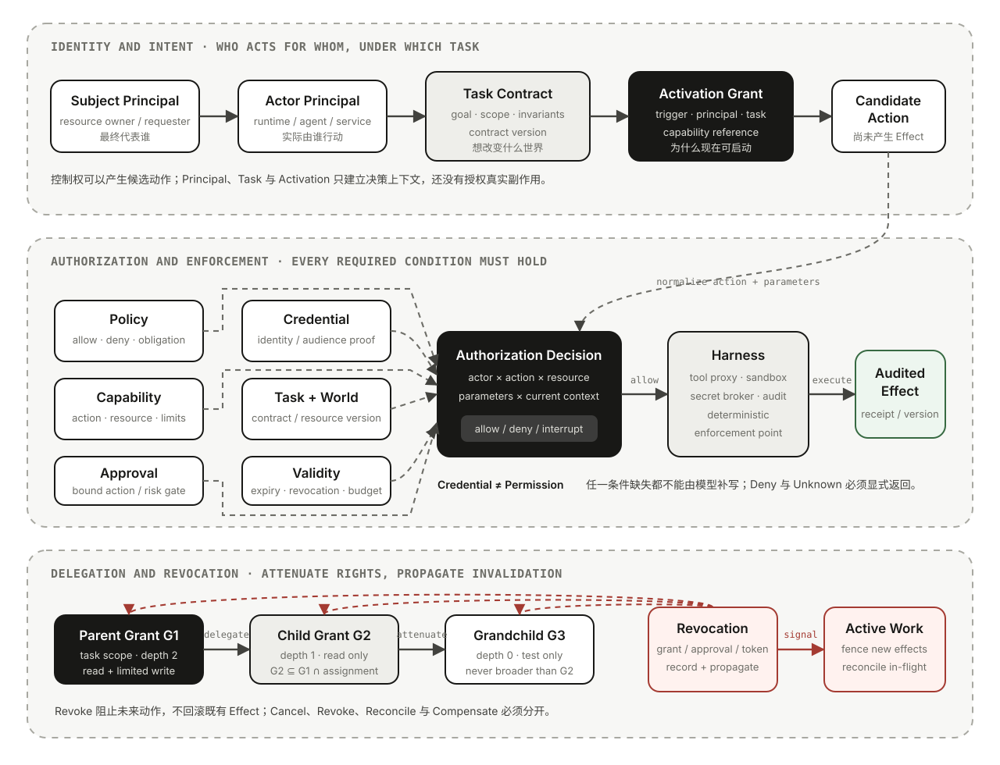

# 07｜Agent 的授权边界：Principal、Capability、Delegation、Approval、Credential 与 Revocation

前五篇分别解释了 Agent 的[决策闭环](01-agent-primer.md)、一次 Run 的[激活与执行](02-agent-runtime-semantics.md)、Observation 与 Claim 的[状态边界](03-agent-state-semantics.md)、Task Contract 和人机控制转移的[任务边界](04-agent-task-semantics.md)，以及父子 Agent 的[委派与验收](05-multi-agent-collaboration.md)；[第 06 篇](06-agent-harness-evolution.md)进一步说明这些边界怎样由 Harness 确定性承载。它们反复遇到同一个问题：**系统凭什么允许这个 Actor 在此刻对这个 Resource 执行这个 Action？**

设想一个 Coding Agent 收到任务：“修复测试，验证后提交变更。”模型选择编辑文件、运行命令并创建 Commit。系统里同时存在这些看似合理的信息：

- Prompt 说它是“资深开发者”；
- Tool Registry 暴露了写文件、Shell 和 Git；
- Runtime 拿到了一个能访问多个仓库的 Git Token；
- 用户在几分钟前批准过一次写文件；
- 父 Agent 把任务转给了一个 Child Agent；
- 企业 Policy 禁止自动修改受保护分支。

如果系统只有 `allowed=true`，它无法解释：谁在行动、代表谁行动、哪个规则生效、Token 能证明什么、上一次 Approval 是否覆盖这一次 Git 操作、子 Agent 能否继续委派，以及用户撤销任务后哪些动作必须停止。

本文的核心判断是：

> **授权不是 Prompt 中的一句话，也不是 Credential 自带的魔法。它是一份针对 Principal、Action、Resource 与当前 Context 的可解释决策；Capability、Approval 和 Delegation 只能在 Policy 允许的范围内收窄或补足条件，并且必须能够过期、撤销与审计。**

## 一个“有凭据，但没有授权”的事故

Run `R42` 被允许在仓库 `repo-a` 的 Worktree `W1` 修复测试。为了拉取依赖，Harness 向 Runtime 注入了一个可访问整个组织的 Git Token。模型看到远端 `main` 比本地更新，于是生成 `git push origin main`；参数合法，Token 也有效，Git 服务因此接受写入。

从认证角度看，请求成功证明了 Token 可用；从任务角度看，Agent 却越过了至少四条边界：

1. Task Contract 只授权修改隔离 Worktree，没有授权远端发布；
2. 用户允许“修复”，没有批准向受保护分支产生副作用；
3. Credential 的技术权限大于本次 Run 的有效 Capability；
4. Harness 没有在工具执行前把 Policy、Capability 与具体参数重新求值。

事故根因不是模型“不听话”，而是系统把**能够认证**误当成**已经授权**，把 Credential 的最大权限误当成本次任务的最小权限。

## 先把七个对象分开

| 对象 | 回答的问题 | 例子 | 最常见混淆 |
| --- | --- | --- | --- |
| **Principal** | 谁对请求、决策或行动拥有可追责身份？ | 用户、服务账号、Agent 实例、审批者、组织 | 角色 Prompt、模型名称或 Session ID |
| **Policy** | 在当前组织和环境规则下，哪些行为允许、拒绝或要求额外条件？ | “禁止自动 Push main”“生产变更需双人审批” | Prompt 指令、Task Goal 或工具描述 |
| **Capability** | 这个 Actor 在特定 Scope 内被授予哪些有界行动能力？ | 只读 `repo-a`；只可写 `W1/src/**`；不可联网 | Credential 本身或 Tool 是否出现在列表里 |
| **Credential** | Actor 用什么可验证材料向执行点证明身份或持有某项权利？ | OAuth Access Token、短期证书、签名、Session Secret | 权限全集、用户意图或永久授权 |
| **Approval** | 有资格的 Principal 是否同意某个稳定候选动作或风险例外？ | 允许 Action `A17` 在 10 分钟内执行一次 | “以后都允许”、Task Acceptance 或普通回复 |
| **Delegation** | 既有 Authority 怎样派生给另一个 Actor，同时保留代表关系和收窄边界？ | 父 Agent 给 Reviewer 只读仓库与测试权限 | 复制父 Token、Handoff 或角色改名 |
| **Revocation** | 已授予或已证明的权利怎样在到期前失效，并传播到后代和缓存？ | 撤销 Task Grant、Approval、Token 或 Child Grant | Cancel、回滚、删除历史或自然过期 |

这里还会使用 **Authority**：它不是第八种凭据，而是 Principal 在特定 Context 下有资格作出决定或采取行动的有效范围。Authority 可能来自组织角色、资源所有权、Task Assignment 或 Delegation；它最终要通过 Policy 和执行点才能产生现实效果。

本文使用的 Capability 是工程语义上的**有界授权信封**，不要求每个系统都采用严格的 Object-Capability 实现。它可以由 Policy Decision、Token Claims、Task Grant、Sandbox 规则和 Tool Constraint 共同实现；关键是不把这些不同载体混成一个布尔值。

## 授权链：从意图到真实副作用



移动端可打开 [SVG 原图](../assets/images/agent-authorization-chain.svg) 查看完整链路。

一次候选动作可以压缩为下面的决策：

```text
Allow(Action, Resource, Context) =
    authenticated(Actor, Credential)
  ∧ policy_permits(Subject, Actor, Action, Resource, Context)
  ∧ capability_covers(Action, Resource, Parameters)
  ∧ approval_satisfies_required_gate(Action, Risk, Context)
  ∧ task_contract_allows_effect(Action, Resource)
  ∧ not_expired_or_revoked(Grant, Credential, Approval)
  ∧ runtime_constraints_hold(Budget, Time, Workspace, Attempt)
```

任何一项不满足，都不应靠模型“再解释一下”变成允许。结果至少要区分：

- `allow`：在确定 Scope 与条件内允许本次执行；
- `deny`：Policy 或 Capability 明确禁止，不应自动重试；
- `approval_required`：候选动作稳定，但缺少有资格 Principal 的特定决策；
- `reauthentication_required`：Credential 缺失、过期、Audience 错误或身份强度不足；
- `unknown / indeterminate`：Policy 数据、资源版本或撤销状态无法确认，应 Fail Closed 或升级；
- `reconcile_required`：动作可能已经发生，不能通过再次授权来猜测结果。

这条链也划分了系统责任：Task Contract 说明**想改变什么世界**；Activation Record 说明**谁因为什么启动 Run**；Authorization Decision 说明**本次动作凭什么可以发生**；Harness 则在 Tool Proxy、Secret Broker、Sandbox 和审批 UI 中**确定性执行决定**。

## Principal：同时记录 Subject、Actor 与 Decision Maker

“用户让 Agent 做”至少包含三个可能不同的身份：

- **Subject / Resource Owner**：工作最终代表谁、影响谁的资源；
- **Actor**：实际发起 Tool Call 或外部请求的运行主体；
- **Decision Maker**：对 Task Amendment、风险 Approval 或 Acceptance 有资格作出决定的人或服务。

例如，Eddie 发起代码任务，Runtime Service 承载执行，Child Agent 生成候选命令，Git 服务账号提交请求，Repository Owner 批准合并。它们不能全部压成 `user_id=eddie`，否则审计会失去真实 Actor；也不能只记录服务账号，否则无法解释它代表谁行动、为什么得到这份 Capability。

模型本身通常不是外部系统承认的安全 Principal。应用可以为一个 Agent Instance 分配内部 Actor Identity，以便隔离工具、预算与审计；但真正向 Git、云平台或数据库认证的，往往仍是 Runtime、用户委托或短期 Workload Identity。系统应明确每层身份的转换，而不是把模型名称写进日志就宣称可追责。

一个最小 Principal Context 可以包含：

```python
class PrincipalContext:
    subject_id: str
    actor_id: str
    acting_on_behalf_of: str | None
    tenant_id: str
    authentication_method: str
    assurance_level: str
    delegation_chain: list[str]
```

身份解析与授权必须分开。认证回答“这个 Credential 对应谁”；授权继续回答“这个身份在当前 Task、Resource、Action 和时间下能做什么”。

## Policy、Capability 与 Credential：规则、权利和证明材料

### Policy 是外部规则，不应由 Run 静默改写

Policy 可以来自组织安全规则、资源 ACL、产品配置、合规要求和环境级门禁。它可能按 Action、Resource、Principal、风险、时间、网络位置和数据分类返回 Allow、Deny 或 Obligation。Task Contract 可以引用 Policy Version，却不能仅凭用户一句 Follow-up 覆盖更高层 Policy。

Policy 还应定义冲突优先级。常见默认是显式 Deny、资源保护和组织不变量优先于 Task Grant；Approval 只有在 Policy 明确允许例外时才能满足额外条件，不能把禁止项变成永久 Allow。

### Capability 是本次行动空间的上界

一个 Capability 不应只写 `tools=["shell"]`。Shell 是宽入口，真正边界还包括命令类别、工作目录、文件 Scope、网络、环境变量、最大资源、允许的副作用和审批规则。对 API Tool，也要约束 Method、Endpoint、Resource ID、字段和调用次数。

有效 Capability 通常来自多个上界的交集：

```text
Effective Capability
= Principal Authority
∩ Organization Policy
∩ Task Contract Scope
∩ Activation Grant
∩ Runtime / Harness Boundary
∩ Current Environment State
```

交集只会收窄。Task Scope 变大、Workspace 改变、Run 恢复或 Policy 更新时，都应重新求值，而不是沿用启动时的一次 Allow。

### Credential 只负责可验证地携带身份或权利

Credential 可能包含 Scope、Audience、Expiry 或 Resource Claims，但它仍是授权链的输入，不是整条授权链。一个组织级 Token 能技术性访问十个仓库，本次 Capability 仍可以只允许一个 Worktree；一个 Token 尚未过期，关联 Task Grant 也可能已经撤销。

[MCP Authorization](https://modelcontextprotocol.io/specification/2025-11-25/basic/authorization)把 HTTP MCP Server 视为 OAuth Resource Server，要求 Resource / Audience 绑定并禁止把收到的 Token 直接透传给上游服务。这给 Agent 工程一个重要提醒：每个资源边界都应获得面向自己的 Credential，并独立执行授权；“宿主拿到了用户 Token”不是把它交给所有工具的理由。

长期 Secret 更不应直接进入模型 Context、工具参数回显、Trace 或 Artifact。Harness 应通过 Secret Broker 在执行点按需注入短期 Credential，让模型只能引用 Credential Handle，而不是读取明文。

## Grant Envelope：把授权固定成可检查对象

任务系统可以用下面的信封把分散条件关联起来：

```yaml
grant_id: grant-r42-repo-write-v3
issuer: principal:repo-owner
subject: principal:eddie
actor: agent:run-r42
acting_on_behalf_of: principal:eddie
task:
  id: task-9
  contract_version: 3
actions:
  - file.read
  - file.write
  - process.exec:test-only
resources:
  workspace: worktree:w1
  paths:
    - src/**
    - tests/**
constraints:
  network: denied
  git_push: denied
  max_process_seconds: 600
  require_approval:
    - file.delete
    - dependency.install
validity:
  not_before: 2026-08-07T09:00:00+08:00
  expires_at: 2026-08-07T11:00:00+08:00
delegation:
  allowed: true
  max_depth: 1
  child_actions:
    - file.read
    - process.exec:test-only
lineage:
  parent_grant_id: null
  revocation_id: revoke:task-9
```

这不是推荐固定 Schema，而是展示授权至少需要哪些维度：谁签发、谁是 Subject 和 Actor、绑定哪个任务版本、允许哪些 Action / Resource、有哪些参数与环境限制、何时失效、能否继续委派，以及怎样撤销。

Grant 必须使用稳定引用进入 Activation、Run、Action 与 Event。只在启动日志打印“权限校验通过”不够，因为长 Run 中 Capability、Policy、Credential 和 Resource Version 都可能变化。

## Approval：有界条件，不是永久授权

Approval 最适合处理这样的问题：候选 Action 已经具体化，Policy 允许由某类 Principal 决定，但风险高到不能由 Agent 自主执行。一个有效 Approval 至少绑定：

```text
approval_id
+ approver_principal
+ action_id / tool_call_id
+ normalized_action_and_parameters
+ resource_and_world_version
+ task_id / contract_version / run_id
+ decision (approve / reject)
+ constraints / allowed_count
+ issued_at / expires_at
+ policy_version
```

这带来五条硬边界：

1. **Approval 不是 Authentication**：点击者仍需被可靠识别，并证明有资格审批该 Resource 和 Risk；
2. **Approval 不是 Task Clarification**：回答参数缺失，不自动允许副作用；
3. **Approval 不是永久 Capability**：批准一次删除文件，不等于当前 Session 以后都可删除；
4. **Approval 不是 Acceptance**：执行前允许动作，与交付后认可结果处在不同责任阶段；
5. **Approval 不是不可变事实**：参数、Resource Version、Contract 或 Policy 实质变化后，旧 Approval 必须失效或重验。

[OpenAI Agents SDK 的 Human-in-the-loop](https://openai.github.io/openai-agents-python/human_in_the_loop/)以 Tool Call ID 为一次调用保存 Approve / Reject 决策，并允许恢复原始 Run；可选的“本 Run 后续同类调用继续允许”也被明确限制在 Run 范围。这个实现很好地说明 Approval 的复用必须是显式 Policy，而不是 UI 为了方便静默扩大 Scope。

当审批等待时间较长，Run 可以 Pause，Credential 却不应长时间保持解锁。恢复时先加载 Approval，再重新验证 Principal、Grant、Policy、Resource Version 与 Credential，最后才执行稳定 Action。审批之后参数被模型重写，应生成新 Action ID 并重新走门禁。

## Delegation：只能派生更窄的 Authority

Multi-Agent 中最危险的默认是“子 Agent 继承父 Agent 的全部工具和环境”。正确关系应是：

```text
Child Grant
⊆ Parent Grant
∩ Child Assignment
∩ Current Policy
∩ Child Sandbox
∩ Remaining Budget / Deadline
```

委派至少固定四组关系：

- **责任血缘**：谁委派给谁，Actor 代表哪个 Subject；
- **任务血缘**：Child Assignment 派生自哪个 Parent Contract Version；
- **授权血缘**：Child Grant 派生自哪个 Parent Grant，收窄了哪些 Action、Resource 与约束；
- **结果血缘**：Child Artifact / Claim 怎样被父级合并、验证与接受。

[RFC 8693](https://datatracker.ietf.org/doc/html/rfc8693)区分 Impersonation 和 Delegation。Impersonation 让 Actor 在规定权限语境中以 Subject 身份行动；Delegation 则保留 Actor 自身身份，同时说明它代表 Subject 行动。Agent 系统默认应优先保留 Delegation 关系，因为“用户授权了父 Agent、实际动作由哪个 Child / Service 执行”对审计、撤销和事故归因都很重要。

`max_delegation_depth`、允许的 Child Principal 类型和可继续委派的 Action 也要进入 Grant。否则一个只读 Reviewer 可能创建拥有写权限的孙 Agent，或者子任务通过重新包装工具绕过父级限制。新成员的 Capability 必须由授权服务或 Harness 从父 Grant 派生，不能由模型自由生成一段看起来合理的 JSON 后自我授权。

Handoff 也不自动转移 Authority。它只改变当前决策者或责任表面；接收者能看到哪些 Context、使用哪些工具、代表谁行动，仍需单独建立 Grant。Agent-as-Tool、Child Task 与 Team 的生命周期差异见 [05｜Multi-Agent](05-multi-agent-collaboration.md)。

## Expiry 与 Revocation：失效不是回滚

Expiry 表示权利按预先约定的时间自然失效；Revocation 表示在到期前主动撤回。两者都应阻止**尚未开始**的新 Action，却都不会让已经发生的现实副作用消失。

可撤销对象至少有四层：

| 撤销对象 | 立即影响 | 不自动完成什么 |
| --- | --- | --- |
| Credential | 执行点不再接受该证明材料 | 不一定撤销底层 Task Grant；其他 Credential 可能仍有效 |
| Approval | 绑定 Action 不再满足审批条件 | 不撤回已执行 Action |
| Capability / Grant | 新 Action 不再被覆盖，后代 Grant 应按 Policy 级联 | 不自动 Cancel Runtime，也不补偿外部 Effect |
| Task / Delegation Relation | 后续激活、恢复与派生委派被阻止 | 不删除历史、Artifact 或审计记录 |

[RFC 7009](https://datatracker.ietf.org/doc/html/rfc7009)允许撤销 Token，并可能连带相关 Token 和底层 Authorization Grant；同时也承认分布式系统中可能存在传播窗口。[RFC 8693](https://datatracker.ietf.org/doc/html/rfc8693)则明确，交换后的 Token 与来源 Token 之间不必天然拥有紧密撤销关联。Agent Runtime 因此必须显式维护 Grant Lineage 和撤销状态，而不是假设身份系统会自动理解父子 Task。

一个可操作的撤销协议是：

```text
Record Revocation Event
→ Stop New Admissions
→ Invalidate Decision / Credential Caches
→ Mark Descendant Grants
→ Signal Active Runs and Child Tasks
→ Fence New Effects
→ Reconcile In-flight Actions
→ Preserve Audit and Report Residual Risk
```

In-flight Action 必须根据执行点分类：

- 尚未发送：直接阻止；
- 已发送但未受理：取消或等待明确拒绝；
- 已受理、支持查询：用 Action ID / Idempotency Key 查询；
- 已完成：记录 Effect，必要时进入 Compensation；
- 结果未知：禁止盲目重试，返回 `reconcile_required`。

Cancel、Revoke 与 Compensate 是三件事：Cancel 请求 Runtime 停止继续；Revoke 移除未来授权；Compensate 用新的已授权动作处理已发生 Effect。把它们合并成一个“撤回”按钮，会在最需要确定性的时候制造错误预期。

## 把授权放回 Agent 全生命周期

授权不是 Tool Call 前的一次中间件检查。它贯穿激活、规划、执行、暂停、恢复、委派和验收：

| 阶段 | 必须固定或重验什么 | 失败时应怎样表达 |
| --- | --- | --- |
| Trigger / Activation | Trigger 来源、Principal、Standing Task Grant、Contract Version、是否可启动 | Denied / Duplicate / Expired，不创建 Run |
| Context Assembly | 哪些 Policy、Secret Handle、Artifact 和 Memory 对模型可见 | Redacted / Omitted；不可用信息不应伪装成空事实 |
| Planning | 模型只能在 Capability 上界内提出 Action；也可提出需审批候选 | Candidate，不产生副作用 |
| Tool Execution | Action / Resource / 参数、Policy、Grant、Approval、Credential、World Version | Allow / Deny / Approval Required / Reconcile Required |
| Pause / Resume | Approval、Principal、Policy、Grant、Checkpoint 与外部 Effect | 同 Run 新 Attempt，无法校准则 Stopped |
| Delegation | Parent Grant、Child Assignment、Actor、Depth、Budget、Deadline | 拒绝派生，不能让子级自行放宽 |
| Completion | 所有 Effect 是否授权、证据是否覆盖 Contract | Policy Violation 不能被绿色测试抵消 |
| Acceptance | 责任人是否接受版本化交付 | Accepted / Rejected / Revision Requested，不追溯授权 |

特别需要注意 Standing Task：Schedule 本身不是 Principal，Cron 到点也不是新的 Approval。后台 Agent 必须在每次 Activation 时绑定仍有效的任务主体、Grant 与 Policy；撤销长期委托后，下一次 Trigger 应被拒绝，即使调度记录仍存在。

## 一个 Coding Agent 场景串起全部对象

继续使用 `repo-a` 修复测试：

1. Eddie 作为 Request Principal 提交任务；系统把 Request 澄清成 Contract `T9@v3`；
2. Activation 绑定 `principal:eddie`、Worktree `W1`、Grant `G3` 和 Trigger `U17`，创建 Run `R42`；
3. 模型控制下一步，先读取日志。它有决策控制权，但 Read 仍由 Capability 与 Sandbox 限制在 `W1`；
4. Test Tool 返回退出码与日志，这是 Observation；Agent 形成“时区测试失败”的 Claim，尚未改变权限；
5. Agent 提议编辑 `src/time.go`。Policy、Grant、路径和 Workspace Version 都满足，Harness 执行并记录 Effect；
6. Agent 提议安装新依赖。Grant 要求 Approval，Runtime 固定 Action `A17` 后 Pause；
7. Eddie 只批准 `A17` 一次。恢复时参数未变、Approval 未过期，Harness 注入短期 Registry Credential 并执行；
8. 父 Agent 创建只读 Reviewer。Child Grant `G4` 只能读取 Patch 和运行测试，不能写文件，也不能继续委派；
9. Reviewer 的“测试通过”只是 Peer Claim，父级根据固定 Commit 的测试 Artifact 重新形成 Verdict；
10. Eddie 在完成后接受交付。Acceptance 不扩大 `G3`，也不允许自动 Push；Run 终态后 Grant 到期，Credential 被回收。

如果第 7 步之前 Eddie 撤销任务，`G3` 与 `G4` 应失效，未开始的安装被阻止；如果请求已经送达 Registry，系统先查询受理状态，再决定保留、补偿或升级，不能把撤销误当成动作从未发生。

这个例子揭示了六个经常被混淆的等式都不成立：

```text
Control            ≠ Authority
Role Prompt        ≠ Capability
Credential         ≠ Permission
Tool Availability  ≠ Action Authorization
Approval           ≠ Permanent Grant
Acceptance         ≠ Retroactive Approval
```

## 协议和框架分别覆盖哪一段

| 实现 / 规范 | 可以提供的边界 | 不自动提供的边界 |
| --- | --- | --- |
| OAuth / MCP Authorization | Principal 认证、Resource / Audience 绑定、Token 使用与资源服务器校验 | 领域 Task Scope、每个 Tool 参数 Policy、Sandbox 与 Completion |
| OAuth Token Exchange | Subject / Actor、Impersonation / Delegation、目标 Scope / Audience 的 Token 交换 | Child Assignment 正确性、自动撤销级联和父任务验收 |
| MCP Elicitation | Server 经 Client 请求结构化用户信息，区分 Accept / Decline / Cancel | 回答者是否有审批 Authority，或信息是否改变 Contract |
| OpenAI Agents SDK HITL | Tool Call interruption、按调用批准 / 拒绝、RunState 恢复 | 组织级 Policy、资源 ACL、外部 Credential 生命周期 |
| A2A Task State | `INPUT_REQUIRED` / `AUTH_REQUIRED` 等跨 Agent 中断状态 | 应用领域里的 Capability 派生与充分审批证据 |
| Sandbox / OS / Cloud IAM | 文件、进程、网络和资源边界的确定性强制 | 用户意图、Task Contract 与业务 Acceptance |

这些能力需要组合，却不能互相冒充。MCP 的传输授权不等于某个 Tool Call 已通过业务审批；Sandbox 拒绝写入不代表 Task Contract 定义正确；A2A 暴露 `AUTH_REQUIRED` 也不会替应用判断谁有资格补足授权。

在实现层，Tool Registry 按 Principal 过滤能力，Policy Engine 校验规范化参数，Secret Broker 签发短期 Credential，Sandbox 强制 Workspace / Network 边界，Approval UI 固定候选 Action，Audit / Revocation Watcher 则负责让长 Run 在权限变化后收敛。这些机制共同执行同一套授权语义，不能互相替代。

## 十二类授权失败

| 失败模式 | 错误等式 | 后果 | 应守住的边界 |
| --- | --- | --- | --- |
| Role-as-Authority | “你是管理员” = 管理员权限 | Prompt Injection 获得高权动作 | Principal 与 Capability 由控制面建立 |
| Credential-as-Grant | Token 有效 = 本次动作允许 | 宽 Token 越过 Task Scope | Credential 与 Effective Capability 分离 |
| Tool-as-Permission | Tool 可见 = 任意参数可执行 | Shell / API 成为通用越权入口 | 参数、Resource 和环境在执行点校验 |
| Approval Bleed | 批准一次 = 本 Session 永久允许 | 后续不同动作复用旧同意 | Approval 绑定 Action、版本、次数和过期时间 |
| Stale Approval | Action 已变，Approval 仍复用 | 用户批准的不是实际执行内容 | 规范化参数与 Action ID 不变性 |
| Delegation Amplification | Child 可以重建父级权限 | 子孙 Agent 权限扩张 | Child Grant 是父级和 Assignment 的交集 |
| Hidden Impersonation | 只记录用户身份 | 无法找到真实 Actor | 同时记录 Subject、Actor 与代表关系 |
| Token Passthrough | 一个 Token 交给所有下游 | Audience 错配与 Confused Deputy | 每个 Resource 独立 Credential 与校验 |
| Revocation Gap | 撤销父 Token 会自动撤销全部子权利 | 后代 Grant 继续行动 | Grant Lineage、缓存失效与传播协议 |
| Cancel-as-Rollback | 停止 Run = 副作用消失 | Unknown Effect 被重复或遗漏 | Cancel、Revoke、Reconcile、Compensate 分离 |
| Policy Drift | Run 启动时允许 = 永久允许 | 长任务绕过新规则 | 高风险 Action 与 Resume 时重新求值 |
| Acceptance Laundering | 用户接受结果 = 过程已授权 | 违规行为被事后“洗白” | Acceptance 与执行授权分离 |

## 授权边界检查

面对一个 Agent Framework、Harness 或产品，可以依次问：

1. **Principal 是否可追责**：Subject、Actor、Approver 与 Acceptance Owner 能否分开记录？
2. **认证与授权是否分离**：Credential 有效以后，是否仍按 Action、Resource、Context 和 Policy 决策？
3. **Capability 是否有界**：Tool、参数、Resource、Workspace、网络、预算、时间和风险分别怎样限制？
4. **执行是否绑定 Task**：Grant 能否追溯 Task / Contract / Run / Activation，而不是独立漂浮？
5. **Policy 是否确定性生效**：模型、Prompt 和 Tool Description 能否绕过 Deny 或 Obligation？
6. **Approval 是否精确**：批准对象、参数、资源版本、次数、过期和审批者资格是否稳定？
7. **恢复是否重新授权**：Pause、Retry 和 Resume 后是否重查 Grant、Policy、Credential、Approval 与世界版本？
8. **委派是否单调收窄**：Child / Grandchild Grant 能否证明不超过 Parent Grant，Actor 代表关系是否保留？
9. **Credential 是否最小暴露**：Secret 是否只在执行点短期注入，并绑定正确 Audience / Resource？
10. **撤销是否可传播**：Grant Lineage、Decision Cache、活跃 Run 与后代任务怎样接收撤销？
11. **在途动作是否可协调**：Action ID、幂等键、回执和补偿能否区分未开始、已受理、已完成与 Unknown？
12. **审计是否能重建决定**：每个 Effect 能否说明当时的 Principal、Policy、Grant、Approval、Credential 与 Resource Version？

如果这些问题只有“Prompt 里写了”“Tool 有权限”“用户点过同意”三种答案，这个系统还没有真正建立授权边界。

## 结论

Agent 的自治来自有限的动态控制权，而不是一份无限的代理权。可靠授权需要守住一条完整链：

```text
Principal and Task
→ Policy and Capability
→ Candidate Action
→ Approval if Required
→ Bound Credential at Enforcement Point
→ Audited Effect
→ Expiry / Revocation / Reconciliation
```

Principal 提供可追责身份；Policy 定义不可绕过的规则；Capability 固定本次行动空间；Credential 在资源边界证明身份或权利；Approval 满足某个具体风险门禁；Delegation 只派生更窄的 Authority；Revocation 阻止未来行动并触发对在途 Effect 的协调。

最值得保留的工程判断是：

> **模型可以控制下一步建议，Task 可以表达期望结果，Credential 可以证明调用身份；但只有在当前 Policy、Capability、Approval 与环境约束共同允许时，Harness 才能把候选动作变成真实副作用。**

## 参考资料

- [Authorization — Model Context Protocol](https://modelcontextprotocol.io/specification/2025-11-25/basic/authorization)
- [Elicitation — Model Context Protocol](https://modelcontextprotocol.io/specification/2025-06-18/client/elicitation)
- [Human-in-the-loop — OpenAI Agents SDK](https://openai.github.io/openai-agents-python/human_in_the_loop/)
- [RunState — OpenAI Agents SDK](https://openai.github.io/openai-agents-python/ref/run_state/)
- [A2A Protocol Specification](https://a2a-protocol.org/dev/specification/)
- [OAuth 2.0 Token Exchange — RFC 8693](https://datatracker.ietf.org/doc/html/rfc8693)
- [OAuth 2.0 Token Revocation — RFC 7009](https://datatracker.ietf.org/doc/html/rfc7009)
- [OAuth 2.0 Protected Resource Metadata — RFC 9728](https://datatracker.ietf.org/doc/html/rfc9728)
- [Resource Indicators for OAuth 2.0 — RFC 8707](https://datatracker.ietf.org/doc/html/rfc8707)
- [PROV-DM: The PROV Data Model — W3C](https://www.w3.org/TR/prov-dm/)
