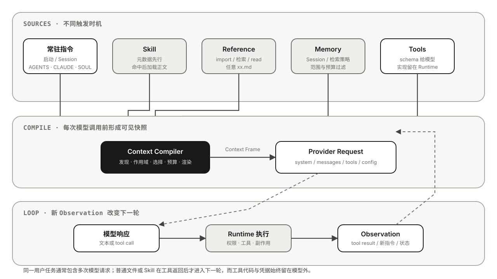

<span class="eyebrow">01 · NOTES · 03</span>

# Agent 为什么会读这些 Markdown：从 `AGENTS.md`、`SOUL.md` 到 `SKILL.md`

仓库里多一个 Markdown，模型并不会因此多一份记忆。`AGENTS.md`、`CLAUDE.md`、`GEMINI.md`、`SOUL.md`、`MEMORY.md`、`SKILL.md` 和随手写下的 `xx.md` 虽然长得一样，命运却很不同：有的开场就坐进上下文，有的要等任务找上门，还有的会一直躺在磁盘上，直到 Agent 主动翻开它。

模型并不直接面对文件系统，它面对的是 Harness 临时装配出来的一次请求。于是，真正值得理解的不是一串文件名，而是背后的 **Context Compiler（上下文编译器）**：它决定此刻该读什么、听谁的、花多少 token，以及哪些东西根本不该交给模型。

> 本文先讲通用模型，再比较 [Pi Agent](../coding-agents/pi-agent.md)、[DeepSeek Harness](../coding-agents/deepseek-harness.md)、[Codex](../coding-agents/codex.md)、[Claude Code](../coding-agents/claude-code.md)、[Gemini CLI](../coding-agents/gemini-cli.md) 与 [OpenCode](../coding-agents/opencode.md)。产品行为核对于 2026-09-07，以各自官方文档或文中锁定版本为准。

## 1. 先把名字叫对：通常是 `AGENTS.md`，不是 `agent.md`

`AGENTS.md` 是多个 Coding Agent 支持的项目指令惯例，拼写通常是复数 `AGENTS`、全大写、扩展名小写 `.md`。

`agent.md`、`Agent.md`、`agents.md` 不会因为“人能看懂”就得到同样待遇。Harness 认的是约定和配置，不是语义联想。Gemini CLI 可以通过 `context.fileName` 接纳别的名字，OpenCode 也能用 `instructions` 指定普通文件；那是你改了编译规则，不是文件自己有了魔法。

同理，任意 `xx.md` 默认只是一份工作区文件。它进入模型上下文通常只有四条路：

1. Harness 把这个名字登记为自动指令文件；
2. 已加载的指令文件通过产品支持的 import 语法展开它；
3. 用户、Prompt 或 Skill 明确要求 Agent 用文件工具读取它；
4. 应用在构造模型请求时自行读取并注入它。

所以，排查指令不生效时，第一件事不是继续润色文字，而是确认它是否真的进入了请求。**存在于磁盘，只是可读；出现在 Context，才是已读。**

## 2. 先看全貌：同是 `.md`，在系统里的身份不同

这些文件没有统一的“Agent Markdown 协议”。`AGENTS.md` 已经形成跨工具惯例，`SKILL.md` 有 [Agent Skills 规范](https://agentskills.io/specification)，`CLAUDE.md` 与 `GEMINI.md` 是产品约定，`SOUL.md`、`MEMORY.md` 等则更依赖具体 Harness。名字相似，不代表能被另一个产品原样识别。

| 文件 | 它回答什么 | 谁维护 | 常见读取时机 | 常见注入形态 |
| --- | --- | --- | --- | --- |
| `AGENTS.md` | 这个仓库里的工作应怎样完成 | 团队 / 用户 | 启动时按目录发现 | 项目指令块，常驻本次任务 |
| `CLAUDE.md` | Claude Code 在这里应知道和遵守什么 | 组织 / 团队 / 用户 | Session 启动；子目录可延迟加载 | system 后的一段用户级 Context |
| `GEMINI.md` | Gemini CLI 的项目 Context 是什么 | 团队 / 用户 | 启动 + 工具访问目录时 JIT 加载 | 合并后随每个 Prompt 发送 |
| `SOUL.md` | Agent 希望以怎样的身份、气质和边界行动 | 产品作者 / 用户 | Agent 或 Session 初始化 | Persona / Bootstrap Context |
| `MEMORY.md` | 哪些过去的信息值得以后再用 | 用户 / Agent / Memory Service | 启动读索引，或检索后按需读 | Memory 片段或普通文件内容 |
| `SKILL.md` | 遇到某类任务时应该怎样做 | 能力作者 | 启动发现元数据，命中后读正文 | 动态指令、Tool Result 或专门 Skill Context |
| `agents/*.md` | 某一个具名 Agent 是谁、能用什么 | 应用 / 团队 | 选择或委派该 Agent 时 | Front Matter 变配置，正文变该 Agent 指令 |
| `commands/*.md` / `prompts/*.md` | 用户这次明确要发起什么流程 | 用户 / 团队 | Slash Command 被调用时 | 展开成这一轮 User Prompt |
| 任意 `xx.md` | 文档作者写进去的普通资料 | 任意作者 | import、检索或文件工具读取时 | 下一轮 Tool Result，或被父文件内联 |

辨别一个文件，别先问“里面写了什么”，先问五件事：**谁认识这个文件名，在哪里找，何时读正文，以什么消息角色交给模型，何时重新加载。** 这五个问题才是文件的 Runtime 身份。

## 3. 把这些文件逐个拆开

### 3.1 `AGENTS.md`：给仓库写的工作说明

`AGENTS.md` 适合写那些“只要在这个仓库工作，就应该知道”的内容：目录结构、构建与测试命令、代码约定、审查要求、验证标准，以及哪些资料应在什么任务中继续读取。它更像给 Agent 的 `CONTRIBUTING.md`，不是一篇人格设定，也不适合塞进某个低频任务的完整操作手册。

```markdown
# Repository guide

## Build and test
- Go 代码修改后运行 `go test ./...`
- Web 目录使用 `pnpm`，不要生成 `package-lock.json`

## Scope
- `payments/` 下的修改还要遵守 `payments/AGENTS.md`

## References
- 改鉴权前先读 `docs/auth-model.md`
```

谁会自动认它，要看产品。Codex、Pi Agent、DeepSeek Harness 和 OpenCode 都有自己的 `AGENTS.md` 发现逻辑；Claude Code 官方明确说它原生读取的是 `CLAUDE.md`，若想共用 `AGENTS.md`，应在 `CLAUDE.md` 中 `@AGENTS.md` 导入或建立符号链接；Gemini CLI 则可通过 `context.fileName` 把它加入候选名。

以 Codex 为例，[OpenAI Docs](https://learn.chatgpt.com/zh-Hans/docs/agent-configuration/agents-md)说明它在一次任务开始时构建指令链：先找全局 `AGENTS.override.md` / `AGENTS.md`，再从仓库根走到当前目录；每个目录最多取一份，越靠近 cwd 的内容拼在越后面。这里的关键是“一次任务开始时构建”，不是模型每思考一步都重新打开磁盘文件。

`agent.md`、`Agent.md` 或单数 `AGENT.md` 默认不是同一约定。在大小写敏感文件系统上尤其如此。除非配置了 fallback 文件名，或 Harness 代码明确读取它们，否则它们只是普通 Markdown。

### 3.2 `CLAUDE.md`：Claude Code 的持久项目 Context

`CLAUDE.md` 可以出现在组织、用户、项目和本地几个层级，适合放构建命令、架构事实、团队约定和反复需要的工作要求。项目常用 `./CLAUDE.md` 或 `./.claude/CLAUDE.md`，个人项目偏好可放 `./CLAUDE.local.md`。

[Claude Code 官方文档](https://code.claude.com/docs/en/memory)给出的读取过程很具体：启动时向上遍历 cwd 的目录链，把找到的 `CLAUDE.md` 与 `CLAUDE.local.md` 依次拼接；工作中读到子目录文件时，再延迟加载子目录里的指令。`.claude/rules/*.md` 还能用 `paths` Front Matter 把规则限制到特定文件模式。

这些内容会出现在 system prompt 之后的用户消息中，而不是提升为 Provider 的 system 权限。它们会影响 Claude 的判断，但权限拒绝、Sandbox 和 Hook 仍由 Runtime 执行。`@path` import 会在启动时展开，适合组织文字，却不会节省 Context：被导入的内容仍然要占 token。

还要分清两个名字：

- `CLAUDE.md` 是人写给 Claude 的持久指令；
- `~/.claude/projects/<project>/memory/MEMORY.md` 是 Claude Code Auto Memory 的索引，由 Claude 在工作中积累。

两者都会在新会话里出现，但作者、用途和加载预算不同。把自动观察混进团队规则，会让“我们要求它这样做”和“它自己曾经这样做过”失去边界。

### 3.3 `GEMINI.md`：Gemini CLI 所说的 Memory，主要是指令 Context

`GEMINI.md` 可以写项目事实、编码风格、Persona 与长期指令。Gemini CLI 的 `/memory show` 展示的是合并后的这些 Context 文件，所以产品界面使用了 Memory 一词；从本文的语义看，它主要仍是“持久指令的加载结果”，不能据此等同于完整的长期 Memory System。

[Gemini CLI 官方文档](https://geminicli.com/docs/cli/gemini-md/)把读取分成三层：`~/.gemini/GEMINI.md` 的全局 Context、Workspace 及祖先目录 Context，以及 Tool 访问新文件/目录时发现的 JIT Context。找到的内容被拼接，并随 Prompt 发送给模型；`/memory reload` 可以强制重新扫描。

`GEMINI.md` 支持 `@./file.md` 导入，也允许用 `context.fileName` 改成一个或多个名字，例如同时识别 `AGENTS.md`、`CONTEXT.md`、`GEMINI.md`。这再次说明：真正生效的是 Loader 配置，文件名只是 Loader 的入口。

### 3.4 `SOUL.md`：人格与价值边界，但不是通用标准

`SOUL.md` 最常见于 OpenClaw 一类把 Workspace 当作 Agent home 的系统。它适合写说话方式、价值取向、关系边界和长期不变的自我描述，不适合写构建命令，也不应该承担真实权限控制。

可以这样理解：`AGENTS.md` 讲“怎样做事”，`SOUL.md` 讲“以怎样的人做事”，`MEMORY.md` 讲“哪些往事值得带到下一次”。[OpenClaw Agent Workspace](https://github.com/openclaw/openclaw/blob/main/docs/concepts/agent-workspace.md)会在 Session 启动时把 `SOUL.md` 与若干 Bootstrap 文件一起加载。换到不认识 `SOUL.md` 的 Coding Agent，文件不会因为文字像 Persona 就自动进入 system prompt。

`SOUL.md` 还有一个容易被忽略的边界：它能塑造表达和取舍，不能授予工具、密钥或文件权限。把“你有权部署生产环境”写进 Soul，只是给模型一个危险的暗示；真正的授权仍必须来自 Runtime。

### 3.5 `MEMORY.md`：一份可读的记忆投影，不是记忆本身

不同产品对这个名字的解释差异很大：

| 场景 | `MEMORY.md` 怎样使用 |
| --- | --- |
| OpenClaw | 主私聊 Session 可加载精选长期记忆；`memory/YYYY-MM-DD.md` 保存日记或事件，其他场景按产品规则读取 |
| Claude Code Auto Memory | 每个仓库一份本机 Memory 目录；启动加载 `MEMORY.md` 前 200 行或 25KB，较详细的主题文件需要时再读 |
| 自研 Harness | 可能常驻加载、检索后加载、作为 MCP Resource 暴露，也可能完全没有特殊含义 |
| 普通 Coding Agent 仓库 | 若产品没有约定或 `AGENTS.md` 没要求读取，它就是普通文件 |

文件里适合保存经筛选的用户偏好、项目经验、已确认决策和主题文件索引，不适合把整段聊天无差别抄进去。写入时至少要保住来源、Scope、时间和更正方式；读取时仍要经过选择，最后只有命中的片段进入某一次 Context。

Memory、Session History、Compaction、RAG、Checkpoint 与 Prompt Cache 的边界，放在专门的 [Memory Engineering](../engineering/memory-engineering.md) 里展开。对这篇文章而言只需记住：**`MEMORY.md` 是某套 Memory Runtime 选择的介质，不是模型脑内的一块硬盘。**

### 3.6 `SKILL.md`：可发现、可触发的操作手册

`SKILL.md` 通常不是孤零零的一篇文档，而是一个能力包的入口：

```text
my-skill/
├── SKILL.md       # 必需：元数据与核心流程
├── references/    # 可选：详细规范
├── scripts/       # 可选：可执行实现
└── assets/        # 可选：模板与资源
```

它最重要的机制叫 **Progressive Disclosure（渐进式披露）**。启动时，Harness 通常只把 `name`、`description` 和可能的路径放进 Skill Catalog；用户显式点名，或模型判断任务匹配后，才读取完整 `SKILL.md`；正文若又引用 `references/`、`scripts/`、`assets/`，这些资源仍等到需要时再读或执行。

[OpenAI Docs 的 Skills 说明](https://learn.chatgpt.com/zh-Hans/docs/build-skills)明确区分了这三层。Codex 的初始 Skill 列表还有独立预算：最多使用 Context Window 的 2%，窗口未知时上限为 8,000 字符；预算不足会先截短描述，甚至省略部分候选，但已选中的 Skill 仍读取完整正文。OpenCode 则把 Catalog 放进 `skill` Tool 描述，模型调用 `skill({name})` 后才拿到正文；Gemini CLI 也采用元数据、正文、资源三级加载。

因此，`description` 不是装饰，它是路由器看到的封面；`SKILL.md` 正文才是被选中后的操作说明。`AGENTS.md` 适合所有任务都遵守的短规则，Skill 适合“只在某类任务出现时才值得付 token”的长流程。

### 3.7 `agents/*.md`：Agent 定义，不是 `AGENTS.md`

复数目录 `agents/` 里的 Markdown 常用于定义一个具名 Agent 或 Sub-Agent。Front Matter 可能声明模型、工具、权限、描述或可委派条件，正文则成为这个 Agent 的专属指令。

```markdown
---
name: reviewer
description: 检查变更中的正确性与回归风险
tools: [read, search]
---

只做评审，不修改文件。结论必须给出证据位置。
```

Harness 往往先扫描 `name` 与 `description` 形成 Agent Catalog；只有用户选中、主 Agent 委派或路由器命中时，才解析完整定义并创建新的执行上下文。它和根目录 `AGENTS.md` 的区别很根本：一个定义“这个仓库如何工作”，另一个定义“派谁来工作”。

Front Matter 也不是天然安全配置。有的产品会把 `tools`、`permission` 解析成 Runtime 限制，有的只把它变成提示文字。判断时要查 Loader 实现，不能看到 YAML 就假定系统会强制执行。

### 3.8 `commands/*.md` 与 `prompts/*.md`：等用户按下开关

这类文件保存可参数化的一次性任务模板，例如 `/review-pr 123`、`/release v2.0`。启动时 Harness 可能只登记命令名和简介；用户调用后才读取模板、替换参数，并把展开结果放进这一轮 User Prompt。

它和 Skill 的差别主要在触发权：Prompt/Command 通常由用户显式选择，Skill 还可以由模型根据描述自动选择。它也和 `AGENTS.md` 不同：命令只代表“这一次要做什么”，不会自然成为此后所有轮次的项目规则。

### 3.9 `USER.md`、`IDENTITY.md`、`TOOLS.md` 与启动文件

这些名字集中出现在 OpenClaw 等 Workspace-oriented Harness 中：

| 文件 | 适合内容 | 常见生命周期 |
| --- | --- | --- |
| `USER.md` | 称呼、稳定偏好、协作关系与用户背景 | Session 初始化，或作为 Memory 画像读取 |
| `IDENTITY.md` | Agent 名称、简介、emoji 等外显身份 | Bootstrap 时创建，Session 启动时加载 |
| `TOOLS.md` | 本地设备名、路径和工具使用说明 | 启动注入文字；不负责注册真实 Tool |
| `BOOTSTRAP.md` | 新 Workspace 第一次建立身份和资料的流程 | 一次性读取，完成后通常删除 |
| `BOOT.md` | Gateway 或应用启动时要执行的短清单 | Runtime 启动事件触发 |
| `HEARTBEAT.md` | 周期检查时的任务说明 | Scheduler / Heartbeat 触发，不随普通对话读取 |

这里最值得注意的不是文件内容，而是触发事件已经不再只有“用户发来一个 Prompt”。Session Start、Gateway Start、首次初始化和定时器，都可以让 Markdown 进入一次新的 Agent Run。

### 3.10 任意 `xx.md`：默认没有特殊身份

`architecture.md`、`api.md`、`plan.md` 或任何自定义名字，默认只是一份可读资料。它进入模型通常只有三种方式：被已加载文件用 import 语法内联；被配置登记成候选文件；或者 Agent 通过 `read_file`、搜索、MCP Resource 等工具主动读取。

第三种方式意味着它不会出现在第一次模型请求里。第一次请求只能让模型看到“可能需要读 architecture.md”的导航；模型发出 Tool Call，Runtime 读取文件，第二次请求才带上 Tool Result。于是，`xx.md` 的核心设计问题不是起什么显眼名字，而是**哪份常驻指令会在正确时刻把 Agent 引到这里。**

写文件前不妨再问两句：这段话值得每轮都付一次 token 吗？它是一条长期规则，还是一次特定工作的做法？常驻 Context 是房租，按需读取是路费。前者稳定但一直花钱，后者便宜却多一次往返。没有一种永远更好，只有是否与使用频率相称。

## 4. 同一句话，放进不同文件会发生什么

假设我们只有一条要求：

> 发布前运行 `make verify`。

文字完全相同，放置位置不同，系统行为就会不同：

| 放在哪里 | Agent 什么时候可能看见 | 它实际表达了什么 | 主要风险 |
| --- | --- | --- | --- |
| 根目录 `AGENTS.md` | 任务开始时 | 仓库里的工作通常都受这条规则约束 | 每个无关任务也反复付 token |
| `release/AGENTS.md` | 以该目录为 cwd，或产品触达该作用域时 | 只在 release 模块工作时适用 | 不同产品的子目录发现时机不同 |
| `CLAUDE.md` | Claude Code Session 启动时 | Claude Code 应长期遵守的项目规则 | 其他 Coding Agent 未必读取 |
| `SOUL.md` | 特定 Persona Harness 初始化时 | 被误写成人格或价值观的一部分 | 语义位置错误，很难知道何时应例外 |
| `MEMORY.md` | 启动加载或 Memory 召回时 | 系统曾经学到的一条经验或事实 | 经验可能过期，也未必是团队正式要求 |
| `release/SKILL.md` | Release Skill 被选中后 | 执行发布流程时的一个步骤 | Skill 未命中时不可见 |
| `commands/release.md` | 用户执行 `/release` 时 | 这一次发布命令的明确流程 | 用户绕过命令时不会触发 |
| `docs/release.md` | Agent 主动读取后 | 供查阅的发布资料 | 没有导航就可能永远不读 |
| CI 配置 | 命令真正执行时 | 不满足就阻止发布 | 它不负责向模型解释为什么失败 |

这个例子揭示了一件比命名更重要的事：**文件位置不是知识分类，而是调度决策。** 你其实同时决定了五个维度：

1. **频率**：每轮常驻，还是低频按需；
2. **触发权**：Harness 自动、模型选择、用户选择，还是 Scheduler 触发；
3. **作用域**：全局、仓库、目录、用户、Session 或某类任务；
4. **作者身份**：团队规定、用户偏好、Agent 经验，还是外部资料；
5. **约束强度**：只影响模型判断，还是由 Runtime / CI 确定性执行。

因此，设计这些文件不是把现有文档重新命名。真正的问题是：**我希望这段内容在什么事件发生时，以谁的名义，进入哪一次模型请求？**

同一条要求往往需要在两层同时存在：`AGENTS.md` 或 Skill 负责提前告诉模型怎样做，CI 负责在模型没做到时真正拦住。前者减少无效尝试，后者守住结果。把两者混成一层，要么系统只会劝告不会阻止，要么只会报错却无法协助 Agent 提前做对。

## 5. Context Compiler：一次请求是怎样被“编译”出来的



模型从来没有一幅持续存在的“项目全景”。它每次只收到一帧。Harness 所做的，就是在调用前把分散的材料编成这一帧：

```text
数据源
  -> 发现 Discovery
  -> 作用域与优先级 Scope / Precedence
  -> 选择 Selection
  -> 读取与规范化 Read / Normalize
  -> 渲染为 Context Frame
  -> 组装 Provider Request
  -> 模型响应 / Tool Observation
  -> 重建下一次 Context Frame
```

### 5.1 发现：先知道“可能有什么”

候选源可能包括：全局配置目录、仓库根目录、当前工作目录的祖先链、刚访问的子目录、当前 Session 历史、已启用的 Skill、MCP Server 暴露的工具/资源，以及应用实时状态。

发现不是阅读，更不是注入。成熟的 Harness 先读便宜的元数据，例如 Skill 的 `name` 和 `description`，让模型知道书架上有哪些书；真正用到时，才把书取下来。

### 5.2 作用域与优先级：离代码近，不等于权力更高

层级指令一般从宽到窄：组织/全局 → 仓库根 → 子目录 → 当前目录。更具体的内容常在拼接文本中靠后，或者覆盖同一目录中的默认候选。但要注意：

- “后拼接”只是同一消息内部的产品语义，不会把项目文件提升成 API 的 `system` 或 `developer` 权限；
- 产品可能是“全部合并”，也可能是“每目录只选一个”，还可能是“第一份命中即停止”；
- 同一个产品的稳定版、预览版行为也可能不同。

### 5.3 选择：上下文管理首先是取舍

常驻指令默认在场；Skill 要看任务是否匹配；Reference 等待引用、检索或工具读取；Memory 还要受用户、时间和隐私范围约束。上下文工程并不是让模型“知道得越多越好”，而是让它在这一刻少看无关的，多看会改变判断的。

### 5.4 读取与规范化：进入请求前，内容已经被解释过

Harness 可能进行 import 展开、去重、Front Matter 解析、路径标注、内容截断、字符转义、敏感信息过滤或摘要。比如 Claude Code 支持 `CLAUDE.md` 中的 `@path` import，OpenCode 的 `AGENTS.md` 不自动解析这种引用，DeepSeek Harness 则明确不解释 `@path`。

### 5.5 Context Frame：模型此刻所处的世界

Context Frame 是一次模型调用前的可见快照。它不等于磁盘，不等于数据库里的完整 Session，也不等于人以为 Agent “应该知道”的东西。通常它包含：

```text
固定 Harness / Agent 身份
+ 应用或组织级开发者指令
+ 项目/目录指令
+ 当前 Agent 或 Skill 的动态指令
+ 对话历史与压缩摘要
+ 本轮用户输入
+ 已完成工具调用及其结果
+ 当前时间、cwd、预算等动态上下文
+ 当前允许的工具 schema
```

有的 Harness 把项目指令拼进 system prompt，有的放进 user-role reminder，还有的让新 Skill 借 tool result 进入历史。看起来都是“模型读到一段文字”，工程含义却不同：它决定这段话以什么身份出现、怎样被压缩、能否回放，以及会不会打断 Prompt Cache 的稳定前缀。

### 5.6 Provider Request：Prompt 早已不只是一段字符串

现代模型请求通常更接近：

```json
{
  "model": "...",
  "instructions_or_system": "...",
  "messages_or_input": [
    {"role": "user", "content": "..."},
    {"role": "assistant", "tool_calls": ["..."]},
    {"role": "tool", "content": "..."}
  ],
  "tools": [{"name": "read_file", "input_schema": {}}],
  "response_format": {},
  "reasoning": {},
  "metadata": {}
}
```

不同 Provider 的字段名不同，Harness 还会做协议适配。`tools` 中通常只有名称、描述和参数 schema；工具代码、凭据与实际执行环境留在 Runtime。模型能请求调用工具，不代表它能看见或执行工具实现。

### 5.7 Tool Observation：Agent 是一连串请求，不是一次长思考

模型第一次请求工具后，Harness 在模型外执行工具，再把结构化结果作为 Observation 放入下一次请求：

```text
请求 #1：用户问题 + 指令 + 工具 schema
响应 #1：调用 read_file("architecture.md")

Runtime：读取文件、检查权限、裁剪输出

请求 #2：原上下文 + tool call + tool result
响应 #2：继续回答，或调用下一个工具
```

所以“Agent 读了这个文件”仍不够精确。更好的问法是：**它在第几次模型调用前变得可见？** 普通 Reference 经 `read_file` 后通常从下一次调用才出现；Skill 激活也常遵循同一节奏。

### 5.8 压缩与恢复：记住状态，不等于保存原文

长 Session 终究要截断或摘要。Session 里可能只保存一个很短的 `skill_load` 状态，完整正文由请求处理器再次物化；另一边，一段工具输出即使还躺在数据库里，也可能早已退出模型视野。可靠系统保存的不是“模型仿佛还记得”，而是足以重建下一帧的来源、状态和规则。

## 6. 加载时机决定了成本，也决定了语义

| 资源 | 发现时机 | 正文进入模型的时机 | 后续更新 | 主要用途 |
| --- | --- | --- | --- | --- |
| 项目指令 Markdown | 启动/Session 初始化；部分产品目录访问时再发现 | 第一轮，或访问新作用域后的下一轮 | 重启、reload、文件触达或产品 watcher | 每次任务都需要的项目事实与规则 |
| Persona / `SOUL.md` | 产品初始化或应用显式配置 | 通常 Session 首轮 | 新 Session 或显式重载 | 稳定人格与交互边界 |
| Skill 元数据 | 启动扫描或 Skill registry 更新 | 候选名/描述常进入首轮 system/tool description | reload 或 registry 变化 | 让模型知道“有什么能力” |
| `SKILL.md` 正文 | Skill 被模型、用户或应用选中 | 激活后的下一次模型请求；少数应用可在首轮预加载 | 按 turn/session 策略保留或重新物化 | 专项流程与操作方法 |
| Skill references/assets | Skill 激活后仍只是可访问资源 | Agent 再次用工具读取，或 Skill loader 明确选择时 | 每次读取反映当时内容 | 长规范、模板、示例、数据 |
| Prompt / Slash Command | 启动时可能只登记名称 | 用户执行命令时，把模板展开为本轮输入/Prompt | 再次调用时重新展开 | 显式、可参数化的一次性任务入口 |
| 普通 `xx.md` | 通常不扫描正文 | import、检索命中或 `read` 工具返回之后 | 再读才更新 | 低频详细资料 |
| Tool schema | 工具注册/权限计算时 | 每次相关模型请求的 `tools` 字段 | 权限、Agent、Skill 激活变化时重算 | 告知模型可调用接口 |
| Tool 实现与凭据 | Runtime 启动或调用时 | 不进入模型；只返回经过裁剪的结果 | Runtime 管理 | 真正执行副作用 |
| Memory | 写入时持久化；会话开始或每轮检索 | 被选中的记忆片段进入本轮 Context | 可抽取、合并、遗忘 | 跨轮/跨 Session 的事实 |
| 会话历史 | 每轮累积或从存储恢复 | 每次调用按预算重放/摘要 | 每轮新增；压缩时改变形态 | 保持对话与工具因果链 |

可以把这张表浓缩成一句话：**常驻指令用每轮 token 换稳定，Skill 用一次目录换弹性，Prompt 用用户触发换确定性，Reference 用额外往返换安静。** 设计上下文，本质上是在这四种成本之间做预算。

## 7. 六个 Coding Agent 的读取策略对比

| 产品 | 主要常驻文件 | 初始层级 | 子目录即时加载 | Skill 正文 | Prompt/命令 |
| --- | --- | --- | --- | --- | --- |
| Pi Agent | `AGENTS.md` / `CLAUDE.md`，支持 `AGENTS.override.md` | 全局 + cwd 祖先链，启动拼接 | 官方当前说明以启动加载为主 | 元数据常驻，模型用 `read` 或命令加载正文 | `prompts/*.md` 在 `/name` 时展开 |
| DeepSeek Harness | `AGENTS.md` / `CLAUDE.md` + `.local` overlay | 全局 + 根到 cwd，作为 durable user message | 成功 `read/write/edit` 后，下一轮补入/更新/移除 | catalog 先行，工具按需取正文 | 由插件/Context 包组合 |
| Codex | `AGENTS.override.md` / `AGENTS.md` / fallback | 全局 + 项目根到 cwd；每目录至多一份 | 当前运行的链在开始时建立 | 元数据先发现，命中后读完整 `SKILL.md` 与资源 | 用户 Prompt 直接进入本轮；Skill 承载复用流程 |
| Claude Code | `CLAUDE.md`、`CLAUDE.local.md`、`.claude/rules` | 托管 + 用户 + 项目 + 本地 | 读到子目录文件时加载该目录指令/路径规则 | 描述用于发现，命中时完整加载 | Skills 可由模型或 `/skill-name` 调用 |
| Gemini CLI | `GEMINI.md`，文件名可配置 | 全局 + workspace/祖先 | 工具访问文件/目录时扫描至 trusted root | `activate_skill` + 用户同意后进入历史 | Custom Command 调用时展开 |
| OpenCode | `AGENTS.md`，`CLAUDE.md` 兼容 fallback | cwd 向上第一份项目规则 + 全局规则 | 稳定文档未承诺自动加载嵌套规则链 | `skill` tool 按需返回全文 | `commands/*.md` 被调用时渲染 |

这些差异不是实现细节。Codex 在每个目录只选一份候选，Pi 会拼接不同目录的命中；DeepSeek Harness 把项目指令写成可回放的 user-role 历史，Gemini CLI 则把访问目录本身视为一次上下文事件。它们回答的是同一个难题：当任务越走越深，新的局部规则究竟何时有资格进入模型的世界。

### 7.1 国内大厂框架：通常由应用装配，不靠固定项目文件名

Coding Agent 替用户规定工作目录，所以它愿意为文件名立规矩；Agent Framework 把选择权交给应用，基础 Prompt 往往由代码传入。两者并无高下，只是产品边界不同。仓库收录的三套国内大厂框架，都不能简单套用“放一个 `AGENTS.md` 就会自动加载”：

| 框架 | 基础 Instruction | Skill / 资源注入 | 本文详解 |
| --- | --- | --- | --- |
| AgentScope（阿里） | 应用构造 Agent 时提供 system prompt，middleware 可在请求前变换 | `Toolkit` 每轮把 Skill 元数据目录追加到 system prompt；viewer 工具按需返回正文 | [AgentScope 6.4](../frameworks/agentscope.md) |
| DeerFlow（字节） | Lead/Sub-Agent Prompt 与 Memory、Workspace 等由 Harness middleware 组装 | 初始 Prompt 只列 Skill/延迟工具目录；选择后读取正文、资源或提升工具 schema | [DeerFlow 7.3](../frameworks/deerflow.md) |
| tRPC-Agent-Go（腾讯） | LLMAgent instruction 由 Go 应用配置 | system 先放 Skill 概览；`skill_load` 后在 system 或 tool result 中物化正文，还可从下一轮激活 ToolSet | [tRPC-Agent-Go 6.4](../frameworks/trpc-agent-go.md) |

如果基于这些 SDK 自研 Coding Agent，应把文件发现算法做成显式 Harness 模块：规定候选名、仓库根、层级覆盖、最大字节数、信任边界、重载事件和注入消息角色。否则“应用读了哪个 Markdown”只散落在业务代码中，很难调试和审计。

## 8. 写进 Prompt 的规则，还不是法律

### 8.1 文本指令是软约束

在 `AGENTS.md` 写下“禁止执行生产命令”，最多是让模型提前知道边界。它可能误解，也可能在长上下文里遗忘。Claude Code 官方同样把 `CLAUDE.md` 定义为 Context，而不是强制配置。**劝模型别做，和让系统不允许它做，是两种工程。**

### 8.2 Tool schema 是能力目录，不是执行权本身

模型看到 `deploy` 工具 schema，只能生成一个调用请求。真正的 allow/deny/ask、参数校验、凭据绑定、Sandbox、网络和文件系统边界应由 Runtime 执行。

### 8.3 Policy 必须在模型外强制

高风险动作至少需要：确定性的权限策略、最小权限凭据、路径/网络隔离、人工审批、幂等键和审计。把 Policy 文案同时写进 Prompt 有助于模型提前规避无效调用，但不能替代 Runtime gate。

## 9. 好的拆分，让上下文有层次感

一个经得起长期维护的仓库，往往只有三层：短小的宪法、按任务启用的操作手册，以及需要时才翻阅的资料室。

```text
AGENTS.md / CLAUDE.md / GEMINI.md
  只放所有任务都要知道的短规则、命令和导航

skills/<name>/SKILL.md
  放某类任务的步骤、检查项和资源入口

docs/*.md / references/*.md / scripts/*
  放长规范、示例、模板与可执行实现，按需读取或运行
```

实践上：

1. 常驻文件保持简短、无重复、可验证；不要复制整份架构文档。
2. 写清适用范围与验证命令，少写“写好代码”这类无法执行的口号。
3. 把“怎么完成一类任务”做成 Skill，把“这一次要做什么”留给用户 Prompt。
4. Reference 只存事实与细节；在常驻指令或 Skill 中标出何时读取它。
5. 用产品自带的 `/context`、`/memory show`、启动清单或 debug 日志核对实际加载结果，不靠猜。
6. 修改指令文件后确认产品的重载边界：有些立即触达，有些需要 `/reload`，有些必须新建 Session。

## 10. 每一段常驻文字，都在收取长期费用

常驻内容会在每次模型调用里重复出现，Agent loop 越长，账单越诚实。稳定前缀通常有利于 Provider Prompt Cache；动态内容若总插进 system prompt 中间，复用前缀就会被截短。把它追加到历史尾部或 tool result 往往更利于缓存，但消息语义和压缩方式也随之改变。Context 的摆放位置，从来不只是排版问题。

文件加载还引入供应链风险：克隆的仓库可以携带恶意 `AGENTS.md`，Skill 能携带脚本，import 或符号链接可能越出仓库，远程 instruction URL 会发生漂移。因此应当：

- 把自动读取的仓库文本视为低于 system/developer/user 的不可信指导；
- 对本地项目、外部路径、Skill 激活和命令执行建立 trust/consent；
- 限制单文件与总预算，记录来源路径和摘要/截断提示；
- 不把密钥、原始私聊或生产凭据写入可注入 Markdown；
- 在可观测数据中记录“哪份源、哪个版本、在第几轮进入 Context”。

## 11. 最后，用六个问题做取舍

- 希望所有任务始终遵守：短小的项目指令文件。
- 只在某类任务中执行：Skill。
- 由用户明确发起的一次操作：Prompt/Slash Command。
- 内容很长且只偶尔需要：普通 Reference，让 Agent 按需读取。
- 跨 Session 保留的用户或项目事实：Memory，并设置范围、来源和遗忘策略。
- 决定工具能否执行：Runtime Policy/Permission，绝不能只写在 Markdown。

`AGENTS.md`、`SOUL.md` 和 `SKILL.md` 都没有直接控制模型的力量。力量在解释它们的 Harness 手里：何时加载、以什么身份加载、何时失效、出了问题能否重建。

好的上下文工程，不是让模型读得更多，而是让它在正确的时刻读到正确的东西。每一次注入都应该答得出四个问题：**为什么是现在？来自哪里？适用于谁？什么时候不再算数？** 答不出这四问的 Context，迟早会变成昂贵而难以追责的背景噪声。

## 参考资料

### 文件约定与产品实现

- [OpenAI Codex：使用 AGENTS.md 自定义指令](https://learn.chatgpt.com/zh-Hans/docs/agent-configuration/agents-md)
- [OpenAI Codex：自定义能力总览](https://learn.chatgpt.com/zh-Hans/docs/customization/overview)
- [OpenAI Codex：构建 Skills](https://learn.chatgpt.com/zh-Hans/docs/build-skills)
- [Agent Skills：SKILL.md 格式规范](https://agentskills.io/specification)
- [Claude Code：Memory 与 CLAUDE.md](https://code.claude.com/docs/en/memory)
- [Claude Code：Agent Skills](https://code.claude.com/docs/en/skills)
- [Gemini CLI：GEMINI.md](https://geminicli.com/docs/cli/gemini-md/)
- [Gemini CLI：Agent Skills](https://geminicli.com/docs/cli/skills/)
- [OpenCode：Rules](https://opencode.ai/docs/rules/)
- [OpenCode：Agent Skills](https://opencode.ai/docs/skills/)
- [Pi Agent：Coding Agent README](https://github.com/earendil-works/pi/blob/main/packages/coding-agent/README.md)
- [DeepSeek Harness：Agent Instructions](https://github.com/deepseek-ai/deepseek-harness/blob/master/packages/context/agent-instructions/README.md)
- [OpenClaw：Agent Workspace](https://github.com/openclaw/openclaw/blob/main/docs/concepts/agent-workspace.md)

### 相关技术：Memory、Context 与协议

- [LangGraph：Memory Overview](https://docs.langchain.com/oss/python/concepts/memory)
- [Google ADK：MemoryService](https://adk.dev/sessions/memory/)
- [OpenAI API：Conversation State](https://developers.openai.com/api/docs/guides/conversation-state)
- [OpenAI API：Compaction](https://developers.openai.com/api/docs/guides/compaction)
- [OpenAI API：Prompt Caching](https://developers.openai.com/api/docs/guides/prompt-caching)
- [Model Context Protocol：Server Primitives](https://modelcontextprotocol.io/specification/2026-07-28/server/index)
