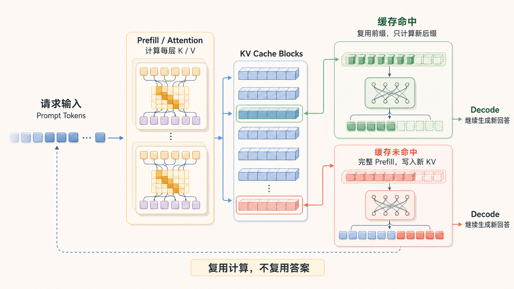
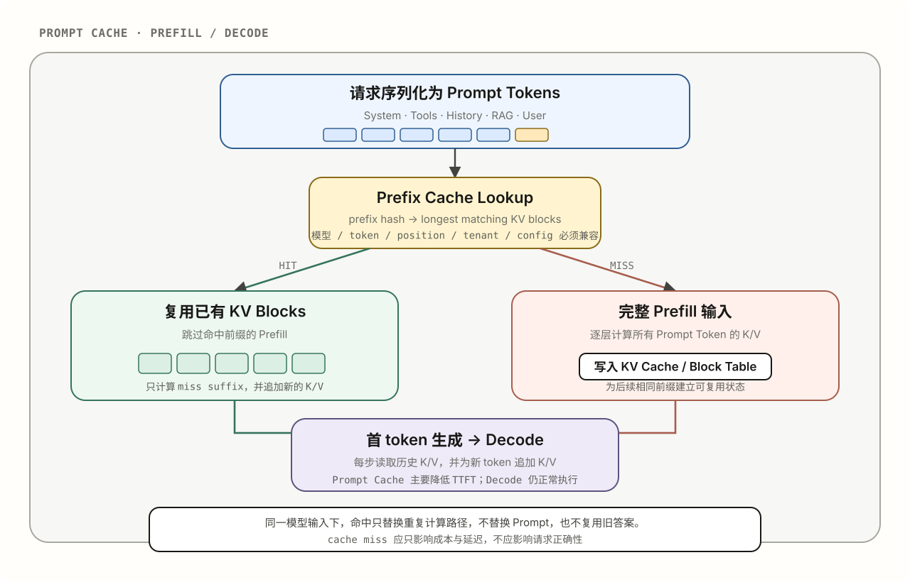
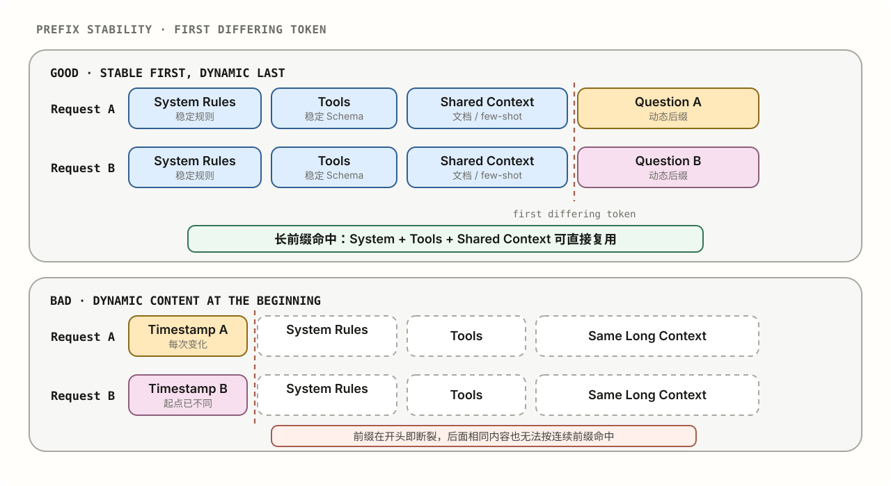

<span class="eyebrow">05 · NOTES · 01</span>

# Prompt Cache：省下的不是 Token，而是重复计算

Prompt Cache 经常被描述成一项“输入打折”功能。这个说法没有错，却容易让人误以为它只是一种计费策略，或者以为服务端保存了 Prompt 原文，下一次直接拿出来用。

它真正复用的是计算。

当两个模型请求拥有相同的 token 前缀时，推理服务可以复用这段前缀已经完成的 Attention 计算，只处理新出现的后缀。服务商少做了大量重复的 Prefill，缓存输入才有了更低的价格和更短的首 token 延迟。



*蓝色方块代表可复用的 KV Cache Blocks。绿色路径表示命中后复用前缀、只计算新后缀；红色路径表示未命中时执行完整 Prefill。两条路径最终都会进入 Decode，重新生成本轮回答。*

理解这一点之后，Prompt Cache 的命中条件、请求形式、生命周期，以及它为什么对 Agent 特别重要，都可以从同一个模型推导出来。

## 先区分三种 Cache

它们都叫 Cache，但缓存对象并不相同。

| 类型 | 缓存什么 | 复用范围 | 是否重新生成回答 |
| --- | --- | --- | --- |
| 生成期 KV Cache | 当前生成过程中的 Attention 状态 | 同一次模型生成 | 是 |
| Prompt / Prefix Cache | 相同请求前缀的 Attention 状态 | 多次模型请求 | 是 |
| Response / Semantic Cache | 已经生成的最终答案 | 相同或语义等价的业务请求 | 否 |

本文讨论的是第二种。

Prompt Cache 不会直接返回上一次的答案。即使命中相同前缀，模型仍然会根据本次后缀和采样参数重新生成输出，结果仍可能不同。OpenAI、Anthropic 和 DeepSeek 的官方文档都把它定义为 Prompt 前缀的复用，而不是回答复用。[OpenAI Prompt Caching](https://developers.openai.com/api/docs/guides/prompt-caching)、[Anthropic Prompt Caching](https://platform.claude.com/docs/en/build-with-claude/prompt-caching)、[DeepSeek Context Caching](https://api-docs.deepseek.com/guides/kv_cache)

## 从 Attention 到 KV Cache

模型先把 Prompt 转成 token，再把每个 token 的隐藏状态 `X` 投影成 Query、Key 和 Value：

```text
Q = XWq
K = XWk
V = XWv

Attention(Q, K, V) = softmax(QKᵀ / √d) V
```

在 causal Transformer 中，当前位置只能关注自己和之前的 token。生成下一个 token 时，历史 token 的 K/V 不会改变，没有必要每一步都重新计算。因此，服务端会保存各层已经算出的 K/V；每生成一个新 token，只计算它的新 Q/K/V，用 Q 读取历史 K/V，再把新 K/V 追加进去。

这就是生成期 KV Cache：

```text
Prefill：一次处理完整输入 → 产生每一层的历史 K/V
Decode：每次生成一个 token → 读取历史 K/V → 追加新 K/V
```

它避免了反复生成历史 token 的 K/V，但不等于生成阶段完全不再处理历史：每个新 token 的 Attention 仍需读取或关注相应的历史状态。实际复杂度还受 Attention 实现、滑动窗口、MQA/GQA 等因素影响，不宜简单概括成一个固定的复杂度变化。

### Prompt Cache 和 KV Cache 到底是什么关系

可以把两者看成“底层状态”与“跨请求复用机制”的关系：

- **KV Cache** 是 Attention 中间状态及其运行时存储机制，首先服务于一次生成过程。
- **Prompt Cache** 是推理服务对这些状态或等价表示建立索引、生命周期和隔离规则，使其可以跨请求复用。

因此，主流 Prefix Cache 通常建立在 KV Cache 之上。它不是另一套与 KV 无关的魔法，只是把原本随请求结束而释放的前缀状态保留一段时间，并允许后续请求重新挂载。

不过，从 API 使用者视角，不能假设每家服务商都保存传统、完整的 K/V 张量。不同模型可能缓存压缩过的 Attention 状态，具体格式也通常不会公开。最稳妥的表述是：**Prompt Cache 保存了足以恢复前缀计算的模型中间状态。**

## Client 并没有把 Cache 发给模型

这是 Prompt Cache 最容易被误解的地方。

Coding Agent 每轮依然会发送完整的逻辑上下文，最多再附加 cache key、cache breakpoint 或服务端 cache object ID：

```json
{
  "model": "model-name",
  "instructions": "stable instructions",
  "tools": ["stable tool definitions"],
  "input": ["conversation history", "new user message"],
  "prompt_cache_key": "session-123"
}
```

它不会把数百 MB 甚至更大的模型内部张量通过网络发回服务端：

```json
{
  "kv_cache": "...model tensors..."
}
```

真实流程是客户端发送 Prompt 和缓存提示，服务端完成 tokenize、路由、前缀匹配、KV Block 恢复和后续推理：



`prompt_cache_key` 不是 Cache 本身。它通常帮助请求路由和缓存分区，最终能否命中仍取决于实际前缀是否一致。OpenAI 的公开流程就是先使用 `prompt_cache_key` 和初始前缀 hash 做路由，再在目标机器上查找相同前缀。[OpenAI Prompt Caching](https://developers.openai.com/api/docs/guides/prompt-caching)

有状态会话 ID 也不等于 Prompt Cache。`previous_response_id` 一类能力让服务端代管逻辑会话；Prompt Cache 则决定推理层能否复用其中某段历史的计算。两者可以同时存在。

## 命中以后，模型如何继续

第一次请求是：

```text
A B C D E
```

第二次请求是：

```text
A B C D E F G
```

只要 `A B C D E` 在相同模型和兼容配置下保持一致，它的状态就不需要重新计算：

```text
读取 KV[A..E]
计算 F，并产生 KV[F]
计算 G，并产生 KV[G]
从 KV[A..G] 继续生成回答
```

这是因为 causal Transformer 中，前缀位置的状态只依赖它之前的 token，不依赖未来会接上 `F G` 还是 `X Y`。相同前缀可以安全地连接不同后缀。

真实推理系统通常按固定 token 数量把 KV 切成 blocks，而不是给任意长度的前缀保存一份完整副本：

```text
Block 1  tokens   0..63   hit
Block 2  tokens  64..127  hit
Block 3  tokens 128..191  hit
Block 4  tokens 192..255  miss
                          ↑ 从这里恢复计算
```

Block hash 通常还会纳入父 block hash、模型或 adapter 标识、多模态内容 hash 和租户隔离 salt。Block Table 再把逻辑 token 位置映射到物理 KV Block，并维护引用计数、淘汰状态等元数据。vLLM 的 Automatic Prefix Caching 展示了这种“累计前缀 hash → 物理 KV block”的公开实现。[vLLM Automatic Prefix Caching](https://docs.vllm.ai/en/latest/design/prefix_caching/)

## 为什么它能省钱，也能降低延迟

设固定前缀长度为 `S`，每轮新增 `Δ` 个 token，一共进行 `T` 轮。

没有跨请求缓存时，累计需要重新 Prefill 的输入大致是：

```text
S + (S + Δ) + (S + 2Δ) + ... + (S + (T-1)Δ)

= T×S + Δ×T×(T-1)/2
```

即使每轮只增加少量内容，重复处理的历史也会随着轮数快速增长。Coding Agent 又会把系统规则、工具定义、项目说明、历史回答和工具结果一起带入下一轮，因此这个放大效应尤其明显。

有缓存以后，服务端每轮主要计算新增后缀：

```text
第一次：计算并写入稳定前缀
后续轮次：低价读取旧前缀 + 计算新后缀
```

可以用下面的抽象成本式理解：

```text
无缓存成本 ≈ Σ full_input_tokens × normal_rate

有缓存成本 ≈ cache_write_tokens × write_rate
           + cache_read_tokens  × read_rate
           + new_suffix_tokens  × normal_rate
```

`read_rate` 通常显著低于普通输入价格，因为服务商不需要重复完成同样的 Prefill。但 Cache 不是免费午餐：首次写入可能有额外价格，显式缓存可能收取存储费，新增 token 仍要正常计算，输出 token 也始终需要生成。

### 它主要优化 TTFT，不是所有延迟

一次推理的用户可见延迟可以粗略拆成：

```text
总延迟 ≈ Prefill + 首 token 排队/调度 + Decode
```

Prompt Cache 主要减少 Prefill，因此对长输入的 **TTFT（Time to First Token，首 token 延迟）** 最有帮助。如果回答本身很长，Decode 仍会逐 token 进行，命中缓存也不会让整段输出瞬间完成。

所以评估效果时要把 `TTFT`、总响应时间和输出速度分开看。只看总耗时，可能会被网络、排队或长 Decode 掩盖；只看 cached tokens，也不能证明用户体验一定改善。

Prompt Cache 同样不会扩大 Context Window。缓存 token 仍然属于模型看到的上下文，通常也仍计入上下文上限和相关速率限制；它们只是以更低的重复计算成本被处理。

## Cache 会保存多久

TTL 是性能契约，不是业务状态契约。应用必须允许 Cache 随时 miss，并在 miss 时完整重算，不能把正确性建立在缓存“还活着”之上。

截至 2026-08-24，几个主要服务的公开策略如下：

| 服务 | 公开生命周期 | 特点 |
| --- | --- | --- |
| OpenAI GPT-5.6+ | 30 分钟，命中后刷新；后台可能保留更久 | 当前 `prompt_cache_options.ttl` 仅支持 `30m` |
| OpenAI 较早模型 in-memory | 通常空闲 5–10 分钟，最长约 1 小时 | 部分模型另支持最长 24 小时策略 |
| Anthropic | 默认 5 分钟，命中后刷新 | 可付费选择 1 小时 |
| Gemini 隐式缓存 | 未公开固定 TTL | 建议把相似请求安排在较短时间内 |
| Gemini 显式缓存 | 默认 1 小时 | TTL 可自定义、更新或手动删除 |
| DeepSeek | 通常数小时到数天 | 磁盘缓存、best-effort、无固定保证 |

具体模型和平台可能调整这些策略，工程实现应在接入时重新核对官方文档。[OpenAI Prompt Caching](https://developers.openai.com/api/docs/guides/prompt-caching)、[Anthropic Prompt Caching](https://platform.claude.com/docs/en/build-with-claude/prompt-caching)、[Gemini Context Caching](https://ai.google.dev/gemini-api/docs/generate-content/caching)、[DeepSeek Context Caching](https://api-docs.deepseek.com/guides/kv_cache)

TTL 设计应该匹配请求节奏：高频 Agent 循环适合短 TTL；会被多人反复引用的大型固定资料，才值得考虑显式缓存和更长 TTL。无论哪一种，都要同时考虑写入价格、读取次数、存储费和淘汰概率，而不是只追求最长保存时间。

## 真正决定命中率的是 Prefix

Prompt Cache 通常要求从第 0 个 token 开始精确匹配，不是“意思相近”就能命中。



因此最有效的排列是：

```text
最稳定
  模型协议与系统规则
  Tool definitions
  项目级说明和共享材料
  会话历史
  工具调用与结果
  当前用户输入和运行时状态
最动态
```

一个关键细节是：普通 HTTP header、trace ID 或 metadata 不会自动参与模型前缀匹配；它们只有被网关、兼容层或代理**注入到 instructions / messages / tools 等模型可见内容中**时，才会破坏前缀。如果某个转接层把每次变化的计费头、时间戳或请求 ID 塞到 instructions 第一行，后面即使有 100K token 完全相同，也可能从第一个 token 就无法连续命中。

反过来，把动态字段全部搬到最后也不是绝对规则：如果模型必须尽早看到某个高优先级约束，正确性优先于缓存率。缓存优化应建立在语义和权限边界正确的前提上。

## User 怎么更好地使用 Prompt Cache

普通使用者无法直接管理服务端 KV Block，但可以让请求形态更稳定：

1. **长期规则写入稳定的项目配置。** 把项目规范放在固定的 `AGENTS.md` 或项目指令中，不要每轮换一种措辞重复粘贴。
2. **长任务尽量在同一项目、模型和会话中连续完成。** 频繁切换模型、工作目录或工具集合会改变前缀和缓存分区。
3. **只启用任务真正需要的工具。** 大量无关 MCP/Tool Schema 会增加输入和 Prefill；但不要在同一会话中来回开关，因为工具定义变化本身也会截断命中。
4. **在上下文失效时再压缩。** Compaction 能减少未来每轮的输入，但会重写旧前缀，使现有缓存从改写处失效。应在历史明显冗余或接近窗口上限时做，而不是机械地每几轮压缩一次。
5. **不要为了缓存率牺牲上下文质量。** 删除必要日志、约束或证据可能让 cached tokens 变多，却让模型做出更差的判断。

“新开会话”与“继续热会话”之间也存在取舍：继续会话通常更容易复用已有前缀；当历史已经被失败方案和无关输出污染时，一份高质量摘要加新会话可能更省后续 token，也更利于推理。判断依据应该是未来总成本和上下文质量，而不是当前一次 cache hit。

## Developer 怎么把它设计好

对 Agent 或 API 开发者，Prompt Cache 是请求组装、可观测性和调度问题：

1. **稳定内容在前，动态内容在后。** 先放系统协议、工具和固定资料，再追加历史、工具结果与本轮问题。
2. **确定性序列化。** 固定 system 段落、tool 数组、JSON Schema 属性和可交换资料的顺序；避免 Map 遍历、空字段、省略规则或格式化方式随机变化。
3. **历史 append-only。** 尽量在末尾追加消息，不要静默重写早期工具结果或重新格式化整段历史。
4. **把运行元数据留在 Prompt 外。** 时间戳、trace ID、billing header 和随机 nonce 放在 API metadata/header；审查网关是否把它们注入模型可见字段。
5. **在稳定边界设置 breakpoint。** 对支持显式缓存的服务，把 breakpoint 放在复用概率高、长度足够且安全边界清楚的位置。
6. **合理使用 cache key。** 用稳定 key 帮助相似请求路由到同一缓存分区；不要用同一个 key 强行混合不同租户、模型、工具配置或权限上下文。
7. **让 TTL 匹配访问模式。** 计算 `写入成本 ÷ 单次读取节省` 所需的最低命中次数，再决定是否显式缓存和延长 TTL。
8. **监控实际命中。** 同时记录 cache write/read tokens、miss suffix、TTFT、总延迟、模型/版本、规范化前缀 hash 和成本。
9. **把 miss 当作正常路径。** 缓存被淘汰、模型升级或路由变化时，应用仍应完整、正确地执行。

常见观测字段包括：

```text
OpenAI     cached_tokens / cache_write_tokens
Anthropic  cache_read_input_tokens / cache_creation_input_tokens
Gemini     cached token usage metadata
DeepSeek   prompt_cache_hit_tokens / prompt_cache_miss_tokens
```

## 如何验证缓存真的生效

不要只凭“第二次好像更快”判断。一个最小实验应该包含：

1. 选择同一个模型、版本、端点和推理配置。
2. 连续发送两次足够长的请求，保持长前缀完全一致，只改变末尾问题。
3. 分别记录 cache write/read 或 cached tokens、TTFT、总耗时和账单费用。
4. 再故意改动前缀开头的一个 token，确认命中量和 TTFT 是否发生预期变化。
5. 重复多次，区分缓存效果与排队、网络、冷启动造成的随机波动。

如果预期命中而实际没有，应比较**最终发到供应商的规范化请求**，而不只是业务代码中的源对象。重点检查：

- instructions 是否被代理注入动态内容；
- tools 和 Schema 顺序是否变化；
- 历史消息是否被重新序列化；
- 模型、版本、区域、adapter 或多模态资源是否变化；
- cache key、breakpoint、最小缓存长度和 TTL 是否满足供应商要求。

## 使用 Prompt Cache 会影响输出质量吗

答案需要分两种情况。

### 1. 精确前缀缓存：按设计不应影响质量

对商用 API 常见的 exact-prefix cache，相同 token、相同位置、相同模型配置本来就会产生同样的前缀 Attention 状态。读取已经算好的状态与重新计算一次，在算法语义上是等价的。因此 Prompt Cache 只改变 Prefill 的执行路径，不改变模型看到的内容，也不应该系统性地降低回答质量。

缓存命中后两次回答仍可能不同，那通常来自采样随机性、服务端数值非确定性或本轮后缀不同，而不是因为复用了上一次答案。

真正更常见的是**间接影响**：为了提高命中率，开发者删除了必要上下文、错误地重排消息、固定了本该动态更新的资料，或压缩掉关键证据。此时质量变化来自 Prompt 已经变了，而不是缓存本身。

### 2. 模块化 Attention 复用：存在质量权衡

2024 年 MLSys 论文 [Prompt Cache: Modular Attention Reuse for Low-Latency Inference](https://proceedings.mlsys.org/paper_files/paper/2024/hash/a66caa1703fe34705a4368c3014c1966-Abstract-Conference.html) 中的 “Prompt Cache” 比商用 API 的连续前缀缓存更激进：它把 Prompt 拆成可复用模块，用 PML Schema 预分配 position ID，并跨请求复用模块的 Attention 状态。[Google Research 论文页](https://research.google/pubs/prompt-cache-modular-attention-reuse-for-low-latency-inference/)

这样做可以复用不一定连续、也不一定总在 Prompt 最开头的结构化模块，但会引入额外约束：

- K/V 依赖 token 的位置，模块复用必须保持 position ID 一致；
- 独立预计算的模块之间没有完整的交叉 Attention，相当于引入 Attention Mask；
- 当模块语义独立时，这种隔离可能没有损失，甚至减少干扰；当模块强相关时，则可能降低一致性。

论文用 **scaffolding** 把强耦合模块共同编码，以更多缓存空间换取接近原始 Prompt 的 Attention 关系，并在其实验设置中报告了很小的准确率影响。这是一个系统研究结果，不等于所有供应商的普通 Prompt Caching 都采用同样实现。

可以这样区分：

| 机制 | 匹配对象 | 复用灵活性 | 质量风险 |
| --- | --- | --- | --- |
| 商用 exact-prefix cache | 从第 0 个 token 开始的连续相同前缀 | 较低 | 按设计与重算等价 |
| 论文的 modular Prompt Cache | 预定义 Schema 中的可复用模块 | 较高 | 需处理位置与跨模块 Attention |

因此，讨论“Prompt Cache 会不会影响质量”时，必须先说明讲的是普通精确前缀复用，还是论文里的模块化、可能带近似的 Attention 复用。

## 六个常见误区

| 误区 | 更准确的说法 |
| --- | --- |
| Cache 保存了 Prompt 原文或旧答案 | 它主要保存可恢复前缀计算的 Attention 状态，输出仍重新生成 |
| 意思相近就能命中 | 普通 Prefix Cache 要求开头的 token 序列精确连续匹配 |
| 客户端把编码后的 Cache 发给模型 | 客户端发送完整逻辑请求和缓存提示，服务端保管并挂载模型状态 |
| cache key 相同就一定命中 | key 主要帮助路由或分区，真实前缀和配置仍必须兼容 |
| cached tokens 不再占 Context Window | 它们通常仍属于上下文，只是重复计算价格更低 |
| 命中以后整个回答都会立刻完成 | 它主要缩短 Prefill/TTFT，Decode 仍需逐 token 生成 |

## Prompt Cache 的边界

它能优化的是重复推理，不能替代：

- Memory：跨会话保存用户或任务事实；
- RAG：从外部知识库选择相关内容；
- Compaction：缩短超长历史；
- Response Cache：直接复用确定性答案；
- Session Storage：持久化消息和工具事件。

这也是为什么 Prompt Cache 不应该成为正确性依赖。它只改变一次请求“需要做多少重复计算”，不应该改变“模型能够看到什么”。

## 结语

Prompt Cache 省下的不是 Prompt，也不是上下文窗口中的 token，而是相同 token 前缀已经完成的计算。

对普通单轮调用，它是一项推理优化；对不断重放长历史的 Agent，它会进一步变成架构问题：系统提示如何组装、工具是否稳定排序、运行时上下文放在哪里、会话是否只追加、压缩从哪个位置改写历史，都会改变缓存命中率。

最值得记住的不是某个服务商当前的 TTL 或折扣，而是三条长期有效的原则：

1. Cache 复用计算，不复用答案；
2. 精确、连续、稳定的前缀决定命中范围；
3. 正确的上下文永远优先于漂亮的缓存指标。

下一篇：[Agent 架构如何塑造 Prompt Cache](agent-architecture-shapes-prompt-cache.md)。
